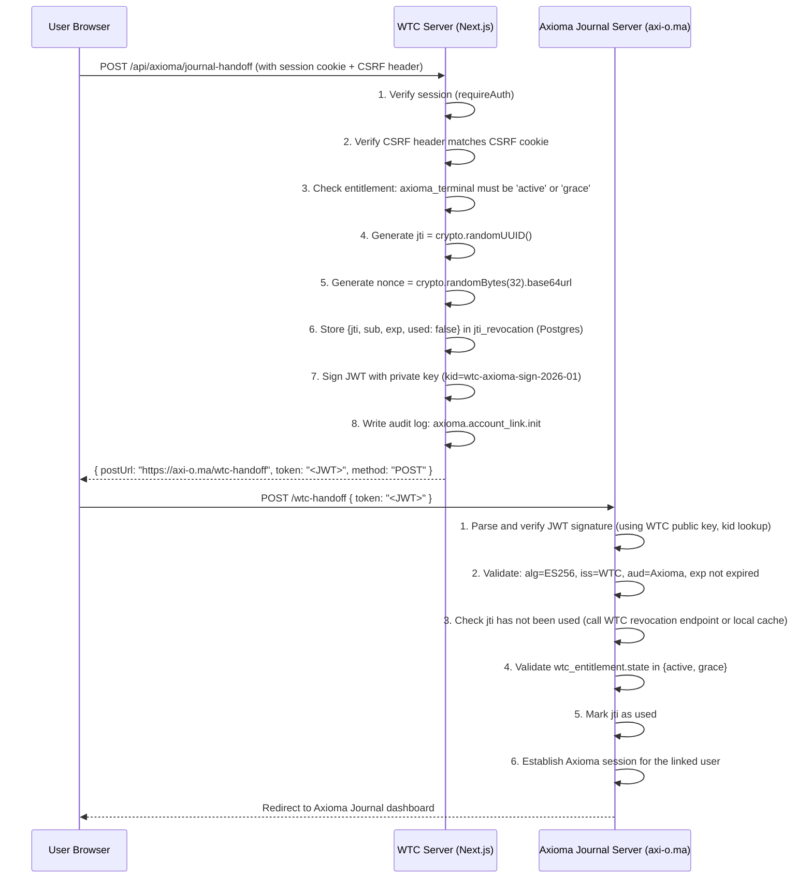

# Axioma Handoff Token Specification — WTC Ecosystem Platform

> Status: Phase 0 design document. Governs all implementation.
> Owner: ecosystem-security-auditor
> Last updated: 2026-06-01 (Phase 3.11)
>
> **Current implementation note (through Phase 3.11).** The replay-prevention store landed as table
> `axioma_handoff_jti_revocations` (migration **0004**) with repos `recordHandoffJti` / `consumeHandoffJti`
> (the atomic single-statement conditional UPDATE described below) / `revokeHandoffJtisByUser` /
> `purgeExpiredHandoffJtis` (worker purge). The ES256 signer is wired into the bridge behind a staging+prod
> fence (`resolveHandoffSigner`). The WTC-side Option A consume route now exists at
> `POST /api/axioma/jti/consume`; it is fail-closed behind DB availability, `AXIOMA_ROUTE_SKELETON_ENABLED=true`,
> and a non-empty `AXIOMA_BRIDGE_API_TOKEN`. The local journal-handoff route is extracted into a tested
> request handler; it requires a linked Axioma user id before `open_journal` signing and records JTI plus
> `axioma.account_link_init` audit atomically. The canonical jti-lifecycle audit codes are
> `axioma.handoff_jti_consume` / `_replay` / `_revoke`. **Still TARGET/B4:** the EC P-256 key (OP),
> confirmed `journal_server` endpoint shapes (EXT), live Open-Journal/Download activation, the external
> Option A vs B replay-check decision ([Q-15](OPEN_QUESTIONS.md)), and the `axioma_account_links` OTC-to-hash migration.

Related docs:
- [SECURITY_MODEL.md](./SECURITY_MODEL.md)
- [RBAC_MATRIX.md](./RBAC_MATRIX.md)
- [AUDIT_LOG_SCHEMA.md](./AUDIT_LOG_SCHEMA.md)
- [CONTRACTS/axioma-bridge.md](./CONTRACTS/axioma-bridge.md)

---

## Purpose

The Axioma Handoff Token enables two specific user flows:

1. **Open Axioma Journal** — user clicks "Open Journal" in the WTC dashboard; WTC issues a short-lived signed token; the user is redirected to `axi-o.ma` where the token is validated and the Axioma Journal session is established without a second login.

2. **Account Link** — user connects their WTC account to their Axioma account (first-time or re-link); the handoff token carries the entitlement claim and WTC identity so Axioma can verify authorization and establish the link.

### What WTC never does

- WTC never receives the user's Axioma password.
- WTC never receives or stores exchange API keys from the Axioma local terminal.
- WTC never gates local Axioma order execution — the local trading path inside the Axioma desktop terminal is entirely local and operates independently of WTC session state.
- WTC's token only authorizes the Axioma-server-side journal/account features, not any desktop terminal operations.

---

## Token Structure (JWT — Compact Serialization)

The handoff token is a signed JWT using the **ES256** algorithm (ECDSA P-256 with SHA-256). Asymmetric signing is chosen over HMAC so that Axioma journal server can verify without sharing a secret key with WTC.

### Header

```json
{
  "alg": "ES256",
  "typ": "JWT",
  "kid": "wtc-axioma-sign-2026-01"
}
```

- `alg`: always `"ES256"`. Axioma MUST reject tokens with any other algorithm value, including `"none"`, `"HS256"`, or any algorithm not explicitly allowlisted.
- `kid`: Key ID for signature verification. Allows key rotation without breaking in-flight tokens.

### Payload (Claims)

```json
{
  "iss": "https://app.wtc.example.com",
  "aud": "https://axi-o.ma",
  "sub": "wtc-user-uuid-here",
  "jti": "nonce-uuid-here",
  "iat": 1748512800,
  "exp": 1748512800,
  "nbf": 1748512800,
  "wtc_flow": "open_journal",
  "wtc_entitlement": {
    "product_code": "axioma_terminal",
    "state": "active",
    "expires_at": "2027-05-29T00:00:00Z"
  },
  "wtc_axioma_user_id": "axioma-linked-user-uuid-or-null",
  "nonce": "csrf-nonce-32-hex-chars"
}
```

### Claim Definitions

| Claim | Type | Required | Description |
|-------|------|----------|-------------|
| `iss` | string | YES | Issuer URI of the WTC platform. Axioma validates this exactly. |
| `aud` | string | YES | Audience — the Axioma journal server's canonical URI. Axioma validates this exactly. |
| `sub` | string | YES | WTC user UUID — the unique, stable identity of the WTC account holder. |
| `jti` | string | YES | JWT ID — a UUID v4 nonce unique to this token. Used for replay prevention. |
| `iat` | number | YES | Issued-at time (Unix seconds UTC). |
| `exp` | number | YES | Expiry time (Unix seconds UTC). `exp = iat + 300` (5-minute TTL). |
| `nbf` | number | YES | Not-before time. Set to `iat` — token is immediately valid. |
| `wtc_flow` | string | YES | `"open_journal"` or `"account_link"`. Axioma uses this to select the handling flow. |
| `wtc_entitlement` | object | YES | Current entitlement snapshot: `product_code`, `state`, and `expires_at`. This is a snapshot at issuance time — Axioma should re-verify with WTC in sensitive flows. |
| `wtc_axioma_user_id` | string/null | YES | The Axioma-side user UUID if WTC has a confirmed account link. Current WTC `open_journal` issuance requires this value; `null` is reserved for an explicit future account-link flow. |
| `nonce` | string | YES | CSRF nonce — 32 random hex bytes. Matched against the nonce stored in the user's WTC session at token issuance time. |

### TTL

**5 minutes (300 seconds).** The token is intended to be consumed immediately during the POST handoff. Axioma MUST reject tokens at or after `exp`.

---

## Open Journal Token Issuance Flow



---

## Account-Link OTC Flow

The current local account-link route does not issue a handoff JWT. `POST /api/axioma/account-link/init`
is a browser-session mutation protected by CSRF, session auth, current `axioma_terminal` entitlement,
and shared Axioma route readiness. It returns a cryptographically random five-minute OTC once in a
`Cache-Control: no-store` response and persists only `SHA-256(OTC)` in `axioma_account_links.link_nonce_hash`.

Axioma completes the local link with `POST /api/axioma/account-link/complete` using
`Authorization: Bearer <AXIOMA_BRIDGE_API_TOKEN>` and a JSON body:

```json
{ "code": "<OTC>", "axioma_user_id": "<Axioma user id>" }
```

The complete endpoint rejects all query strings, re-checks the pending row owner's current WTC
entitlement before consuming the hash, and never writes the raw OTC or hash to audit payloads or
responses. `DELETE /api/axioma/account-link` revokes pending/linked rows for the current WTC user
through the audited DB helper. These routes are local-only acceptance; live Axioma endpoint acceptance
and browser CTA enablement remain separate B4 gates.

---

## Signing Key Management

### Key pair

- Algorithm: **P-256 (secp256r1)** elliptic curve
- WTC holds the **private key** in `AXIOMA_HANDOFF_SIGNING_KEY` with the active `kid` in `AXIOMA_HANDOFF_KEY_ID` (PEM format, stored as deployment secret)
- Axioma holds the **public key** (provided out-of-band during setup; also publishable at `https://app.wtc.example.com/.well-known/axioma-jwks.json`)

### JWKS endpoint

WTC publishes a JWKS endpoint:

```
GET https://app.wtc.example.com/.well-known/axioma-jwks.json
```

Response:
```json
{
  "keys": [
    {
      "kty": "EC",
      "crv": "P-256",
      "use": "sig",
      "alg": "ES256",
      "kid": "wtc-axioma-sign-2026-01",
      "x": "<base64url-encoded x>",
      "y": "<base64url-encoded y>"
    }
  ]
}
```

Axioma MAY cache this endpoint with a short TTL but MUST re-fetch if `kid` validation fails. The implemented route serves configured keys with `Cache-Control: public, max-age=300` and returns `503` plus `Cache-Control: no-store` when key material is absent or invalid.

### Key rotation

1. Generate new key pair: `openssl ecparam -name prime256v1 -genkey -noout -out new-key.pem && openssl ec -in new-key.pem -pubout -out new-key-pub.pem`
2. Assign new `kid`: `wtc-axioma-sign-2026-07`
3. Add new private key to env: `AXIOMA_HANDOFF_SIGNING_KEY`
4. Set `AXIOMA_HANDOFF_KEY_ID=wtc-axioma-sign-2026-07` so new tokens use the new `kid`
5. If Axioma requires key-overlap rotation, add multi-key JWKS support before rotating; the current route publishes the active key only.
6. Wait for all in-flight tokens to expire (5 minutes max)

Rotation MUST be coordinated with the Axioma team — they must update their public key trust if not using the JWKS auto-discovery endpoint.

---

## CSRF Protection

The handoff URL contains a `nonce` query parameter that is:
1. Generated by WTC at token issuance time.
2. Stored in the user's WTC session record server-side (`sessions.axioma_handoff_nonce`).
3. Embedded in the `nonce` JWT claim.
4. Embedded in the `nonce` query parameter of the handoff URL.

Axioma MUST:
- Verify that the `nonce` query parameter matches the `nonce` claim inside the JWT.
- This prevents a token that was issued for a different flow from being substituted.

WTC MUST:
- Validate the CSRF double-submit token on the `POST /api/axioma/journal-handoff` request (X-CSRF-Token header check per [SECURITY_MODEL.md](./SECURITY_MODEL.md) В§3) before issuing any handoff token.
- Validate the same CSRF header on `POST /api/axioma/account-link/init` before issuing any one-time account-link code.

---

## Replay Prevention

### Strategy: JTI revocation table

```sql
CREATE TABLE axioma_handoff_jti_revocations (
  jti           uuid PRIMARY KEY,
  sub           uuid NOT NULL,             -- WTC user id
  issued_at     timestamptz NOT NULL,
  expires_at    timestamptz NOT NULL,
  used_at       timestamptz,               -- NULL = not yet used
  revoked_at    timestamptz,               -- NULL = not revoked; set for manual revoke
  revoke_reason text
);
```

At issuance: INSERT `{jti, sub, issued_at, expires_at, used_at: null}`.
At consumption: attempt UPDATE `used_at = now()` WHERE `jti = ? AND used_at IS NULL AND revoked_at IS NULL AND expires_at > now()`. If 0 rows updated в†’ reject as replay.

### How Axioma checks replay

Two options (implementation choice based on Axioma architecture readiness):

**Option A — Axioma calls WTC revocation endpoint** (preferred for two-party trust):
```
POST https://app.wtc.example.com/api/axioma/jti/consume
Authorization: Bearer <Axioma-to-WTC service token>
Body: { "jti": "<uuid>" }

Response 200: { "consumed": true }  в†’ valid, now marked used
Response 409: { "error": "already_consumed" }  в†’ replay, reject
Response 404: { "error": "not_found" }  в†’ unknown jti, reject
```

Current WTC route behavior also includes `401` for missing/bad bearer token, `400` for malformed JSON or
non-UUID `jti`, `410` for expired or revoked JTI rows, `405` for non-POST methods, and `503` while route
prerequisites are absent. The route does not call live Axioma and does not put tokens in URLs.

**Option B — Local bloom filter / Redis cache** (if Axioma is fully standalone): Axioma maintains a local Redis set of consumed JTIs with TTL = token expiry + 60 seconds. This requires Axioma trusting WTC's clock and token expiry claim, which is acceptable given signature verification.

External acceptance for Option A vs Option B remains open in [Q-15](OPEN_QUESTIONS.md). The WTC-side Option A route exists locally, but terminal CTAs and live Axioma activation remain disabled until the Axioma team confirms the model and endpoint shapes.

### Cleanup

WTC background worker deletes `axioma_handoff_jti_revocations` rows where `expires_at < now() - 1 hour` (post-expiry cleanup, keeping a brief buffer for audit queries).

---

## Revocation Behavior

| Scenario | Behavior |
|----------|---------|
| Token has not been consumed and has not expired | Valid; Axioma consumes on first use |
| Token consumed (used_at IS NOT NULL) | Reject as replay; Axioma returns 401 |
| Token expired (exp < now()) | Reject; Axioma returns 401 |
| WTC entitlement revoked AFTER token was issued | Token may still succeed at Axioma side within 5-min TTL; this is acceptable given the short TTL. For immediate revocation, WTC marks the `jti` as `revoked_at = now(), revoke_reason = 'entitlement_revoked'` — Axioma checks the revocation endpoint before consuming. |
| User account deleted | All pending JTIs for the user are marked `revoked_at = now()` |
| Admin manually revokes handoff token | Admin UI calls `POST /api/admin/axioma/revoke-jti`; marks row `revoked_at` |

---

## Axioma Validation Requirements

Axioma journal server MUST perform the following checks on every received token, in order:

1. Parse JWT without trusting — extract `kid` from header.
2. Fetch WTC public key for `kid` from JWKS endpoint (cached) or configured public key.
3. Verify signature using ES256 — reject if signature does not verify.
4. Reject if `alg` header is not exactly `"ES256"` (no algorithm confusion).
5. Verify `iss` == `"https://app.wtc.example.com"` (exact string match).
6. Verify `aud` == `"https://axi-o.ma"` (exact string match).
7. Verify `exp` > current time (with max 30-second clock skew allowance).
8. Verify `nbf` <= current time + 30 seconds.
9. Verify `wtc_entitlement.state` ∈ `{'active', 'grace'}` — reject if `none`, `expired`, `revoked`, `refunded`, `chargeback`, or `manual_review`.
10. Verify `jti` has not been consumed (replay check).
11. Verify `nonce` query parameter matches `nonce` JWT claim.
12. Mark `jti` as consumed.
13. Proceed with flow-specific handling based on `wtc_flow`.

If any check fails, Axioma returns `401 Unauthorized` with a generic error message. No information about which specific check failed is returned to the client (to prevent probing).

---

## Audit Events Emitted

WTC emits audit log entries for every handoff token lifecycle event:

| Event | audit action | actor_context | Notes |
|-------|-------------|---------------|-------|
| Token issued | `axioma.account_link_init` | `'app/terminal'` | `target_type=axioma_handoff_jti`, `target_id=jti`, `after_redacted={flow, product_code, entitlement_state}` |
| Token consumed at WTC (Option A) | `axioma.handoff_jti_consume` | `'axioma-server'` | `actor_role='system'`, `actor_user_id=sub`, `after={consumed:true}` |
| Token already used / invalid at WTC (Option A) | `axioma.handoff_jti_replay` | `'axioma-server'` | `result='failure'`, `after={reason}` |
| Token revoked (admin or entitlement revoke) | `axioma.handoff_jti_revoke` | `'admin-panel'` or `'worker:entitlement'` | |
| Account link confirmed by Axioma | `axioma.account_link.complete` | `'axioma-server'` | Written when Axioma calls WTC back to confirm link |
| Account link revoked | `axioma.account_link.revoke` | varies | |

---

## Implementation Package

Implemented package and route locations:
- `packages/axioma-bridge/src/{handoff,es256,signer,jwks}.ts` - claim shape, signing, verification, and JWKS material.
- `packages/db/src/repositories.ts` - `recordHandoffJti`, `consumeHandoffJti`, `revokeHandoffJtisByUser`, `purgeExpiredHandoffJtis`.
- `apps/web/src/app/api/axioma/journal-handoff/route.ts` - current POST-body handoff route skeleton.
- `apps/web/src/app/api/axioma/jti/consume/route.ts` and `apps/web/src/features/terminal/axioma-jti-consume.ts` - WTC-side Option A consume route.

```typescript
// Interface only — no implementation in docs
export interface HandoffTokenPayload {
  iss: string;
  aud: string;
  sub: string;
  jti: string;
  iat: number;
  exp: number;
  nbf: number;
  wtc_flow: 'open_journal' | 'account_link';
  wtc_entitlement: {
    product_code: 'axioma_terminal';
    state: 'active' | 'grace';
    expires_at: string;
  };
  wtc_axioma_user_id: string | null;
  nonce: string;
}

export async function issueHandoffToken(
  userId: string,
  flow: 'open_journal' | 'account_link'
): Promise<{ token: string; handoff_url: string }>;

export async function consumeHandoffJti(
  jti: string
): Promise<{ consumed: boolean; reason?: string }>;
```

---

## Note on Local Axioma Order Execution

The Axioma desktop terminal (`C:\Users\maxib\TV_GREENFIELD_TERMINAL`) uses locally encrypted exchange API keys stored via Electron `safeStorage`. The WTC handoff token:

- Does **not** authorize any order execution.
- Does **not** carry exchange API credentials.
- Does **not** create any path by which WTC could read or influence the local exchange key vault.

The token authorizes only Axioma server-side features: the cloud journal, account management, and download eligibility. The local trading engine of the Axioma desktop terminal is never connected to WTC token validation. This boundary is architectural and must be preserved through all future iterations.
