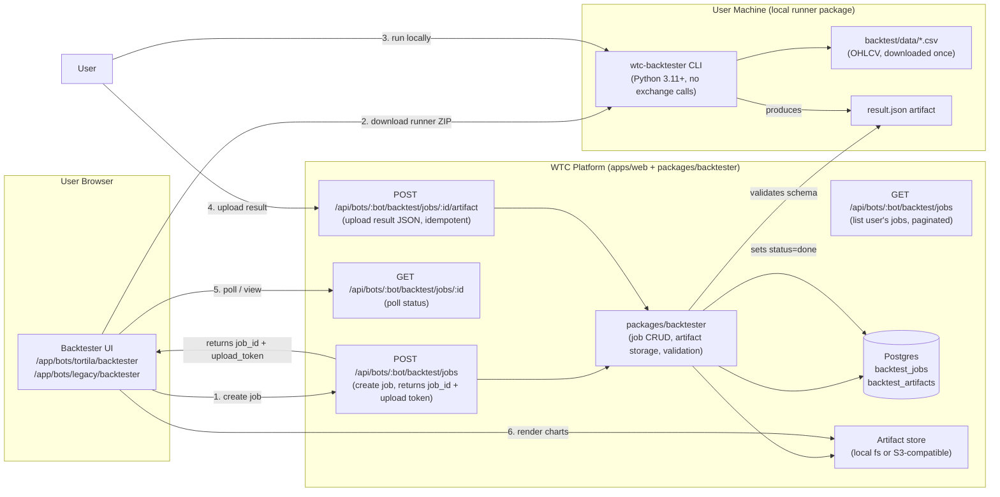

# Backtester Distribution Plan

**Owner:** ecosystem-backtester-architect  
**Status:** Phase 3.2 update — the Tortila local-runner download MVP is now **real and entitlement-gated** (`wtc-backtester-0.1.0.zip` + `/api/bots/:bot/backtest/runner-download`). The Legacy Bot backtester remains a permanent "not available for this bot" product boundary. Server-side job/result/artifact upload remains TARGET; the platform still never fabricates returns and still never executes heavy backtests in the web tier. Older Phase 2.13 / PG10 "locked/no runner ZIP" notes in this document are historical unless explicitly marked current.  
**Related:** [`packages/backtester`](../packages/backtester/), [`CONTRACTS/backtester-runner.md`](CONTRACTS/backtester-runner.md), [`BOT_INTEGRATION_PLAN.md`](BOT_INTEGRATION_PLAN.md)  
**Phase 2 handoff:** [`docs/handoffs/20260530-0126-ecosystem-backtester-architect.md`](handoffs/20260530-0126-ecosystem-backtester-architect.md)

---

## 1. Scope

**Tortila Bot only.** The WTC backtester gives entitled Tortila Bot users the ability to test the Tortila Turtle strategy against real historical OHLCV data — with their own parameter choices — and view structured result artifacts in the platform dashboard.

The Legacy Bot does NOT have a backtester. The `/app/bots/legacy/backtester` route (and any `[bot]=legacy` path) renders a permanent "not available for this bot" locked card, with no configuration form and no job creation. This is a product decision, not a temporary placeholder.

The web tier (Next.js / `apps/web`) **does not execute backtests**. Heavy computation runs only inside a downloadable local runner package on the user's machine. Results are uploaded back to the platform as signed artifacts and displayed through the visualization layer.

Two engine definitions exist in the codebase, but only one is exposed to users at this time:

| Engine | Strategy | Bot | Source shape | User-accessible |
|--------|----------|-----|-------------|-----------------|
| `tortila` | Turtle breakout, Wilder ATR, Donchian, multi-unit pyramid | Tortila Bot | `bot_tortila/backtest/engine.py` | Yes |
| `legacy_dca` | RSI/CCI crossunder, DCA averaging ladder, TP-only exit | Legacy Bot | `bot_tortila/old_bot_backtest/dca_engine.py` | No — schemas defined but engine not distributed |

---

## 2. Hard constraints

1. **No synthetic / fabricated results.** If no artifact file exists for a `BacktestJob`, the UI renders an empty state with "No results yet — run the local runner and upload." Never interpolate, estimate, or show placeholder numbers.
2. **No web-tier compute.** The Next.js server never executes `run_backtest()` or `run_portfolio_backtest()`. All CPU work happens in the local runner.
3. **Strict isolation from live trading.** A backtest job never touches exchange API keys, live orders, or any live bot runtime state. The runner has no network access to BingX or any exchange in its core path; OHLCV data is downloaded once (separate step) and used offline.
4. **Entitlement-gated.** A user must have an `active` (or valid `grace`) entitlement for `tortila_bot` or `legacy_bot` respectively to create or view backtest jobs.
5. **No result editing.** Uploaded artifacts are immutable. If a user wants different results, they run a new job. Platform never modifies artifact values.
6. **Audit-logged.** Every job creation, upload, and deletion is written to `audit_logs`.

---

## 3. System architecture



---

## 4. User flow

### 4.1 Overview (step-by-step)

1. User navigates to `/app/bots/tortila/backtester` (or `/app/bots/legacy/backtester`).
2. Entitlement check: if not `active`/`grace` for that bot, render locked state (upgrade CTA, no job creation).
3. User fills the **Job Parameters Form** (see §5).
4. Platform creates a `BacktestJob` record in state `queued`, returns `job_id` and a one-time signed `upload_token`.
5. UI shows the **Download Runner** banner with a ZIP download link and setup instructions.
6. User downloads and runs the local CLI (once per machine setup; subsequent runs are just `wtc-backtester run --job <job_id>`).
7. Runner produces `result.json` (the artifact) and prints a `wtc-backtester upload` command.
8. User runs the upload command (or drags-and-drops the file in UI, which calls the same upload endpoint).
9. Platform validates the artifact schema and sets job status to `done`.
10. UI renders the result (equity curve, trade table, metrics cards).

### 4.2 Job status machine

```
queued → running → done
                 ↘ failed
       ↘ cancelled (user-initiated only, before artifact upload)
```

| Status | Meaning |
|--------|---------|
| `queued` | Job created, runner not yet started. |
| `running` | Runner has called the "start" heartbeat endpoint (optional). |
| `done` | Artifact uploaded and validated. Results visible. |
| `failed` | Runner reported an error, or validation of uploaded artifact failed. Error message stored. |
| `cancelled` | User cancelled before upload. No artifact. |

State transitions are server-side only; the client cannot set status directly.

---

## 5. Job Parameters Form

### 5.1 Tortila (Turtle strategy)

| Parameter | Type | Allowed values | Default |
|-----------|------|----------------|---------|
| `symbols` | string[] | BingX perp universe (e.g. `["XRP/USDT:USDT","ETH/USDT:USDT"]`) | `["ETH/USDT:USDT"]` |
| `timeframe` | enum | `"1h"`, `"4h"` | `"1h"` |
| `system` | enum | `1` (20/10), `2` (55/20) | `2` |
| `risk_pct` | float | 0.001 – 0.02 (slider) | 0.005 |
| `stop_n` | float | 1.0 – 4.0 (step 0.5) | 2.0 |
| `add_step` | float | 0.25 – 2.0 (step 0.25) | 0.5 |
| `max_units` | int | 1 – 4 | 4 |
| `atr_period` | int | 10 – 30 | 20 |
| `leverage` | int | 1 – 10 | 5 |
| `initial_equity` | float | 1 000 – 1 000 000 | 10 000 |
| `mm_anti_martingale` | bool | | false |
| `mm_per_symbol_dd_halt_pct` | float | 0 – 1 | 0.0 |
| `mm_per_symbol_dd_cooldown_bars` | int | 0 – 500 | 48 |
| `data_lookback_days` | int | 90 – 1 080 | 365 |

### 5.2 Legacy DCA strategy

| Parameter | Type | Allowed values | Default |
|-----------|------|----------------|---------|
| `symbols` | SymbolConfig[] | (per-symbol config objects) | required |
| `initial_equity` | float | 1 000 – 1 000 000 | 10 000 |
| `max_concurrent` | int | 1 – 10 | 5 |
| `fee_rate` | float | 0.0001 – 0.002 | 0.0005 |
| `data_lookback_days` | int | 30 – 365 | 180 |

SymbolConfig fields per-symbol: `timeframe` (`"1m"` or `"3m"`), `use_rsi`, `use_cci`, `rsi_length`, `rsi_threshold`, `cci_length`, `cci_threshold`, `take_profit_percent`, `initial_entry_percent`, `averaging_levels` (1–3), `averaging_percents` (array), `averaging_volume_percents` (array), `use_balance_percent`, `leverage`.

All parameters are Zod-validated server-side at job creation and again at artifact upload (runner config must match the stored job params within a defined tolerance).

---

## 6. Local runner package

### 6.1 Distribution

- Format: ZIP archive `wtc-backtester-<version>.zip`
- Contents:
  ```
  wtc-backtester/
    README.txt
    requirements.txt          # numpy, pandas, ccxt (for download step only)
    run.py                    # CLI entry point (no exchange API keys needed)
    engine/
      __init__.py
      tortila_engine.py       # copy of backtest/engine.py, versioned, no live deps
      dca_engine.py           # copy of old_bot_backtest/dca_engine.py, versioned
    download_ohlcv.py         # ccxt-based OHLCV downloader, public endpoints only
    upload.py                 # posts result.json to the platform upload endpoint
    LICENSE
    CHECKSUMS.sha256
  ```
- The runner ZIP is served from a **signed download URL** generated by `packages/backtester`. The URL embeds the `job_id` as context but any entitled user with an active job can download the runner version tied to that release.
- Versioning: runner version is stored in `BacktestJob.runner_version`. Platform refuses artifacts produced by runners older than `min_supported_runner_version` (configured per-engine).

### 6.2 Setup (user instructions)

```
# Requires Python 3.11+
unzip wtc-backtester-<version>.zip
cd wtc-backtester
pip install -r requirements.txt

# Step 1: download OHLCV (public BingX endpoints, no keys)
python download_ohlcv.py --symbols ETH/USDT:USDT XRP/USDT:USDT --timeframes 1h 4h --days 365

# Step 2: run the backtest (uses stored job params from platform)
python run.py --job <job_id> --token <upload_token> [--dry-run]

# Step 3: upload result (or use --auto-upload flag in step 2)
python upload.py --job <job_id> --token <upload_token> --file result.json
```

### 6.3 Runner CLI interface

```
python run.py \
  --job <job_id>               # UUID of the BacktestJob on the platform \
  --token <upload_token>       # one-time signed upload token (expires 7 days) \
  --engine tortila|legacy_dca  # auto-detected from job metadata if omitted \
  --data-dir ./data            # path to OHLCV CSVs \
  --out result.json            # artifact output path \
  --dry-run                    # run but do not upload; print metrics to stdout
```

The runner fetches job parameters from `GET /api/bots/:bot/backtest/jobs/:id/params`, sending the upload token in the `Authorization: Bearer <upload_token>` header (no auth cookie needed — the token is the credential for this endpoint only). It never reads or requires exchange API keys.

### 6.4 Security properties of the runner

- No network calls to any exchange during the compute step.
- The upload step posts only the `result.json` artifact and the job ID.
- Upload token is HMAC-signed by the platform (`packages/crypto`), scoped to `{job_id, user_id, exp}`.
- Runner output contains no secrets; it only reflects strategy parameters and OHLCV-derived calculations.

---

## 7. Artifact schema (BacktestResult)

The artifact is a single JSON file. The schema is Zod-validated on upload by `packages/backtester/src/artifact.ts`. Any artifact that fails validation is rejected with status `failed` and an error message; no partial results are stored.

### 7.1 Tortila artifact schema

```typescript
// packages/backtester/src/schemas/tortila-artifact.ts

interface TortilaTrade {
  symbol: string;
  side: "long" | "short";
  units: number;
  avg_entry: number;
  exit_price: number;
  pnl: number;                  // realized PnL in USDT
  pnl_pct: number;              // PnL as % of open equity at trade start
  bars_held: number;
  open_ts: number;              // ms epoch
  close_ts: number;             // ms epoch
  exit_reason: "stop" | "exit_signal" | "end_of_data";
}

interface TortilaFill {
  ts_ms: number;
  side: "buy" | "sell";
  qty: number;
  price: number;
  role: "entry" | "add" | "stop" | "exit_signal" | "end_of_data";
  realized_pnl: number;
}

interface TortilaEquityPoint {
  ts_ms: number;
  equity: number;
}

interface TortilaSymbolResult {
  symbol: string;
  timeframe: string;
  initial_equity: number;
  final_equity: number;
  total_return_pct: number;
  num_trades: number;
  win_rate: number;
  profit_factor: number;       // null if no denominator
  max_drawdown_pct: number;
  expectancy_per_trade: number;
  avg_bars_held: number;
  sharpe_per_trade: number;
  equity_curve: TortilaEquityPoint[];
  trades: TortilaTrade[];
  fills: TortilaFill[];
  bars_processed: number;
}

interface TortilaArtifact {
  schema_version: "tortila/v1";
  job_id: string;
  runner_version: string;       // semver, e.g. "1.0.0"
  engine: "tortila";
  produced_at: string;          // ISO-8601 UTC
  config: {
    symbols: string[];
    timeframe: string;
    system: 1 | 2;
    risk_pct: number;
    stop_n: number;
    add_step: number;
    max_units: number;
    atr_period: number;
    leverage: number;
    initial_equity: number;
    mm_anti_martingale: boolean;
    mm_per_symbol_dd_halt_pct: number;
    mm_per_symbol_dd_cooldown_bars: number;
    data_lookback_days: number;
    fee_rate: number;
    slippage: number;
  };
  portfolio: {
    initial_equity: number;
    final_equity: number;
    total_return_pct: number;
    annualised_pct: number;      // computed from actual data span
    portfolio_max_dd_pct: number;
    total_trades: number;
    portfolio_win_rate: number;
    avg_profit_factor: number;
    data_start_ts: number;       // ms epoch — actual data range start
    data_end_ts: number;
  };
  per_symbol: TortilaSymbolResult[];
}
```

### 7.2 Legacy DCA artifact schema

```typescript
// packages/backtester/src/schemas/legacy-dca-artifact.ts

interface DCAClosedTrade {
  symbol: string;
  open_ts_ms: number;
  close_ts_ms: number;
  qty: number;
  avg_entry: number;
  exit_price: number;
  realised_pnl: number;
  fees: number;
  averaging_levels_filled: number;
  bars_held: number;
}

interface DCAOpenAtEnd {
  symbol: string;
  open_ts_ms: number;
  qty: number;
  avg_entry: number;
  last_close: number;
  unrealised: number;
  avg_levels_filled: number;
  drawdown_pct: number;
}

interface LegacyDCAArtifact {
  schema_version: "legacy_dca/v1";
  job_id: string;
  runner_version: string;
  engine: "legacy_dca";
  produced_at: string;
  config: {
    symbol_configs: Array<{
      symbol: string;
      timeframe: string;
      use_rsi: boolean;
      use_cci: boolean;
      rsi_length: number;
      rsi_threshold: number;
      cci_length: number;
      cci_threshold: number;
      take_profit_percent: number;
      initial_entry_percent: number;
      averaging_levels: number;
      averaging_percents: number[];
      averaging_volume_percents: number[];
      use_balance_percent: number;
      leverage: number;
    }>;
    initial_equity: number;
    max_concurrent: number;
    fee_rate: number;
    data_lookback_days: number;
  };
  portfolio: {
    initial_equity: number;
    final_equity: number;
    total_return_pct: number;
    annualised_pct: number;
    num_trades: number;
    win_rate: number;
    profit_factor: number | "inf";
    max_drawdown_pct: number;
    avg_bars_held: number;
    avg_avg_levels: number;
    rejected_signals: number;
    max_open_positions: number;
    worst_intrabar_dd_pct: number;
    worst_intrabar_symbol: string;
    data_start_ts: number;
    data_end_ts: number;
  };
  trades: DCAClosedTrade[];
  open_at_end: DCAOpenAtEnd[];
  equity_curve: Array<{ ts_ms: number; equity: number }>;
  per_symbol: Record<string, {
    trades: number;
    win_rate: number;
    gross_pnl: number;
    avg_levels_filled: number;
    avg_bars_held: number;
  }>;
}
```

### 7.3 Artifact validation rules

- `job_id` in the artifact must match the `job_id` in the URL.
- `engine` must match the engine recorded in the `BacktestJob`.
- `config` fields must match the job's stored params within defined tolerances (exact match for discrete params; ±1e-9 for floats).
- `produced_at` must be after `job.created_at` and before `now + 5 minutes` (clock skew tolerance).
- `runner_version` must be >= `min_supported_runner_version` for that engine.
- `equity_curve` must have at least 1 point; equity values must be finite positive numbers.
- `portfolio.initial_equity` must match `config.initial_equity`.
- Per-symbol results must correspond exactly to `config.symbols` (no extra, no missing).
- `trades` list: `pnl` values must be finite; timestamps must be monotonically non-decreasing; `open_ts < close_ts` for each trade.

---

## 8. Database schema (Ops group)

**TARGET — NOT implemented.** The backtest tables do not exist in `packages/db/src/schema.ts` yet (no `backtest_jobs`/`backtest_results`/`backtest_artifacts` table today; the backtester is a type/job model only). When built they would live in the `Ops` bounded context alongside `job_queue` — today the single `packages/db/src/schema.ts`; a future split could add `packages/db/src/schema/ops.ts`.

```sql
-- BacktestJob
CREATE TABLE backtest_jobs (
  id              UUID PRIMARY KEY DEFAULT gen_random_uuid(),
  user_id         UUID NOT NULL REFERENCES users(id),
  product_code    TEXT NOT NULL,             -- 'tortila_bot' or 'legacy_bot'
  engine          TEXT NOT NULL,             -- 'tortila' or 'legacy_dca'
  status          TEXT NOT NULL DEFAULT 'queued',
                                             -- queued|running|done|failed|cancelled
  params          JSONB NOT NULL,            -- validated job params (see §5)
  runner_version  TEXT,                      -- set when artifact uploaded
  error_message   TEXT,
  upload_token_hash TEXT,                    -- bcrypt hash of the one-time upload token
  upload_token_exp  TIMESTAMPTZ,
  created_at      TIMESTAMPTZ NOT NULL DEFAULT now(),
  updated_at      TIMESTAMPTZ NOT NULL DEFAULT now(),
  done_at         TIMESTAMPTZ,
  CONSTRAINT backtest_jobs_status_check CHECK (
    status IN ('queued','running','done','failed','cancelled')
  )
);

CREATE INDEX backtest_jobs_user_id ON backtest_jobs(user_id);
CREATE INDEX backtest_jobs_status ON backtest_jobs(status);

-- BacktestArtifact (one per completed job)
CREATE TABLE backtest_artifacts (
  id              UUID PRIMARY KEY DEFAULT gen_random_uuid(),
  job_id          UUID NOT NULL REFERENCES backtest_jobs(id) ON DELETE CASCADE,
  engine          TEXT NOT NULL,
  schema_version  TEXT NOT NULL,
  storage_key     TEXT NOT NULL,            -- path in artifact store (not a public URL)
  file_size_bytes BIGINT NOT NULL,
  sha256          TEXT NOT NULL,            -- hex; for integrity check
  produced_at     TIMESTAMPTZ NOT NULL,
  uploaded_at     TIMESTAMPTZ NOT NULL DEFAULT now(),
  CONSTRAINT one_artifact_per_job UNIQUE (job_id)
);
```

**Hard rule:** `storage_key` is never returned in API responses. The platform generates a short-lived signed URL for download. Artifact files are never served as raw static paths.

---

## 9. packages/backtester surface

The package lives at `packages/backtester/` and exposes the following TypeScript surface (no Python in the package; Python only in the runner distribution):

```typescript
// packages/backtester/src/index.ts

export { createBacktestJob }    from './jobs';
export { getBacktestJob }       from './jobs';
export { listBacktestJobs }     from './jobs';
export { cancelBacktestJob }    from './jobs';
export { startBacktestJob }     from './jobs';     // called by runner heartbeat
export { uploadArtifact }       from './artifacts';
export { getArtifactDownloadUrl } from './artifacts';
export { validateTortilaArtifact } from './schemas/tortila-artifact';
export { validateLegacyDCAArtifact } from './schemas/legacy-dca-artifact';
export { generateUploadToken }  from './tokens';
export { verifyUploadToken }    from './tokens';
export type { BacktestJob, BacktestJobStatus, BacktestArtifact } from './types';
export type { TortilaArtifact } from './schemas/tortila-artifact';
export type { LegacyDCAArtifact } from './schemas/legacy-dca-artifact';
```

```typescript
// packages/backtester/src/types.ts

export type BacktestJobStatus = 'queued' | 'running' | 'done' | 'failed' | 'cancelled';

export interface BacktestJob {
  id: string;
  userId: string;
  productCode: 'tortila_bot' | 'legacy_bot';
  engine: 'tortila' | 'legacy_dca';
  status: BacktestJobStatus;
  params: Record<string, unknown>;  // validated at creation
  runnerVersion: string | null;
  errorMessage: string | null;
  uploadTokenExp: Date | null;
  createdAt: Date;
  updatedAt: Date;
  doneAt: Date | null;
}

export interface BacktestArtifact {
  id: string;
  jobId: string;
  engine: string;
  schemaVersion: string;
  fileSizeBytes: number;
  sha256: string;
  producedAt: Date;
  uploadedAt: Date;
  // storage_key NOT exposed externally
}
```

---

## 10. Visualization model

### 10.1 Components (in `packages/ui/src/charts/`)

| Component | Input | Notes |
|-----------|-------|-------|
| `EquityCurveChart` | `{ ts_ms, equity }[]` | Recharts `AreaChart`; gold (#d5a94f) fill; log-scale toggle |
| `TradeScatterChart` | `TortilaTrade[]` or `DCAClosedTrade[]` | PnL per trade vs time; green/red dots |
| `MetricsGrid` | computed metrics object | Cards: Return, Max DD, Win Rate, PF, Sharpe, Trades, Avg bars held |
| `MonthlyPnLGrid` | grouped by YYYY-MM | Heatmap table; green positive / red negative cells |
| `PerSymbolTable` | per-symbol rows | Sortable: Return, DD, PF, Win%, Trades |
| `DCAOpenAtEndTable` | `DCAOpenAtEnd[]` | Shows positions that never closed; prominent warning header |
| `TradeListTable` | trades array | Filterable by symbol, exit reason; paginated |

### 10.2 Empty state rules

- If `BacktestJob.status === 'queued'` or `'running'`: show status badge + progress note + runner download CTA. No charts.
- If `BacktestJob.status === 'failed'`: show error message (from `error_message` field) + "Try again" link to create a new job. No charts.
- If `BacktestJob.status === 'done'` but artifact not yet loaded (network): spinner.
- If artifact loaded but `portfolio.num_trades === 0`: show "No trades generated — strategy produced no signals in this data range." No equity curve interpolation.
- **Never show placeholder/mock equity curves.** A real artifact must exist.

### 10.3 DCA-specific warnings (required, not optional)

The DCA strategy has no stop-loss. Positions open at the end of the backtest period represent unrealised losses that were never recovered. The UI **must** display:

> **Warning:** X position(s) are still open at the end of this backtest with a total unrealised loss of $Y. These are not included in the win rate calculation. The DCA strategy relies on price recovery; positions that never recovered represent permanent capital risk at a given leverage.

This warning cannot be hidden by the user or suppressed by the platform.

---

## 11. API route overview (apps/web)

TARGET (not yet implemented): All routes are in `apps/web/src/app/api/bots/[bot]/backtest/`.

| Method | Path | Auth | Description |
|--------|------|------|-------------|
| `GET` | `/api/bots/:bot/backtest/jobs` | session cookie + entitlement | List user's jobs (paginated, newest first) |
| `POST` | `/api/bots/:bot/backtest/jobs` | session cookie + entitlement | Create new job; returns `{job_id, upload_token}` |
| `GET` | `/api/bots/:bot/backtest/jobs/:id` | session cookie | Get job status |
| `DELETE` | `/api/bots/:bot/backtest/jobs/:id` | session cookie | Cancel a queued job |
| `GET` | `/api/bots/:bot/backtest/jobs/:id/params` | `Authorization: Bearer` | Used by runner to fetch job params (no cookie) |
| `POST` | `/api/bots/:bot/backtest/jobs/:id/heartbeat` | `Authorization: Bearer` | Runner signals it has started (sets status=running) |
| `POST` | `/api/bots/:bot/backtest/jobs/:id/artifact` | `Authorization: Bearer` | Upload result artifact |
| `GET` | `/api/bots/:bot/backtest/jobs/:id/artifact/download-url` | session cookie | Get signed short-lived URL for artifact JSON |
| `GET` | `/api/bots/:bot/backtest/runner-download` | session cookie + entitlement | Get signed URL for runner ZIP |

`:bot` is `tortila` or `legacy` — maps to product codes `tortila_bot` / `legacy_bot` respectively.

---

## 12. Separation from live trading

These controls are enforced in `packages/backtester` and must be reviewed in any change to the package:

1. `BacktestJob` has no foreign key to `exchange_accounts` or `exchange_api_key_secrets`.
2. Job creation does not call any bot adapter method.
3. The upload endpoint does not write to `bot_metric_snapshots`, `bot_position_snapshots`, or any live-state table.
4. Runner download URLs are generated by `packages/backtester`, not by `packages/bot-adapters`.
5. The runner ZIP ships no exchange key handling code. `download_ohlcv.py` uses public OHLCV endpoints only (no auth required).
6. `packages/entitlements` is queried for read-only access gates; the backtester never grants or modifies entitlements.
7. All audit log entries from the backtester have `source: 'backtester'` to distinguish them from live trading audit events.

---

## 13. Rate limits and resource constraints

| Limit | Value | Rationale |
|-------|-------|-----------|
| Active jobs per user per engine | 3 | Prevent queue abuse |
| Total queued/running jobs per user | 5 | Combined cap |
| Job params JSON max size | 8 KB | Zod-validated |
| Artifact max file size | 50 MB | Sufficient for 1 080 days × 21 symbols × 5 TFs |
| Upload token TTL | 7 days | User may take time to download + run |
| Runner download URL TTL | 15 minutes | Re-requestable from the UI |
| Artifact download URL TTL | 15 minutes | Re-requestable from the UI |
| Runner min-version enforcement | per release | Old runners rejected; error returned |

---

## 14. Future extensions (out of scope for MVP)

- **In-browser sweep results viewer:** display pre-computed sweep JSON (portfolio_rank, per_symbol) as a leaderboard table. Still read-only; sweep is run locally by admin/researcher and uploaded as a special artifact type.
- **Walk-forward validation display:** OOS/IS split visualization.
- **Monthly PnL heatmap:** aggregate across multiple jobs.
- **Notification:** email/Telegram when artifact validates successfully.
- **Admin artifact review:** admin can flag or delete artifacts flagged as anomalous.

---

## 15. Open questions

See [`OPEN_QUESTIONS.md`](OPEN_QUESTIONS.md) for items tagged `backtester`. Key open items:

- Runner packaging: single Python script vs PyInstaller binary vs Docker. PyInstaller binary removes the Python install requirement but complicates code signing; document in OPEN_QUESTIONS.
- Data download: should `download_ohlcv.py` cache on-platform (managed by the worker) and let the runner fetch a pre-signed data bundle, rather than requiring the user to run the download step themselves? (Reduces friction, but data freshness TTL needs design.)
- Multi-symbol portfolio equity curve aggregation method when timeframes differ across symbols: union-of-timestamps vs resampling to a common grid.

---

## 16. Phase 3.2 distribution model (download MVP shipped; job/artifact pipeline target)

_Original locked-card decision: epoch 20260530-0126. Superseded for Tortila download-only distribution by Phase 3.2; see `docs/handoffs/20260531-1220-phase-3-2-backtester-product-surfaces.md`._

### 16.1 Distribution flow — Tortila only

The local runner is a **ZIP archive** served from a platform-generated signed URL. It is not hosted on a third-party CDN in MVP; the platform signs and serves it directly. The flow is:

```
User (browser)
  1. POST /api/bots/tortila/backtest/jobs          → job_id + upload_token
  2. GET  /api/bots/tortila/backtest/runner-download → signed ZIP URL (15 min TTL)
  3. [user downloads ZIP, installs Python 3.11+, runs pip install -r requirements.txt]
  4. python download_ohlcv.py --symbols ... --days 365   (public BingX endpoints, no keys)
  5. python run.py --job <job_id> --token <upload_token>  (compute, produces result.json)
  6. python upload.py --job <job_id> --token <upload_token> --file result.json
     OR: run.py --auto-upload flag combines steps 5+6
  7. Poll GET /api/bots/tortila/backtest/jobs/:id → status=done
  8. GET  /api/bots/tortila/backtest/jobs/:id/artifact/download-url → signed artifact URL
  9. [browser renders charts from artifact JSON]
```

The runner package is pinned to a **release version** stored in `packages/backtester` configuration. There is no auto-update mechanism in the runner itself. Platform enforces `min_supported_runner_version` at artifact upload time.

**Download is ENABLED for entitled Tortila users** because the Phase 3.2 runner ZIP exists on disk and the download route streams it after entitlement checks. The server-side job/result/artifact pipeline described above remains TARGET, so the current product surface is a download/local-workflow MVP, not hosted backtest execution.

### 16.2 Runner ZIP contents (design)

```
wtc-backtester-<version>/
  README.txt                  # setup instructions + security notice
  requirements.txt            # numpy, pandas, ccxt (download step only), requests
  run.py                      # CLI: fetches params, runs engine, writes result.json
  upload.py                   # CLI: posts result.json to platform artifact endpoint
  download_ohlcv.py           # public OHLCV download (BingX/Binance, no auth)
  engine/
    __init__.py
    tortila_engine.py         # vendored copy of backtest/engine.py, no live deps
  LICENSE
  CHECKSUMS.sha256            # sha256 of each file in the ZIP
```

The `engine/tortila_engine.py` file is a **vendored, version-pinned copy** of `bot_tortila/backtest/engine.py` with all live-trading imports removed. It does not import from `turtle_bot.*`; indicator functions (`atr_wilder`, `donchian_upper`, `donchian_lower`) are inlined or copied into the engine module. This guarantees the runner works without the full Tortila bot package installed.

### 16.3 Artifact store approach (MVP: local filesystem stub)

There is no object storage (S3) in the current deployment. The artifact store is a **local filesystem stub** behind a storage interface. The interface is defined in `packages/backtester/src/storage.ts` (TARGET — not implemented):

```typescript
// packages/backtester/src/storage.ts  (TARGET)
export interface ArtifactStorage {
  put(key: string, body: Buffer, sizeLimitBytes: number): Promise<void>;
  signedUrl(key: string, ttlSeconds: number): Promise<string>;
}
```

Two implementations:
- `LocalFsStorage` — stores artifacts in a configured local directory (e.g. `./data/backtester-artifacts/`). Signed URLs are short-lived platform-generated paths served by a route handler, not direct filesystem paths.
- `S3Storage` — stub only; class exists but all methods throw `NotImplementedError`. Wired in when `ARTIFACT_STORE=s3` is set in env.

The active implementation is selected at startup by the `ARTIFACT_STORE` env var (`local` default). This keeps the platform honest: the stub is visible in code, not hidden. The storage key format is `{user_id}/{job_id}/artifact.json` — not guessable and not a public path.

---

## 17. Page content model (Phase 3.2 current surface + target states)

_Original locked-card model decided at epoch 20260530-0126; Tortila download-only surface superseded in Phase 3.2. Legacy remains locked._

### 17.1 Route structure

| Route | Bot | Outcome |
|-------|-----|---------|
| `/app/bots/tortila/backtester` | Tortila | Full backtester UI (entitlement-gated) |
| `/app/bots/legacy/backtester` | Legacy | Permanent "not available" card — no form, no job, no runner |
| `/app/bots/[anything-else]/backtester` | Unknown | `notFound()` — 404 |

The `[bot]` dynamic segment continues to exist; the MAP in `page.tsx` is authoritative. Any bot slug not in the MAP returns `notFound()`.

### 17.2 Legacy Bot — "not available" treatment

The Legacy Bot card renders immediately, before any session/entitlement check, because there is nothing to gate. Content:

```
Section header kicker: "Legacy backtester"
Title: "Not available for this bot"

Card:
  "The Legacy Bot does not have a backtester. The Tortila Turtle strategy backtester
   is available under Bots → Tortila → Backtester."

[No form. No job creation link. No download button. No "coming soon" CTA that implies future availability.]
```

The wording does NOT say "coming soon" or "planned" — it states the product boundary clearly. This is consistent with the hard boundary: `legacy_bot` does not have a backtester.

### 17.3 Tortila backtester — state matrix

All states below assume entitlement check has passed (user has `active` or valid `grace` for `tortila_bot`).

#### State A — no jobs yet (first visit)

```
Section header: "Tortila Backtester"
Copy: "Backtests run locally on your machine. Download the runner, run it, and upload
       the result artifact. The platform never fabricates returns."

[Job Parameters Form — enabled for configuration]

[Queue run] button — enabled (creates a job record)
[Download local runner] button — ENABLED for entitled Tortila users; streams the checked `wtc-backtester-0.1.0.zip`

Results area: EmptyState "No results yet — configure and queue a run above."
```

#### State B — job queued (runner not yet started)

```
[Job status card]
  Status badge: "Queued"
  Job ID: <id> (truncated, copy button)
  Created: <time ago>

[Runner instructions card — prominent]
  "Step 1: Download the local runner" → [Download] button — DISABLED (grayed, same reason)
  "Step 2: Run the backtest locally" → command snippet (copyable, tokens redacted in static text)
  "Step 3: Upload the result" → drag-drop area or upload button

[Cancel job] link — cancels this queued job

Results area: EmptyState "No results yet."
```

The download button is enabled for the current Tortila runner release. Job queueing, server-side artifact upload, and hosted result visualization remain target work; the current MVP is a local runner distribution and local workflow.

#### State C — job running (runner has called heartbeat)

```
[Job status card]
  Status badge: "Running" (amber)
  Runner version: <semver>
  Started: <time ago>

Results area: EmptyState "Running — upload the result artifact when the runner completes."
[Cancel] is hidden (job is in running state; cancellation requires an explicit new endpoint call)
```

#### State D — job failed

```
[Job status card]
  Status badge: "Failed" (red)
  Error: <error_message from runner report, or "Artifact validation failed: <reason>">

[Try again] link → creates new job with same params (params pre-filled in form)
Results area: EmptyState with error context.
```

No charts. No partial metrics. The error message is the only content in the results area.

#### State E — job done, artifact ready

```
[Job status card]
  Status badge: "Done" (green)
  Runner version: <semver>
  Completed: <timestamp>
  [Download raw artifact JSON] → calls /artifact/download-url (15 min signed link)

[Results section]
  MetricsGrid: Return %, Max Drawdown %, Win Rate, Profit Factor, Sharpe, Total Trades, Avg Bars Held
  EquityCurveChart: gold area chart; log-scale toggle; time-range selector
  MonthlyPnLGrid: YYYY-MM heatmap table
  TradeScatterChart: PnL per trade vs time (green/red dots)
  PerSymbolTable: sortable; Return, DD, PF, Win%, Trades per symbol
  TradeListTable: filterable by symbol and exit reason; paginated

NO DCA-specific warning (this is Tortila only; DCA is not available)
```

#### State F — done but artifact fetch loading

```
[Job status card — done state]
[Results section]: spinner only. No partial numbers. No placeholder chart shapes.
```

### 17.4 Empty state rules (non-negotiable)

- **Never show placeholder equity curve data.** A visible chart line means a real artifact was uploaded.
- **Never interpolate or estimate metrics.** If a field is null or zero in the artifact, render the raw value with no manipulation.
- **Never show a "loading" equity curve that resolves into demo data.** The spinner resolves into either a real chart or an error.
- `portfolio.total_trades === 0`: render "No trades generated — strategy produced no signals in the selected date range." No equity curve section rendered.

### 17.5 Entitlement-locked state

Rendered before any of the above — if `access.allowed === false`:

```
Section header: "Tortila Backtester — Access Required"
RiskWarningBanner severity=warning: "Backtester access requires an active Tortila Bot subscription."
[Upgrade / View plans] CTA → /pricing or /app/subscriptions
[No form. No job creation. No runner download.]
```

This is the same `accessFor` + `reasonLabel` pattern used in the existing page. No change needed to the access model.

---
