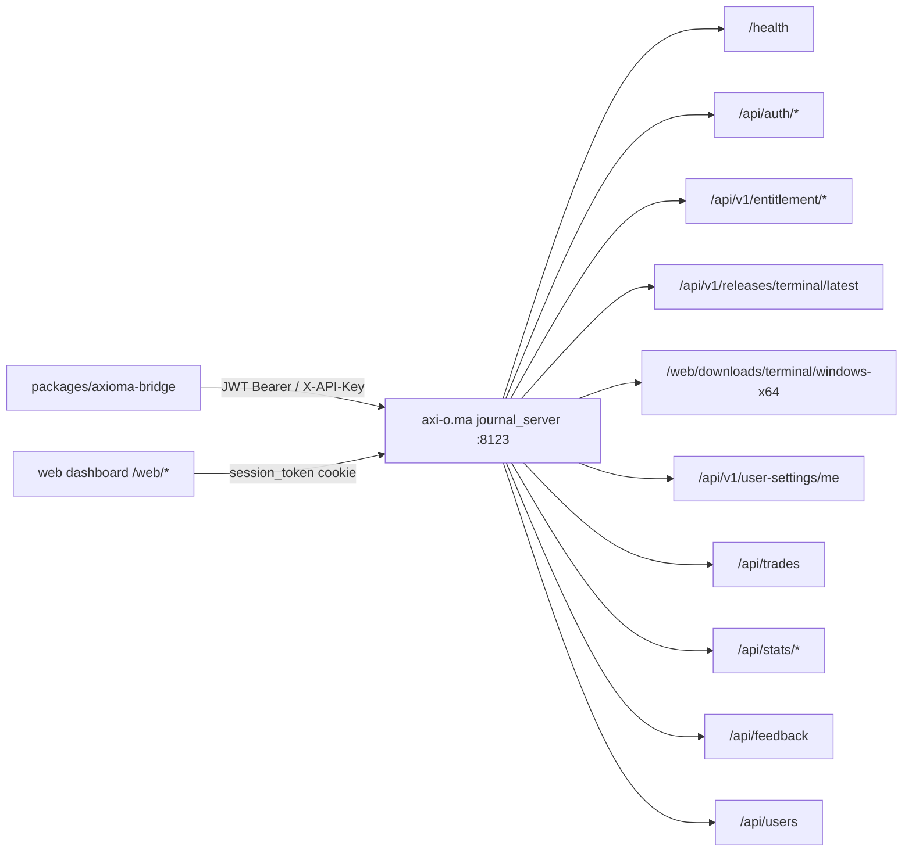

# CONTRACT: WTC ↔ Axioma Bridge

**Status:** Phase 3.14 - ES256 signer, JWKS route skeleton, POST-body journal handoff route acceptance, WTC-side
`POST /api/axioma/jti/consume`, `axioma_handoff_jti_revocations` replay store, and WTC-side one-time
download token/proxy handler exist and remain fail-closed. Local account-link persistence now stores only hash-only OTC
state for new flows, clears legacy plaintext OTC in migration `0010`, enforces active-link uniqueness locally, and exposes
local init/complete/unlink route handlers. `@wtc/axioma-bridge` now emits `typ: JWT`,
Unix-second `iat/nbf/exp`, `wtc_*` claims, and POST-body handoff output instead of token-bearing query
URLs. The WTC journal-handoff handler requires a linked Axioma user id before `open_journal` signing and
records JTI plus issuance audit atomically. The WTC download handler issues hash-only five-minute download
tokens and consumes them atomically, but the runtime Next adapter still has no live installer fetcher and
returns `501` instead of streaming from Axioma. **Production activation remains TARGET/B4:** EC P-256 key
provisioning, confirmed `journal_server` endpoint shapes, live download streaming, live account-link acceptance,
external replay-model confirmation, and enabled terminal CTAs are still not complete.
**Version:** 1.3.5 (2026-06-01)
**Related docs:**
- [`../ARCHITECTURE_DECISIONS.md`](../ARCHITECTURE_DECISIONS.md)
- [`../AXIOMA_HANDOFF_TOKEN_SPEC.md`](../AXIOMA_HANDOFF_TOKEN_SPEC.md)
- [`../SECURITY_MODEL.md`](../SECURITY_MODEL.md)
- [`../TERMINAL_PRODUCT_AREA.md`](../TERMINAL_PRODUCT_AREA.md)
- `packages/axioma-bridge/` in the monorepo

---

## 1. Ownership and parties

| Role | System | Tech |
|------|--------|------|
| **Owner / provider** | Axioma journal_server | FastAPI + PostgreSQL 15+, uvicorn `127.0.0.1:8123`, nginx proxy `axi-o.ma` |
| **Consumer** | WTC Ecosystem Platform | Next.js 15 / `packages/axioma-bridge` (server-side only) |
| **Desktop client** | Axioma Terminal | Electron 33 + React 18, package id `com.greenfield.terminal` (rename to Axioma — see §10) |

WTC communicates with `journal_server` exclusively through the WTC server side (`packages/axioma-bridge`). The browser/Next.js client never calls `axi-o.ma` directly. The Axioma desktop terminal also talks directly to `axi-o.ma` for its own session — that is a separate channel WTC does not intercept.

---

## 2. Hard boundary (non-negotiable)

> WTC license/account state **MAY gate** premium server-backed features: downloads, cloud journal access, indicators, support-bundle submission, and the "Open Axioma Journal" signed link.
>
> WTC license/account state **MUST NEVER gate** the local Axioma order-execution path: open, close, cancel, protective stop updates, position sizing, or any K.7 / sidecar typed-OK flow.
>
> `journal_server` itself encodes this rule in every entitlement endpoint and user-settings endpoint comment: _"Server / license MUST NEVER be on the local order path."_

This is an architecture lock inherited from `docs/architecture/MULTI_USER_LOCAL_KEY_DESIGN.md` inside the Axioma terminal source. WTC inherits and enforces it.

---

## 3. Authentication

### 3.1 journal_server auth chain

The server accepts credentials in this precedence order (see `app/api/deps.py::get_current_user`):

1. **JWT Bearer token** — `Authorization: Bearer <token>` obtained via `POST /api/auth/login`. HS256, configurable expiry (`JWT_EXPIRE_MINUTES`, default 1440 min = 24 h). Subject is the integer user id; role is embedded as a claim.
2. **Static API key** — `X-API-Key: <key>` matched against server-side `settings.API_KEY`. Maps to a named user row (`API_KEY_USERNAME`, default `"admin"`). Used for server-to-server calls.
3. **Session cookie** — `session_token` HTTP cookie containing a JWT. Used by the web dashboard UI. Not suitable for WTC server-side bridge calls.

Production requires `API_KEY` to be a non-empty value and `JWT_SECRET_KEY` to be a non-default value. Server refuses to start otherwise (AUDIT R4 / E-002 / E-003 check in `app/main.py::lifespan`).

### 3.2 WTC bridge auth strategy

WTC communicates with `journal_server` using **a dedicated service-account JWT** or a **static API key** stored in WTC's encrypted secret vault (AES-256-GCM KEK envelope, never plaintext in DB or logs). This is a **WTC server-only credential** — the browser never sees it.

For user-scoped calls (e.g. fetching a specific user's entitlement or journal), the bridge impersonates the user by using a WTC-issued Axioma Handoff Token (see В§6) to create or retrieve a matching Axioma user session, or the bridge maps the WTC user id to an Axioma user id stored in `axioma_account_links`.

**Rate limits applied by journal_server:**
- `POST /api/auth/login`: `5/minute` per remote address (slowapi)
- `POST /api/auth/register`: `5/minute` per remote address

The WTC bridge must never retry login in a tight loop. Implement exponential back-off with a max of 3 retries and circuit-break after 3 consecutive failures.

---

## 4. Endpoint / function boundary

All journal_server endpoints are served at `https://axi-o.ma` (nginx в†’ `127.0.0.1:8123`). The internal port is not reachable from outside the server.

### 4.1 Surface map



### 4.2 Endpoint inventory

| Surface | Method | Path | Auth required | WTC usage |
|---------|--------|------|--------------|-----------|
| Health | GET | `/health` | None | Integration health check; `{status:"ok",db:"connected",service:"journal-server"}` |
| Login | POST | `/api/auth/login` | None (public) | Bridge service-account login to obtain JWT |
| Register | POST | `/api/auth/register` | None (public) | Axioma account-link flow only — WTC triggers on user's behalf when linking |
| Current user | GET | `/api/auth/me` | JWT/key | Read Axioma user profile + optional entitlement sub-object |
| Update profile | PATCH | `/api/auth/me` | JWT | Update `strategy_family` |
| Entitlement enroll | POST | `/api/v1/entitlement/enroll` | JWT (admin role required) | WTC admin grants an Axioma entitlement after WTC payment confirmed |
| Entitlement status | GET | `/api/v1/entitlement/me` | JWT | Check user's Axioma entitlement status |
| Entitlement check | POST | `/api/v1/entitlement/check` | JWT | Same as GET /me, POST form |
| Entitlement revoke | POST | `/api/v1/entitlement/revoke` | JWT (admin) | WTC admin revokes entitlement on expiry/chargeback |
| Terminal release | GET | `/api/v1/releases/terminal/latest` | JWT | Fetch latest release metadata for WTC terminal page |
| Downloads page | GET | `/web/downloads` | session cookie | Web dashboard; not used by WTC API bridge |
| Download installer | GET | `/web/downloads/terminal/windows-x64` | session cookie | Authenticated download — WTC bridge generates a signed short-lived URL or proxies this route |
| User settings read | GET | `/api/v1/user-settings/me` | JWT | Read non-secret terminal preferences |
| User settings upsert | PUT | `/api/v1/user-settings/me` | JWT | Write non-secret terminal preferences |
| List trades | GET | `/api/trades?...` | JWT | Open Axioma Journal — scoped to user |
| Trade detail | GET | `/api/trades/{id}` | JWT | Single trade with attachments/notes |
| Stats | GET | `/api/stats/summary` | JWT | Aggregate stats for journal view |
| Stats v2 premises | GET | `/api/stats/premises` | JWT | Premise-aware analytics |
| Stats v2 timeframes | GET | `/api/stats/timeframes` | JWT | Timeframe analytics |
| Stats v2 exchanges | GET | `/api/stats/exchanges` | JWT | Exchange analytics |
| Stats v2 premise-outcomes | GET | `/api/stats/premise-outcomes` | JWT | Extended outcome distribution |
| Feedback create | POST | `/api/feedback` | JWT | Support handoff — user submits bug/proposal from WTC |
| Feedback list | GET | `/api/feedback` | JWT | Admin support queue |
| Feedback detail | GET | `/api/feedback/{id}` | JWT | Single ticket |
| Feedback update | PATCH | `/api/feedback/{id}` | JWT (admin for status/triage) | Admin triage |
| Users list | GET | `/api/users` | JWT (admin) | Admin diagnostics |
| Users detail | GET | `/api/users/{id}` | JWT | Own profile or admin |
| Changelog (web) | GET | `/web/changelog` | session cookie | Web dashboard; WTC bridge calls `/api/v1/releases/terminal/latest` instead |

**Feature flag:** `ENTITLEMENT_ENABLED` on the journal_server. When `False`, `/api/v1/entitlement/*` returns 404. WTC bridge must handle 404 gracefully and display "Entitlement system not yet active" rather than error state.

---

## 5. Request/response schemas

### 5.1 `POST /api/auth/login`

**Request:**
```json
{ "username": "string", "password": "string" }
```

**Response 200:**
```json
{ "access_token": "string", "token_type": "bearer" }
```

**Errors:** `401 Invalid credentials`

---

### 5.2 `GET /api/auth/me`

**Response 200:**
```json
{
  "id": 1,
  "username": "string",
  "display_name": "string|null",
  "role": "admin|tester|viewer",
  "is_active": true,
  "telegram_id": null,
  "strategy_family": "levels|elliott|smart_money",
  "created_at": "2026-01-01T00:00:00Z",
  "updated_at": "2026-01-01T00:00:00Z",
  "entitlement": {
    "id": 1,
    "user_id": 1,
    "plan": "axioma-pro",
    "tier": "basic|plus|team",
    "valid_until": "2027-01-01T00:00:00Z|null",
    "device_id": "string|null",
    "revoked_at": null,
    "created_at": "...",
    "updated_at": "..."
  } // null when ENTITLEMENT_ENABLED=false or no record
}
```

---

### 5.3 `GET /api/v1/entitlement/me` and `POST /api/v1/entitlement/check`

**Response 200:**
```json
{
  "status": "active|grace|expired|revoked|none",
  "plan": "string|null",
  "tier": "string|null",
  "valid_until": "ISO8601|null",
  "grace_days_remaining": 5,  // non-null only when status="grace"
  "note": "Informational only — server / license is NEVER on the local order path."
}
```

**Notes:**
- `ENTITLEMENT_GRACE_DAYS` (default 7): expired entitlements within this window show `"grace"` not `"expired"`.
- `valid_until: null` means perpetual / no expiry — status remains `"active"` unless revoked.
- `status: "none"` means no record — local trading is still available; only server-backed features are gated.

---

### 5.4 `GET /api/v1/releases/terminal/latest`

**Response 200:**
```json
{
  "product": "string",
  "platform": "windows-x64",
  "version": "1.2.3",
  "installer_name": "Axioma-Setup-1.2.3.exe",
  "sha256": "abc123...",
  "size_bytes": 123456789,
  "downloads_url": "https://axi-o.ma/web/downloads",
  "changelog_url": "https://axi-o.ma/web/changelog",
  "release_entry": {
    "version": "1.2.3",
    "date": "2026-05-29",
    "sections": [{"title": "Changed", "items": ["..."]}],
    "excerpt_items": ["item1", "item2", "item3"],
    "excerpt_text": "item1 • item2 • item3"
  }
}
```

**404:** Release manifest not present on server (operator hasn't deployed an installer yet).

WTC caches this response in `terminal_release_cache` table (TTL: 10 min). Stale cache is shown with a "last updated" timestamp; never silently discarded.

---

### 5.5 Download eligibility (signed URL / authenticated route)

Installers are **never served as raw public files**. There are two valid mechanisms:

**Option A (current server capability):** WTC bridge generates a short-lived signed Axioma session for the user and redirects them to `https://axi-o.ma/web/downloads/terminal/windows-x64` with a session cookie. The route requires `get_current_user_web` auth.

**Option B (recommended for WTC v1):** WTC bridge creates a time-limited one-time download token (stored in `terminal_download_events`), and the user clicks a link that routes through WTC's own proxy endpoint at `/api/axioma/download/terminal`. WTC proxy forwards with the service-account credential, streams the response. This keeps Axioma's internal URL opaque.

Option B is the default contract. Option A is a fallback if server-side proxy bandwidth is a concern. The choice is recorded in `docs/ARCHITECTURE_DECISIONS.md`.

**Response (bridge endpoint, WTC-side):**
```json
{
  "download_url": "https://app.wtc.example.com/api/axioma/download/terminal?token=<one-time-token>",
  "expires_at": "2026-05-29T12:05:00Z",
  "installer_name": "Axioma-Setup-1.2.3.exe",
  "sha256": "abc123...",
  "size_bytes": 123456789
}
```

Download token: single-use, TTL 5 min, stored in `terminal_download_events`. Consuming the token marks `consumed_at`. Expired or already-consumed tokens return `410 Gone`.

**Current WTC local shape (Phase 3.12):** `POST /api/axioma/download` issues the one-time proxy URL after CSRF,
session, entitlement, route-readiness, and release-template checks. `GET /api/axioma/download/terminal?token=...`
consumes the hash in `terminal_download_events` and can stream through an injected installer provider in local tests.
The production runtime adapter deliberately has no live installer provider yet; without one it returns
`501 bridge_not_implemented` before consuming the token. Browser CTAs remain disabled until a later live-activation phase.

---

### 5.6 `GET/PUT /api/v1/user-settings/me`

**Read response:**
```json
{
  "settings": {
    "rightPanelOpen": true,
    "tradePanelVisible": false,
    "positionToolSide": "LONG"
  },
  "last_device_id": "uuid-string|null",
  "updated_at": "ISO8601|null"
}
```

**Write request:**
```json
{
  "device_id": "uuid-string",
  "settings": { "rightPanelOpen": true },
  "client_updated_at": "ISO8601"
}
```

**Write rules:**
- Only whitelisted keys (`rightPanelOpen`, `tradePanelVisible`, `positionToolSide`) are persisted; others are silently dropped.
- Payload is scanned for forbidden credential tokens (case-insensitive substring match). Match в†’ `400 Bad Request`.
- Stale client clock в†’ `409 Conflict` with `stored_updated_at` and `client_updated_at`.
- Server NEVER stores exchange API keys. This is an architecture lock.

---

### 5.7 Trades + stats (Open Axioma Journal)

These endpoints are scoped to the authenticated user automatically. Non-admin users can only see their own trades. Admin sees all.

**Trades list query params:** `limit`, `offset`, `status`, `asset`, `timeframe`, `source`

**Stats v2 query params:** `date_from`, `date_to`, `market`, `setup_type`, `side`, `timeframe`, `exchange_code`

See §4.2 for full endpoint list. WTC surfaces these as a read-only journal view inside `/app/terminal`. WTC never writes trades into Axioma's journal — trade records are created by the Axioma terminal itself.

---

### 5.8 Feedback / support handoff

**Create feedback request:**
```json
{
  "feedback_type": "bug|proposal",
  "raw_text": "string (min 1 char)",
  "exchange_code": "string|null",
  "symbol": "string|null",
  "related_trade_id": 123,
  "timeframe": "string|null",
  "app_version": "string|null",
  "active_module": "string|null"
}
```

**Response 201:** `FeedbackResponse` (id, status, timestamps, user_display_name).

**Redaction rules before forwarding from WTC:**
- Strip any field value that matches the credential forbidden-token list.
- Strip `exchange_code` values longer than 20 chars.
- Never forward `raw_text` that contains strings matching patterns: `[A-Z0-9]{20,}` that look like API keys, or `-----BEGIN.*KEY-----` patterns.
- Redact before sending; log that redaction occurred (not what was redacted).

**Admin triage via `PATCH /api/feedback/{id}`:** only `status`, `category`, `severity`, `assigned_to`, `admin_notes`, `normalized_text` are mutable.

---

## 6. Open Axioma Journal: signed link

When a WTC user with an active `axioma_terminal` entitlement clicks "Open Axioma Journal":

1. WTC checks entitlement (fail-closed — must be `active` or `grace`).
2. WTC checks `axioma_account_links` for an existing Axioma user id mapped to the WTC user id.
3. If linked: WTC issues a short-lived WTC-signed handoff token containing ONLY the WTC user id, the linked Axioma user id, and the current entitlement state. WTC NEVER calls `/api/auth/login` on the user's behalf, and NEVER receives or stores the user's Axioma password or Axioma JWT.
4. WTC hands the token to Axioma (production: POST, not a long-lived GET token in browser history).
5. Axioma validates the handoff token (signature + claims, see В§6.1) and creates its OWN session for the linked Axioma user.

If not linked: WTC shows "Connect your Axioma account" and directs the user through the account-link flow (В§7).

### 6.1 Handoff token spec (reference)

Full specification in `docs/AXIOMA_HANDOFF_TOKEN_SPEC.md`. Summary:

| Field | Value |
|-------|-------|
| `iss` | `https://app.wtc.example.com` (exact-match; see AXIOMA_HANDOFF_TOKEN_SPEC) |
| `aud` | configured Axioma audience, default `axi-o.ma` |
| `sub` | WTC user id (string) |
| `wtc_axioma_user_id` | Linked Axioma user id (identity only — NEVER a JWT or password) |
| `wtc_entitlement` | `{ product_code, state, expires_at }` snapshot at issuance time |
| `jti` | UUID v4 — replay prevention |
| `iat` / `nbf` / `exp` | Unix-second timestamps; `exp` is Now + 5 minutes |
| `nonce` | CSRF nonce bound to the browser session |

The handoff token is:
- Signed with WTC's ES256 P-256 private key (or HS256 only in dev/test stub; never production).
- Single-use: Axioma records `jti` or calls WTC's Option A consume route and rejects reuse.
- Never stored in the browser history (issued as a POST redirect, not a GET).
- Revoked if WTC entitlement is revoked before expiry (Axioma polls `/api/v1/entitlement/check`).

**CSRF protection:** The `nonce` claim must match the WTC session's server-side CSRF token. Mismatched nonce в†’ reject the handoff.

**Audit events:** current WTC codes are `axioma.account_link_init`, `axioma.handoff_jti_consume`,
`axioma.handoff_jti_replay`, and `axioma.handoff_jti_revoke`.

---

## 7. Account / device link state

Axioma stores only `{ serverUrl, jwt, cached_entitlement }` in its local license vault (`license.enc`, Electron `safeStorage`). WTC stores only the Axioma user id and link metadata in `axioma_account_links`.

### 7.1 Account link flow (one-time code)

```mermaid
sequenceDiagram
  participant U as User (WTC browser)
  participant W as WTC Platform
  participant A as Axioma Desktop / Web
  participant JS as journal_server

  U->>W: Click "Link Axioma account"
  W->>W: Generate short-lived one-time code (OTC)\nstored only as link_nonce_hash with state=pending\nTTL 5 min
  W-->>U: Show OTC once for terminal entry
  U->>A: Enter OTC in terminal
  A->>JS: POST /api/auth/login (user's OWN Axioma credentials, entered in the terminal — never sent to WTC)
  JS-->>A: JWT (stored only locally by the terminal)
  A->>W: POST /api/axioma/account-link/complete { code, axioma_user_id } (service-auth envelope; no query params)
  W->>W: Validate OTC not expired, not used\nStore axioma_account_links row\nMark OTC consumed
  W-->>A: 200 OK { linked: true }
  A->>A: Store { serverUrl, jwt, cached_entitlement } in license.enc
```

**OTC properties:**
- Cryptographically random 32-byte token, base64url-encoded.
- TTL 5 minutes.
- Single-use.
- Bound to WTC session user id.
- Consumed status written atomically.

**What WTC stores in `axioma_account_links`:**
- `wtc_user_id` (FK в†’ users)
- `axioma_user_id` (integer from journal_server users table)
- `axioma_username` (display only)
- `linked_at`
- `last_verified_at`
- `state` (`pending | linked | revoked | expired | error | not_linked`)
- `link_nonce_hash` (SHA-256 hash of OTC; OTC itself is discarded after issue/consume)
- `code_expires_at`, `consumed_at`, `revoked_at`

**Current WTC local shape (Phase 3.14):** migration `0010` adds the hash/timestamp columns and partial active-link
uniqueness indexes, clears legacy plaintext `one_time_code`, and revokes pending legacy rows. `@wtc/db` can issue, consume,
read, and revoke hash-only OTC rows locally. The local HTTP routes exist at `/api/axioma/account-link/init`,
`/api/axioma/account-link/complete`, and `/api/axioma/account-link`; completion is service-bearer/JSON-body only and rejects
query strings. Terminal CTAs remain disabled until live Axioma acceptance and browser action gates are scoped and observed.

**What WTC never stores:** Axioma user password, raw JWT, exchange keys.

### 7.2 Link status

| Status | Meaning | UI |
|--------|---------|-----|
| `pending` | OTC issued, not yet consumed | "Waiting for Axioma to connect..." |
| `linked` | Successfully linked | "Axioma account connected" |
| `not_linked` | No active link | "Connect Axioma account" |
| `revoked` / `expired` | Previous link or pending code is no longer usable | "Connect Axioma account" |

---

## 8. Error envelope

All journal_server errors follow FastAPI's default shape:

```json
{
  "detail": "string OR object"
}
```

Common HTTP status codes from journal_server:

| Code | Meaning | WTC bridge handling |
|------|---------|-------------------|
| 200/201 | Success | Forward response |
| 400 | Validation / forbidden payload | Surface as validation error |
| 401 | Not authenticated / expired token | Refresh service-account JWT, retry once |
| 403 | Admin required | Surface as permission error |
| 404 | Resource not found / feature flag off | Return null/not-found state; do NOT propagate 404 to WTC UI as error |
| 409 | Stale client (user-settings) | Surface "settings out of date, pulling latest" |
| 410 | Download token expired/consumed | Surface "download link expired, request a new one" |
| 413 | Upload too large | Surface file size error |
| 415 | Unsupported media type | Surface as attachment type error |
| 422 | Pydantic validation error | Surface field-level errors |
| 429 | Rate limit exceeded | Back-off, surface "too many requests" |
| 503 | DB disconnected (health endpoint) | Surface as Axioma service degraded |

**WTC bridge error envelope (returned to WTC frontend):**
```json
{
  "code": "AXIOMA_BRIDGE_ERROR",
  "message": "human-readable message",
  "axioma_status": 404,
  "retry_eligible": false,
  "context": "entitlement|release|download|journal|link|support"
}
```

Never forward raw Axioma error detail to the browser. Sanitize first.

---

## 9. Idempotency

| Operation | Idempotency |
|-----------|------------|
| `GET /api/auth/me` | Idempotent (read) |
| `GET /api/v1/entitlement/me` | Idempotent (read) |
| `GET /api/v1/releases/terminal/latest` | Idempotent (read), cache-safe |
| `POST /api/v1/entitlement/enroll` | **Not idempotent** — repeated calls create new rows. WTC must check existing before enrolling. |
| `POST /api/v1/entitlement/revoke` | Idempotent — revoking an already-revoked row is safe (no-op at service level; returns the row) |
| `PUT /api/v1/user-settings/me` | Last-write-wins; idempotent for same payload |
| `GET /api/trades` | Idempotent (read) |
| `POST /api/feedback` | **Not idempotent** — creates a new row. WTC should prevent double-submit on UI. |
| Download token create | **Not idempotent** — creates a new single-use token each time |
| OTC link code create | **Not idempotent** — creates a new code; old pending codes must be revoked or expire |

---

## 10. Rate limits and timeouts

### journal_server-side rate limits (slowapi, keyed by remote IP)

| Endpoint | Limit |
|----------|-------|
| `POST /api/auth/login` | 5/minute |
| `POST /api/auth/register` | 5/minute |
| All other endpoints | No server-side per-endpoint limit observed; global uvicorn worker limits apply |

### WTC bridge-side limits (enforced by `packages/axioma-bridge`)

| Operation | WTC timeout | WTC retry |
|-----------|------------|-----------|
| Health check | 5 s | No retry (just mark degraded) |
| Auth / JWT refresh | 5 s | 3 retries with exponential back-off (1s, 2s, 4s) |
| Entitlement check | 5 s | 2 retries |
| Release metadata fetch | 10 s | 1 retry; serve cached on failure |
| Download proxy stream | 60 s | No retry (stream in progress) |
| User settings read/write | 5 s | 1 retry |
| Trades / journal read | 10 s | 1 retry |
| Stats read | 15 s | 1 retry |
| Feedback create | 5 s | No retry (user action; show error) |
| Handoff token issue | 3 s | No retry |
| OTC link create/consume | 5 s | 1 retry |

**Circuit breaker:** After 5 consecutive timeouts or 5xx errors within 60 seconds, mark the Axioma bridge as `degraded` in `integration_health_checks`. Retry circuit opens after 30 s. Show "Axioma service temporarily unavailable" in UI; do not error-blank the whole `/app/terminal` page.

---

## 11. Mock-vs-real status

| Functionality | Status | Notes |
|---------------|--------|-------|
| Health check | Ready to implement | Straightforward HTTP GET |
| Entitlement read (`/api/v1/entitlement/me`) | Ready | Feature flag `ENTITLEMENT_ENABLED` must be `True` on server |
| Entitlement enroll / revoke | Ready (admin-only) | Must be called after WTC billing confirms payment |
| Release metadata fetch | Ready | Requires `release-manifest.json` deployed on server |
| Download proxy (Option B) | Local WTC token/proxy handler accepted; live streaming blocked | `POST /api/axioma/download` issues a hash-only one-time token and `GET /api/axioma/download/terminal` consumes it in local tests with an injected installer provider. Runtime live Axioma streaming remains unwired and returns fail-closed `501`. |
| Open Axioma Journal | Local WTC route accepted; live activation blocked | Handoff token spec **is written** (`AXIOMA_HANDOFF_TOKEN_SPEC.md`, ES256); ES256/JWKS signing primitives, POST-body handoff output, linked-account-required route handler, JTI replay row, and issuance audit are implemented locally. Browser CTA enablement and live Axioma `/wtc-handoff` acceptance remain B4. |
| Account / device link (OTC) | Local persistence hardened; routes not implemented | `axioma_account_links` now has hash-only OTC fields, consume/revoke/link timestamps, and active-link uniqueness. Account-link init/complete/unlink routes and live Axioma acceptance remain B4. |
| User settings read/write | Ready | Available now on journal_server |
| Trades / journal | Ready (read-only) | User must be linked; admin can read all |
| Stats v2 | Ready (read-only) | Same auth requirements |
| Feedback / support | Ready | Redaction pipeline needed on WTC side |
| **Mock adapter** | Implemented | `packages/axioma-bridge/src/bridge.ts` (`createMockAxiomaBridge`) returns static product state shaped like the schemas above; used in dev. The HS256 handoff signer in `handoff.ts` is a documented DEV STUB — production must use ES256. |

---

## 12. Package rename risk

The Axioma terminal's current package identity is:
- Electron: `com.greenfield.terminal`
- App title: `"Trading Terminal"` (in some configs)
- Intended rename: `Axioma` / `com.axioma.terminal`

This is a **deliberate migration**, not a blind find-and-replace. Risks:
- Electron `safeStorage` keys are application-id-scoped. Renaming the app id breaks all locally encrypted data (license vault, exchange key encryptions) for existing users. Migration requires a decryption + re-encryption pass under the new app id at first launch.
- Auto-updater URLs and code-signing certificates must be updated.
- Any WTC-side deep-link scheme (`axioma://` vs `greenfield://`) must be agreed before announcing.

**WTC bridge impact:** WTC stores the `product` string returned by `GET /api/v1/releases/terminal/latest` (currently populated from `release-manifest.json`). If the manifest's `product` field changes during the rename, WTC's `terminal_release_cache` must be invalidated and the UI label must not hardcode the old name. Use the server's `product` field as the display name once the rename is complete.

Track this in `docs/OPEN_QUESTIONS.md` under "Axioma rename migration".

---

## 13. Required tests before production wiring

### Unit tests (`packages/axioma-bridge`, Vitest)

| Test | Description |
|------|-------------|
| `entitlement-status-mapper.test.ts` | Maps `none/active/grace/expired/revoked` to WTC entitlement states; verifies `grace_days_remaining` propagation |
| `release-metadata-parser.test.ts` | Parses `release_entry` sections; handles missing `release_entry` (server returns null) |
| `download-token.test.ts` | OTC create/consume lifecycle; expired token returns 410; reuse returns 410 |
| `handoff-token.test.ts` | Token signature, expiry, nonce match, single-use, missing claims all return errors |
| `otc-link.test.ts` | OTC TTL, single-use, bound to WTC user id, invalid OTC returns 400 |
| `error-envelope.test.ts` | Each Axioma HTTP error code maps to the correct `AxiomaBridgeError` code |
| `forbidden-credential-scan.test.ts` | Feedback redaction: payloads with API-key-like strings are stripped |
| `circuit-breaker.test.ts` | 5 consecutive errors в†’ `degraded`; circuit opens after 30 s |
| `rate-limit-backoff.test.ts` | 429 response triggers exponential back-off |
| `settings-payload-whitelist.test.ts` | Non-whitelisted keys dropped; forbidden tokens rejected 400 |

### Integration tests (`tests/integration/`, Vitest + test DB)

| Test | Description |
|------|-------------|
| `axioma-bridge-health.integration.ts` | Health check returns `{status:"ok"}` or `{status:"degraded"}` |
| `axioma-entitlement-sync.integration.ts` | WTC billing webhook в†’ enroll on Axioma в†’ status read back matches |
| `axioma-link-flow.integration.ts` | Full OTC flow: issue в†’ consume в†’ `axioma_account_links` row created |
| `axioma-release-cache.integration.ts` | Cache hit within TTL; cache miss fetches from server |
| `axioma-download-proxy.integration.ts` | Token issuance, proxy stream, token consumed after use |
| `axioma-feedback-redaction.integration.ts` | Feedback forwarded without credential patterns |

### E2e tests (Playwright)

| Test | Description |
|------|-------------|
| `terminal-page-entitlement-states.e2e.ts` | UI shows correct state for each of: `none`, `active`, `grace`, `expired`, `revoked` |
| `terminal-page-no-release.e2e.ts` | UI shows "No release available" when server returns 404 |
| `terminal-page-service-degraded.e2e.ts` | Circuit breaker active в†’ UI shows degraded banner, not blank page |
| `axioma-account-link-flow.e2e.ts` | OTC displayed в†’ consumed в†’ "Connected" state |
| `download-button-states.e2e.ts` | Download blocked when entitlement=expired; enabled when active |
| `feedback-submit.e2e.ts` | Feedback form redacts and submits; shows ticket id |

---

## 14. DB tables owned by this contract (WTC side)

These live in `packages/db` under the `Axioma` bounded context (see seed doc):

| Table | Purpose |
|-------|---------|
| `axioma_account_links` | Maps WTC user в†’ Axioma user id; OTC state; link status |
| `terminal_release_cache` | Cached release metadata from `/api/v1/releases/terminal/latest`; TTL-checked by worker |
| `terminal_download_events` | One-time download token; consumed_at; WTC user + Axioma user |
| `terminal_license_events` | Audit log of WTC-issued entitlement enroll/revoke calls to Axioma |

---

## 15. Worker responsibilities

The `apps/worker` background job handles:

| Job | Schedule | Description |
|-----|----------|-------------|
| `axioma-release-sync` | Every 10 min | Fetch `/api/v1/releases/terminal/latest`; update `terminal_release_cache` |
| `axioma-entitlement-expiry-sync` | Hourly | For each `active` WTC axioma_terminal entitlement near expiry: call Axioma revoke if WTC entitlement is expired/revoked |
| `axioma-health-check` | Every 5 min | Call `/health`; update `integration_health_checks`; flip circuit breaker |
| `axioma-download-token-cleanup` | Hourly | Delete expired unconsumed download tokens from `terminal_download_events` |

---

## 16. Audit events

All events written to `audit_logs` table:

| Event | Trigger |
|-------|---------|
| `axioma.entitlement.enroll` | WTC calls Axioma enroll for a user |
| `axioma.entitlement.revoke` | WTC calls Axioma revoke |
| `axioma.link.otc_issued` | OTC generated for account link |
| `axioma.link.otc_consumed` | OTC consumed; link created |
| `axioma.link.otc_expired` | OTC expired without use |
| `axioma.link.unlinked` | User explicitly unlinked Axioma account |
| `axioma.account_link_init` | Signed handoff token / link code issued |
| `axioma.handoff_jti_consume` | WTC Option A consume route marks a JTI used |
| `axioma.handoff_jti_replay` | WTC Option A consume route rejects replay/invalid JTI |
| `axioma.handoff_jti_revoke` | WTC revokes outstanding handoff JTIs |
| `axioma.download_request` | WTC one-time download URL issued; raw token/hash omitted |
| `terminal.download` | WTC download token consumed or rejected; raw token/hash omitted |
| `axioma.feedback.submitted` | Feedback forwarded to Axioma (after redaction) |
| `axioma.bridge.degraded` | Circuit breaker opened |
| `axioma.bridge.recovered` | Circuit breaker closed |

Audit log entries NEVER include: exchange credentials, raw JWTs, download token values, OTC values, or personal financial data.

---

## 17. Part 6 — Product area design

> Added: 2026-05-30 by ecosystem-axioma-bridge-auditor (Phase 2).
> All UI sections labelled dev-placeholder where applicable.
> Companion doc: `docs/TERMINAL_PRODUCT_AREA.md`.

---

### 17.1 /products/axioma-terminal — public product page content model

This is the unauthenticated marketing/information page at route `/products/terminal`
(product code `axioma_terminal`, slug `terminal`).

**Purpose:** Inform prospective and existing users about what Axioma Terminal is, how it connects to
their WTC account, and what is gated. Must not imply WTC controls trading or holds exchange keys.

#### Hero / above-the-fold

- Product name: "Axioma Terminal" (display name from WTC side; see §12 for rename risk — do not hardcode)
- Status badge: `Flagship product` (gold tone) + availability status from `PRODUCT_AVAILABILITY`
- Tagline: "A professional desktop trading terminal with an integrated cloud journal and analytics suite — licensed and delivered through your WTC account."
- No hero blob, no gamification, no placeholder illustrations that imply live data

#### What it is — three-panel description

Panel 1 — Desktop terminal:
- "Axioma Terminal is a standalone Electron desktop application. It runs locally on your machine and connects to your exchange directly. WTC does not sit in your order path."
- Highlights: Lightweight Charts v5 execution view, local order management, OS-level encrypted exchange keys (Electron safeStorage), offline-capable

Panel 2 — Cloud journal:
- "Every trade you execute in Axioma Terminal can be logged to the Axioma cloud journal. WTC provides a direct link to your personal journal dashboard — no separate login required once your account is linked."
- Highlights: trade log with premise/timeframe/outcome tagging, stats v2 analytics (win rate, expectancy by setup, premise outcomes), feedback/support bridge

Panel 3 — WTC integration:
- "Your WTC account manages your Axioma license, delivers authenticated downloads, and links your account so you can open your journal in one click. WTC never executes orders, never holds your exchange keys, and the terminal runs independently even if WTC is unreachable."
- Highlights: license/entitlement state, signed download delivery, account link with one-time code, support handoff

#### Feature highlights list (structured)

```
feature_highlights: [
  { label: "Local order execution",      detail: "Connects directly to your exchange — WTC is never in the order path" },
  { label: "Encrypted exchange keys",    detail: "Keys stored using OS-level Electron safeStorage; never transmitted to WTC" },
  { label: "Cloud journal",             detail: "Log trades to the Axioma cloud; view analytics from anywhere" },
  { label: "Stats v2 analytics",        detail: "Win rate, expectancy, premise outcomes, timeframe breakdown" },
  { label: "Signed downloads",          detail: "Authenticated installer delivery — no guessable public URLs" },
  { label: "Account link",              detail: "One-time code flow; WTC stores only your Axioma user id, never your Axioma password" },
  { label: "Release notes",            detail: "Latest version and changelog surfaced in your WTC dashboard" },
  { label: "Support bridge",           detail: "Submit Axioma feedback from WTC — redacted before forwarding" },
]
```

#### Screenshots / media section

- Slot for 2–3 screenshots (desktop terminal UI, journal dashboard, stats view)
- Placeholder: `[SCREENSHOT: Axioma Terminal execution view — to be provided by Axioma team]`
- Images must NOT show real account balances, real trade data, or real exchange credentials
- Alt text required for each image

#### Access / license model section

- "Axioma Terminal is available on the `axioma_monthly` and `axioma_yearly` plans, and is included in the `bundle_pro` bundle."
- "Access is managed through WTC entitlements. Your license status is always visible on your terminal dashboard once logged in."
- Grace period: "If your subscription lapses, a 7-day grace period allows you to renew before access to server-backed features (journal, downloads, support) is suspended. The terminal itself continues to function locally during and after grace."
- **Hard boundary note (must be visible):** "WTC never gates your local order execution. You can trade with Axioma Terminal regardless of your WTC subscription status."

#### How it connects to your WTC account — account-link explainer

- "When you first activate Axioma Terminal through WTC, you will be shown a short-lived one-time code."
- "Enter this code in the Axioma Terminal app (or click the deep link). Axioma exchanges the code server-side and establishes a secure link. WTC stores only your Axioma account identifier — never your Axioma password, never your exchange keys."
- "Once linked, clicking 'Open Journal' in your WTC dashboard opens your personal Axioma journal without a separate login." (production: signed handoff token; dev-stub today — see §17.3)
- Diagram: simplified version of the account-link flow in В§7.1 above

#### CTA section

- Primary CTA: "Create WTC account" в†’ `/register`
- Secondary CTA: "See pricing" в†’ `/pricing`
- Tertiary (for logged-in users, rendered client-side): "Go to your terminal dashboard" в†’ `/app/terminal`

---

### 17.2 /app/terminal — logged-in product dashboard content model

This is the authenticated page at route `/app/terminal` for users with a WTC session.
The existing implementation is at `apps/web/src/app/(app)/app/terminal/page.tsx`.

**Purpose:** Show the user's live product state, gate premium actions on entitlement,
surface the mock bridge state clearly, and never hide degraded or placeholder status.

The page is a **server component** that calls `getBridge().getProductState()` with the WTC user's
entitlement status. All placeholder/mock labels are displayed without exception.

#### Page layout (sections in order)

**Section 1 — Header + entitlement status**
- Title: "Axioma Terminal" (kicker: "Product")
- Entitlement status pill (ok/bad/neutral) — sourced from `access.allowed` / `reasonLabel(access.reason)`
- Copy: "A first-class WTC product. WTC owns the product experience — license, account-link, release, download, journal — and never copies the Axioma runtime or touches local order execution."

**Section 2 — Dev/placeholder warning banner** (when `axiomaBridgeIsDev()` is true)
- Severity: info
- Title: "Axioma bridge: dev / placeholder"
- Detail: "No live Axioma bridge is configured (AXIOMA_BRIDGE_API_TOKEN unset). The Download and Open-Journal actions below are placeholders — they do NOT point at a real production endpoint."
- This banner MUST appear whenever the mock bridge is active. It must not be dismissible.

**Section 3 — Bridge error banner** (when bridge call throws)
- Severity: error
- Title: "Axioma bridge unavailable"
- Detail: "Could not reach the Axioma bridge. Product state is temporarily unavailable — please retry shortly."

**Section 4 — No entitlement warning** (when `!access.allowed` and no bridge error)
- Severity: warning
- Title: "License {reasonLabel(access.reason)}"
- Detail: "Activate an Axioma plan in billing to unlock downloads, the cloud journal, and premium server features. Local terminal trading is never gated by WTC."

**Section 5 — License & account card** (two-column grid, left card)

Fields:
- License status: `state.license.status` — shown as a tone-mapped StatusPill (active=ok, grace=warn, expired/revoked=bad, none=neutral)
- Plan code: `state.license.planCode` if present, else "—"
- Valid until: `fmtDate(state.license.validUntil)` — "Perpetual" when null
- Account link: `state.accountLink.state` — linked/pending/not_linked as StatusPill
- If `state.accountLink.state === 'linked'`: show `state.accountLink.axiomaUserId` (display only)

Actions:
- "Connect Axioma account" button — disabled when `!access.allowed || isDev`; label appends "(dev placeholder)" when `isDev`
- Explainer footnote: "Device link uses a one-time code Axioma exchanges server-side. WTC never receives exchange keys or the Axioma JWT."

**Section 6 — Latest release card** (two-column grid, right card)

Fields:
- Version: `v{state.release.version}` + channel badge (stable=gold, beta=warn)
- Published: `fmtDate(state.release.publishedAt)`
- Min supported: `state.release.minSupportedVersion`
- Release notes: `state.release.notes` as bullet list

No-release state: "No release available" — shown when bridge returns null release. Must not error.

Actions:
- Download button: disabled and labelled "(dev placeholder)" when `isDev`; disabled with "Download (needs license)" when `!access.allowed`; primary action when active and real bridge
- Download button title attribute explains placeholder state to screen readers / tooltip

**Section 7 — Journal & support card** (full width)

Actions:
- "Open Axioma Journal" — disabled when `!access.allowed || isDev`; labelled "(dev placeholder)" in dev mode
- "FAQ" link в†’ `state.support.faqUrl`
- "Support" link в†’ `state.support.contactUrl`
- Footnote: "In production, 'Open Journal' POSTs a short-lived, single-use, audience-bound handoff token to Axioma — never a long-lived GET token placed in browser history — and gates server features only, never local order execution."

**Section 8 — Docs / training links** (optional, static)

Proposed links (content TBD by operator):
- "Getting started guide" — placeholder, no URL yet
- "Keyboard shortcuts" — placeholder
- "Journal tagging guide" — placeholder
- All placeholder links are rendered as disabled or "(coming soon)" until real URLs exist

#### Entitlement state в†’ UI state mapping

| Entitlement state | Download button | Open Journal button | Account link button | Warning banner |
|------------------|----------------|--------------------|--------------------|---------------|
| `active` (real bridge) | Primary, enabled | Primary, enabled | Enabled | None |
| `active` (dev/mock bridge) | Ghost, disabled, "(dev placeholder)" | Ghost, disabled, "(dev placeholder)" | Disabled, "(dev placeholder)" | "dev placeholder" info banner |
| `grace` | Ghost, enabled with warning | Ghost, enabled with warning | Enabled | "Grace period — renew soon" warning |
| `expired` | Disabled, "needs license" | Disabled, "needs license" | Disabled | License warning |
| `revoked` | Disabled, "needs license" | Disabled | Disabled | License warning |
| `none` | Disabled, "needs license" | Disabled | Disabled | License warning |
| Bridge degraded | Disabled, "service unavailable" | Disabled | Disabled | Bridge error banner |

---

### 17.3 Mock bridge view shape — typed AxiomaProductView

The pages consume a typed view object assembled from `AxiomaProductState` (В§17.3.1) plus
WTC-side context. This is the shape the UI actually binds against, derived from the mock bridge today
and the real bridge in future.

#### 17.3.1 Current bridge type (`packages/axioma-bridge/src/bridge.ts`)

The existing `AxiomaProductState` type in the mock bridge is:

```typescript
// Source of truth: packages/axioma-bridge/src/bridge.ts
export type LicenseStatus = 'active' | 'inactive' | 'expired' | 'none';
export type AccountLinkState = 'linked' | 'pending' | 'not_linked';

export interface TerminalRelease {
  version: string;
  channel: 'stable' | 'beta';
  publishedAt: number;           // Unix ms
  minSupportedVersion: string;
  notes: string[];
}

export interface AxiomaProductState {
  license: {
    status: LicenseStatus;
    planCode?: string;
    validUntil: number | null;   // Unix ms; null = perpetual
  };
  accountLink: {
    state: AccountLinkState;
    axiomaUserId?: string;
  };
  release: TerminalRelease;
  download: {
    eligible: boolean;
    requiresAuth: true;          // always true — never a raw public URL
    url?: string;                // present only when eligible; opaque signed token URL
  };
  journal: { reachable: boolean };
  support: { faqUrl: string; contactUrl: string };
}
```

**Gap note:** `LicenseStatus` in the bridge (`'active' | 'inactive' | 'expired' | 'none'`) does not yet
include `'grace'` or `'revoked'`. The journal_server entitlement endpoint returns
`active | grace | expired | revoked | none`. The bridge type must be extended before real wiring.

#### 17.3.2 Target extended view type (propose for platform-architect to adopt)

```typescript
// TARGET — not yet in packages/axioma-bridge/src/bridge.ts
// Propose this extension when wiring the real bridge.
// DEV-PLACEHOLDER: mock bridge returns a subset today.

export type AxiomaLicenseStatus =
  | 'active'
  | 'grace'
  | 'expired'
  | 'revoked'
  | 'none'
  | 'unknown';   // bridge degraded / not yet fetched

export interface AxiomaGracePeriod {
  daysRemaining: number;
}

export interface AxiomaReleaseSection {
  title: string;
  items: string[];
}

export interface AxiomaReleaseEntry {
  version: string;
  date: string;             // ISO date string
  sections: AxiomaReleaseSection[];
  excerptItems: string[];
  excerptText: string;
}

export interface AxiomaTerminalRelease {
  product: string;          // from manifest — do NOT hardcode; changes on rename
  platform: string;
  version: string;
  installerName: string;
  sha256: string;
  sizeBytes: number;
  releaseEntry: AxiomaReleaseEntry | null;
  publishedAt: string;      // ISO date string
  minSupportedVersion: string;
  channel: 'stable' | 'beta';
}

export interface AxiomaDownloadEligibility {
  eligible: boolean;
  requiresAuth: true;       // architecture constant
  downloadUrl?: string;     // WTC proxy URL, present only when eligible; short-lived
  expiresAt?: string;       // ISO timestamp of download token expiry
  installerName?: string;
  sha256?: string;
  sizeBytes?: number;
}

export interface AxiomaAccountLink {
  state: 'linked' | 'pending' | 'not_linked';
  axiomaUserId?: number;
  axiomaUsername?: string;  // display only
  linkedAt?: string;
  lastVerifiedAt?: string;
}

export interface AxiomaProductView {
  // --- bridge metadata ---
  bridgeMode: 'mock' | 'real';      // 'mock' drives dev-placeholder labels
  bridgeHealthy: boolean;

  // --- license ---
  license: {
    status: AxiomaLicenseStatus;
    planCode: string | null;
    validUntil: string | null;      // ISO timestamp; null = perpetual
    gracePeriod: AxiomaGracePeriod | null;  // non-null only when status='grace'
  };

  // --- account link ---
  accountLink: AxiomaAccountLink;

  // --- release ---
  release: AxiomaTerminalRelease | null;  // null = no release manifest on server

  // --- download ---
  download: AxiomaDownloadEligibility;

  // --- journal ---
  journal: {
    reachable: boolean;
    openJournalAvailable: boolean;  // requires linked + active/grace + real bridge
  };

  // --- support ---
  support: {
    faqUrl: string;
    contactUrl: string;
  };
}
```

**Construction rule:** The page assembles `AxiomaProductView` from:
1. `bridgeMode`: `'mock'` when `axiomaBridgeIsDev()` returns true, `'real'` otherwise
2. `bridgeHealthy`: `false` when the bridge call throws or circuit breaker is open
3. All other fields: populated from `AxiomaProductState` (mock or real)
4. `journal.openJournalAvailable`: `accountLink.state === 'linked' && license.status in ['active','grace'] && bridgeMode === 'real'`

When `bridgeHealthy === false`, every action button is disabled and the bridge-error banner is shown.
When `bridgeMode === 'mock'`, every action button that touches Axioma is disabled and labelled with
"(dev placeholder)" — the label is a content string in the button, not CSS-only hiding.

#### 17.3.3 Mock data values (current mock bridge)

The `createMockAxiomaBridge` in `packages/axioma-bridge/src/bridge.ts` returns:

```typescript
// Current mock values (bridge.ts SAMPLE_RELEASE + getProductState):
{
  bridgeMode: 'mock',
  bridgeHealthy: true,
  license: {
    status: hasEntitlement ? 'active' : 'none',
    planCode: hasEntitlement ? 'axioma_yearly' : null,
    validUntil: hasEntitlement ? <now + 300 days ms> : null,
    gracePeriod: null,
  },
  accountLink: { state: 'not_linked' },
  release: {
    product: 'Axioma Terminal',   // placeholder — will come from manifest on real bridge
    platform: 'windows-x64',
    version: '0.1.0',
    channel: 'beta',
    publishedAt: '2026-05-20',
    minSupportedVersion: '0.1.0',
    installerName: 'Axioma-Setup-0.1.0.exe',
    sha256: '',                   // not populated in mock
    sizeBytes: 0,                 // not populated in mock
    releaseEntry: null,
    excerptText: '',
  },
  download: {
    eligible: hasEntitlement,
    requiresAuth: true,
    downloadUrl: hasEntitlement ? '<baseUrl>/releases/axioma-setup-0.1.0.exe' : undefined,
  },
  journal: { reachable: true, openJournalAvailable: false },  // false — mock bridge
  support: { faqUrl: '<baseUrl>/faq', contactUrl: '<baseUrl>/support' },
}
```

Note: the mock `downloadUrl` is a plain base URL path, not a real signed proxy URL.
This will throw/break if a real download is attempted — which is intentional (the download
button is disabled in dev mode).

---

### 17.4 Future bridge/SSO activation shape (partly implemented, still B4-gated)

> This section describes the production-ready activation path. ES256/JWKS signing primitives,
> POST-body handoff output, JTI persistence, the WTC-side consume route, the local download token/proxy
> handler, and local account-link routes exist. Live Axioma endpoint confirmation, browser CTA actions, installer streaming, live account-link acceptance, and production key
> provisioning are still B4.

#### 17.4.1 ES256/JWKS production handoff (TARGET)

When the real bridge is activated, the "Open Journal" flow becomes:

1. WTC server: calls the current handoff builder/signing path in `packages/axioma-bridge/src/{handoff,es256,signer}.ts`
   - Requires `AXIOMA_HANDOFF_SIGNING_KEY` in env (PEM)
   - Requires `AXIOMA_HANDOFF_KEY_ID` in env
   - Signs with ES256 (ECDSA P-256) — not HS256
2. WTC server: return a form action (POST) pointing at `https://axi-o.ma/wtc-handoff`
3. Browser: submits the form (POST — not GET, token never in URL history)
4. Axioma: validates token per `AXIOMA_HANDOFF_TOKEN_SPEC.md В§Axioma Validation Requirements`
   - Verifies ES256 signature via JWKS at `https://app.wtc.example.com/.well-known/axioma-jwks.json`
   - Verifies all 13 validation steps (iss, aud, exp, nbf, entitlement_state, jti replay, nonce)
5. Axioma: establishes session в†’ redirects to journal dashboard

**JWKS endpoint (CURRENT):** `GET https://app.wtc.example.com/.well-known/axioma-jwks.json`
returns a public ES256 JWKS only when `AXIOMA_HANDOFF_SIGNING_KEY` and `AXIOMA_HANDOFF_KEY_ID` are configured
and parseable; otherwise it returns `503` with `Cache-Control: no-store`.

**Dev-stub current state:** `signHandoffToken` in `handoff.ts` uses HS256 only in dev/test and throws if
`NODE_ENV === 'production'`. The production path is ES256 through `createEs256Signer` / `resolveHandoffSigner`.

#### 17.4.2 Real bridge activation checklist (TARGET)

Before `bridgeMode` can be set to `'real'` in production:

- [ ] `AXIOMA_BRIDGE_API_TOKEN` set (WTC service-account credential for journal_server)
- [ ] `ENTITLEMENT_ENABLED=True` on journal_server
- [ ] `release-manifest.json` deployed on journal_server
- [x] `axioma_account_links` hash-only OTC fields and active-link uniqueness migrated locally
- [x] `terminal_release_cache`, `terminal_download_events`, `terminal_license_events` tables migrated locally
- [x] One-time download token fields/indexes added to `terminal_download_events` (`token_hash`, expiry, consume, revoke)
- [x] OTC account-link bridge endpoints implemented locally (`/api/axioma/account-link/init`, completion service envelope, unlink/revoke)
- [x] WTC-side download token/proxy handler implemented and locally tested at `/api/axioma/download/terminal`
- [ ] Live Axioma installer streaming provider wired and accepted for `/api/axioma/download/terminal`
- [x] ES256/JWKS signer implemented behind deployment fence
- [x] JWKS endpoint live at `/.well-known/axioma-jwks.json` when configured
- [x] WTC-side journal-handoff route-level handler implemented and locally tested while CTAs remain disabled
- [x] WTC-side JTI consume route implemented at `POST /api/axioma/jti/consume` behind route prerequisites
- [ ] Axioma team confirms token validation endpoint live and tested
- [ ] All tests in В§13 green
- [ ] Circuit breaker and health-check worker jobs active
- [ ] Rename migration resolved (see В§12 and OPEN_QUESTIONS Q-1) or explicitly deferred

---

### 17.5 INTEGRATION_MAP deltas (proposed — for platform-architect to merge)

The following changes are proposed for `docs/INTEGRATION_MAP.md В§3 Axioma Journal Server` section.
The axioma-bridge-auditor does not own INTEGRATION_MAP; these are recommendations only.

**Add to the Axioma row:**

1. Release cache TTL: update from "6 hours" (current INTEGRATION_MAP text) to "10 min" (per contract §5.4 and worker §15 — 10-minute sync job). The "6 hours" value in INTEGRATION_MAP is stale.

2. Add a new "Axioma product page / dashboard" row noting that:
   - `/products/terminal` is a public static product page (no bridge call — uses static copy + availability status)
   - `/app/terminal` is an authenticated dashboard that calls `packages/axioma-bridge` server-side on every page load
   - Both pages show explicit dev-placeholder labels when `axiomaBridgeIsDev()` is true

3. Add a note that `terminal_release_cache`, `terminal_download_events`, and `terminal_license_events` are migrated locally; `terminal_download_events` now includes hash-only one-time download token lifecycle fields. `axioma_account_links` now has OTC hash/active-link hardening and local route handlers, but live Axioma acceptance remains B4.

4. Update mock-vs-real row: "Real bridge activated in deployment phase 3" remains correct. Add: "ES256/JWKS production signer and local WTC download token/proxy mechanics exist; live Axioma endpoint acceptance and installer streaming are still B4."
