# WTC Ecosystem Platform — Data Model

> **Scope**: Physical database schema — tables, columns, types, constraints,
> indexes, and Drizzle/drizzle-kit migration plan.
> For business concepts and state machines see [DOMAIN_MODEL.md](./DOMAIN_MODEL.md).
>
> Canonical authority: [handoffs/0000-orchestrator-seed.md](./handoffs/0000-orchestrator-seed.md).
>
> **Stack**: PostgreSQL 17 + Drizzle ORM + drizzle-kit. Schema package: `packages/db`.

---

## 0. Conventions

- All primary keys are `UUID` v4, generated by the application layer (`gen_random_uuid()` fallback on DB).
- All timestamps are `TIMESTAMPTZ` (UTC). Default for `created_at` is `NOW()`.
- `JSONB` is used where structure varies by product or is intentionally extensible.
- **CURRENT:** the Drizzle schema is a single file `packages/db/src/schema.ts` (**43 tables** — 21 base tables from migrations 0000/0001 + 17 new tables from migration 0002 + 2 new tables from migration 0003 (`billing_webhook_events`, `billing_manual_review_items`) + 1 new table from migration 0004 (`axioma_handoff_jti_revocations`, PG6) + LMS upload/object lifecycle tables through migration 0015). The
  per-bounded-context `packages/db/src/schema/<context>.ts` split below — and every "**Package file**:
  `packages/db/src/schema/*.ts`" header in this doc — is **TARGET** layout, not yet created. Treat all
  such paths as the planned split; today they all live in the one `schema.ts`.
- Migrations live in `packages/db/migrations/` and are version-controlled.
- Migration `0016_colorful_lyja` is current and adds auth lockout columns to `users`; it does not change the 43-table count.
- Column names: `snake_case`. Table names: plural `snake_case`.
- Soft deletes: `deleted_at TIMESTAMPTZ` where stated. Hard deletes otherwise.
- `NOT NULL` is the default unless explicitly marked **nullable**.

### Migration status labels

- **REAL** — table/column exists in `schema.ts` and in a committed migration file.
- **REAL-in-0002** — table/column created by migration `0002_sour_paibok.sql` (landed Phase 2.1).
  Present in `packages/db/src/schema.ts` and PGlite-tested.
- **REAL-in-0003** — table/column created by migration 0003 (landed Phase 2.4).
  Present in `packages/db/src/schema.ts` and covered by the real-PG harness.
- **TARGET** — documented design; not yet in any migration or schema file.

---

## 1. Identity Context

**Package file**: `packages/db/src/schema/identity.ts`

### 1.1 `users`

Purpose: Core identity record. One row per WTC account.

> **Current implementation note (through migration `0016_colorful_lyja`):** the live single-file
> `packages/db/src/schema.ts` `users` table currently contains `id`, `email`, `password_hash`,
> `display_name`, `created_at`, and the auth lockout columns marked REAL-in-0016 below. The richer identity fields
> in the design table (`email_confirmed`, `email_confirmed_at`, `locale`, `updated_at`, `last_login_at`,
> `deleted_at`) remain TARGET unless a later migration adds them. The current unique index is
> `users_email_idx` on `email`, not the target-era `lower(email)` functional index.
>
> Lockout state is server/internal data. Public login responses keep generic copy; admin UI projects only
> safe lockout state and unlock actions are audit logged.

| Column | Type | Nullable | Default | Notes |
|---|---|---|---|---|
| `id` | `UUID` | NO | `gen_random_uuid()` | PK |
| `email` | `TEXT` | NO | — | Unique, lowercase-normalised at write |
| `email_confirmed` | `BOOLEAN` | NO | `false` | Must be `true` before full access |
| `email_confirmed_at` | `TIMESTAMPTZ` | YES | — | |
| `password_hash` | `TEXT` | NO | — | Argon2id output. Never returned in API |
| `display_name` | `TEXT` | YES | — | |
| `failed_login_15m_count` | `INTEGER` | NO | `0` | REAL-in-0016; rolling 15-minute failed-login counter |
| `failed_login_15m_reset_at` | `TIMESTAMPTZ` | YES | - | REAL-in-0016; reset boundary for the 15-minute counter |
| `failed_login_60m_count` | `INTEGER` | NO | `0` | REAL-in-0016; rolling 60-minute failed-login counter |
| `failed_login_60m_reset_at` | `TIMESTAMPTZ` | YES | - | REAL-in-0016; reset boundary for the 60-minute counter |
| `failed_login_total_count` | `INTEGER` | NO | `0` | REAL-in-0016; durable total failed-login count for review threshold |
| `last_failed_login_at` | `TIMESTAMPTZ` | YES | - | REAL-in-0016; last failed credential check timestamp |
| `account_locked_until` | `TIMESTAMPTZ` | YES | - | REAL-in-0016; server-enforced temporary lockout deadline |
| `account_lockout_review_required_at` | `TIMESTAMPTZ` | YES | - | REAL-in-0016; admin-review-required marker |
| `locale` | `TEXT` | NO | `'en'` | BCP 47 |
| `created_at` | `TIMESTAMPTZ` | NO | `NOW()` | |
| `updated_at` | `TIMESTAMPTZ` | NO | `NOW()` | Updated by trigger |
| `last_login_at` | `TIMESTAMPTZ` | YES | — | |
| `deleted_at` | `TIMESTAMPTZ` | YES | — | Soft delete |

**PK**: `id`
**Unique**: current `users_email_idx` on `email`; target-era design wanted `lower(email)` normalization.
**Index**: current `users_email_idx` on `email`.

### 1.2 `roles`

Purpose: Static role catalogue. Populated by seed; not user-editable.

| Column | Type | Nullable | Default | Notes |
|---|---|---|---|---|
| `id` | `UUID` | NO | `gen_random_uuid()` | PK |
| `code` | `TEXT` | NO | — | `user` \| `teacher` \| `support` \| `admin` |
| `description` | `TEXT` | YES | — | |

**PK**: `id`
**Unique**: `code`

### 1.3 `user_roles`

Purpose: Many-to-many between users and roles. A user can have multiple roles.

| Column | Type | Nullable | Default | Notes |
|---|---|---|---|---|
| `id` | `UUID` | NO | `gen_random_uuid()` | PK |
| `user_id` | `UUID` | NO | — | FK → `users.id` |
| `role_id` | `UUID` | NO | — | FK → `roles.id` |
| `granted_by` | `UUID` | YES | — | FK → `users.id` (admin who granted) |
| `granted_at` | `TIMESTAMPTZ` | NO | `NOW()` | |
| `revoked_at` | `TIMESTAMPTZ` | YES | — | |

**PK**: `id`
**Unique**: `(user_id, role_id)` where `revoked_at IS NULL`
**FK**: `user_id → users.id`, `role_id → roles.id`, `granted_by → users.id`
**Index**: `idx_user_roles_user_id` on `user_id`

### 1.4 `sessions`

Purpose: Server-side session store. Token in httpOnly cookie; record here.

| Column | Type | Nullable | Default | Notes |
|---|---|---|---|---|
| `id` | `UUID` | NO | `gen_random_uuid()` | PK |
| `user_id` | `UUID` | NO | — | FK → `users.id` |
| `token_hash` | `TEXT` | NO | — | SHA-256 of raw token. Raw token never stored |
| `ip_address` | `INET` | YES | — | |
| `user_agent` | `TEXT` | YES | — | |
| `created_at` | `TIMESTAMPTZ` | NO | `NOW()` | |
| `expires_at` | `TIMESTAMPTZ` | NO | — | |
| `revoked_at` | `TIMESTAMPTZ` | YES | — | Explicit logout |

**PK**: `id`
**Unique**: `token_hash`
**FK**: `user_id → users.id ON DELETE CASCADE`
**Index**: `idx_sessions_user_id` on `user_id`, `idx_sessions_token_hash` on `token_hash`, `idx_sessions_expires_at` on `expires_at` (for expiry sweeps)

### 1.5 `user_profiles`

Purpose: Extended profile data. One-to-one with `users`.

| Column | Type | Nullable | Default | Notes |
|---|---|---|---|---|
| `id` | `UUID` | NO | `gen_random_uuid()` | PK |
| `user_id` | `UUID` | NO | — | FK → `users.id`, UNIQUE |
| `avatar_url` | `TEXT` | YES | — | |
| `bio` | `TEXT` | YES | — | |
| `timezone` | `TEXT` | YES | — | IANA tz string |
| `telegram_handle` | `TEXT` | YES | — | |
| `created_at` | `TIMESTAMPTZ` | NO | `NOW()` | |
| `updated_at` | `TIMESTAMPTZ` | NO | `NOW()` | |

**PK**: `id`
**Unique**: `aal_link_nonce_hash_idx` on `link_nonce_hash` where non-null; `aal_active_user_idx` on active linked `user_id`; `aal_active_axioma_user_idx` on active linked non-null `axioma_user_id`. The old plain `user_id` uniqueness note is superseded by Phase 3.13 partial active-link uniqueness.
**FK**: `user_id → users.id ON DELETE CASCADE`

---

## 2. Products Context

**Package file**: `packages/db/src/schema/products.ts`

### 2.1 `products`

Purpose: Product catalogue. Seeded; not user-editable.

| Column | Type | Nullable | Default | Notes |
|---|---|---|---|---|
| `id` | `UUID` | NO | `gen_random_uuid()` | PK |
| `code` | `TEXT` | NO | — | `tortila_bot` \| `legacy_bot` \| `axioma_terminal` \| `tradingview_indicators` \| `education` \| `club` |
| `display_name` | `TEXT` | NO | — | |
| `route_slug` | `TEXT` | NO | — | e.g. `terminal` |
| `description` | `TEXT` | YES | — | |
| `is_active` | `BOOLEAN` | NO | `true` | Admin can deactivate |
| `sort_order` | `INT` | NO | `0` | |
| `created_at` | `TIMESTAMPTZ` | NO | `NOW()` | |

**PK**: `id`
**Unique**: `code`, `route_slug`

### 2.2 `plans`

Purpose: Purchasable plan definitions. Seeded; admin-editable.

| Column | Type | Nullable | Default | Notes |
|---|---|---|---|---|
| `id` | `UUID` | NO | `gen_random_uuid()` | PK |
| `code` | `TEXT` | NO | — | e.g. `tortila_monthly`, `bundle_pro` |
| `product_code` | `TEXT` | NO | — | FK → `products.code` (or `bundle` for bundles) |
| `display_name` | `TEXT` | NO | — | |
| `billing_period_days` | `INT` | YES | — | NULL = lifetime |
| `price_usd_cents` | `INT` | NO | — | In USD cents. 0 for admin_grant |
| `is_bundle` | `BOOLEAN` | NO | `false` | |
| `bundle_product_codes` | `TEXT[]` | YES | — | Non-null when `is_bundle=true` |
| `is_active` | `BOOLEAN` | NO | `true` | |
| `external_price_id` | `TEXT` | YES | — | e.g. Stripe price ID |
| `created_at` | `TIMESTAMPTZ` | NO | `NOW()` | |

**PK**: `id`
**Unique**: `code`
**Index**: `idx_plans_product_code` on `product_code`

### 2.3 `subscriptions`

Purpose: Billing agreement between user and plan. Drives entitlement via webhooks.

| Column | Type | Nullable | Default | Notes |
|---|---|---|---|---|
| `id` | `UUID` | NO | `gen_random_uuid()` | PK |
| `user_id` | `UUID` | NO | — | FK → `users.id` |
| `plan_code` | `TEXT` | NO | — | FK → `plans.code` |
| `status` | `TEXT` | NO | — | `active` \| `trialing` \| `past_due` \| `canceled` \| `unpaid` \| `paused` \| `incomplete` |
| `external_provider` | `TEXT` | YES | — | `stripe` \| `manual` |
| `external_subscription_id` | `TEXT` | YES | — | Stripe subscription ID (idempotency key) |
| `current_period_start` | `TIMESTAMPTZ` | YES | — | |
| `current_period_end` | `TIMESTAMPTZ` | YES | — | |
| `cancel_at_period_end` | `BOOLEAN` | NO | `false` | |
| `canceled_at` | `TIMESTAMPTZ` | YES | — | |
| `created_at` | `TIMESTAMPTZ` | NO | `NOW()` | |
| `updated_at` | `TIMESTAMPTZ` | NO | `NOW()` | |

**PK**: `id`
**FK**: `user_id → users.id`, `plan_code → plans.code`
**Unique**: `external_subscription_id` (when non-null; idempotency)
**Index**: `idx_subscriptions_user_id` on `user_id`, `idx_subscriptions_status` on `status`

### 2.4 `entitlements`

Purpose: **Access source of truth.** One row per (user × product). `packages/entitlements` owns all reads/writes.

| Column | Type | Nullable | Default | Notes |
|---|---|---|---|---|
| `id` | `UUID` | NO | `gen_random_uuid()` | PK |
| `user_id` | `UUID` | NO | — | FK → `users.id` |
| `product_code` | `TEXT` | NO | — | FK → `products.code` |
| `state` | `TEXT` | NO | — | `none` \| `pending_payment` \| `active` \| `grace` \| `expired` \| `revoked` \| `refunded` \| `chargeback` \| `manual_review` |
| `source` | `TEXT` | NO | — | `subscription` \| `admin_grant` \| `bundle` |
| `plan_code` | `TEXT` | YES | — | Which plan granted this |
| `subscription_id` | `UUID` | YES | — | FK → `subscriptions.id` |
| `granted_at` | `TIMESTAMPTZ` | YES | — | |
| `expires_at` | `TIMESTAMPTZ` | YES | — | NULL = lifetime |
| `grace_until` | `TIMESTAMPTZ` | YES | — | NULL or date 3d past `expires_at` |
| `revoked_at` | `TIMESTAMPTZ` | YES | — | |
| `revoked_by` | `UUID` | YES | — | FK → `users.id` (admin) |
| `revoke_reason` | `TEXT` | YES | — | |
| `metadata` | `JSONB` | YES | `'{}'` | Extension point |
| `created_at` | `TIMESTAMPTZ` | NO | `NOW()` | |
| `updated_at` | `TIMESTAMPTZ` | NO | `NOW()` | |

**PK**: `id`
**Unique**: `(user_id, product_code)` — one entitlement per user×product; state machine governs transitions
**FK**: `user_id → users.id`, `subscription_id → subscriptions.id`
**Index**: `idx_entitlements_user_product` on `(user_id, product_code)`,
`idx_entitlements_state` on `state`,
`idx_entitlements_expires_at` on `expires_at` (for expiry sweeps)

### 2.5 `product_access_events`

> **REAL-in-0002** — designed in handoff `20260530-0126-ecosystem-db-architect.md`.
> Written inside the same transaction as `grantProduct`/`revokeProduct` alongside the existing
> `audit_logs` insert. Provides a queryable structured event stream for billing and analytics.

Purpose: Event log of entitlement state transitions. Feeds audit trail.

| Column | Type | Nullable | Default | Notes |
|---|---|---|---|---|
| `id` | `UUID` | NO | `gen_random_uuid()` | PK |
| `entitlement_id` | `UUID` | NO | — | FK → `entitlements.id` |
| `user_id` | `UUID` | NO | — | FK → `users.id` |
| `product_code` | `TEXT` | NO | — | |
| `from_state` | `TEXT` | NO | — | |
| `to_state` | `TEXT` | NO | — | |
| `reason` | `TEXT` | YES | — | |
| `actor_id` | `UUID` | YES | — | Who triggered (user, admin, system) |
| `actor_type` | `TEXT` | NO | — | `user` \| `admin` \| `system` \| `billing_webhook` |
| `created_at` | `TIMESTAMPTZ` | NO | `NOW()` | |

**PK**: `id`
**FK**: `entitlement_id → entitlements.id`, `user_id → users.id`
**Index**: `idx_pae_entitlement_id` on `entitlement_id`, `idx_pae_user_id` on `user_id`

---

## 3. Secrets Context

**Package file**: `packages/db/src/schema/secrets.ts`

> **SECURITY**: `exchange_api_key_secrets` stores ONLY ciphertext and key metadata.
> No plaintext API key or secret ever appears in this table, in logs, in audit events,
> in API responses, or in fixtures. The `packages/crypto` package is the sole
> decryption path and operates in-memory only.

### 3.1 `exchange_accounts`

Purpose: Metadata record for a user's registered exchange account. No credentials here.

| Column | Type | Nullable | Default | Notes |
|---|---|---|---|---|
| `id` | `UUID` | NO | `gen_random_uuid()` | PK |
| `user_id` | `UUID` | NO | — | FK → `users.id` |
| `exchange` | `TEXT` | NO | — | `bingx` \| `binance` \| `bybit` \| … |
| `label` | `TEXT` | NO | — | User-chosen name, e.g. "Main BingX" |
| `is_testnet` | `BOOLEAN` | NO | `false` | |
| `connection_status` | `TEXT` | NO | `'untested'` | `untested` \| `ok` \| `error` \| `revoked` |
| `last_tested_at` | `TIMESTAMPTZ` | YES | — | |
| `error_message` | `TEXT` | YES | — | Last connection error, if any |
| `created_at` | `TIMESTAMPTZ` | NO | `NOW()` | |
| `updated_at` | `TIMESTAMPTZ` | NO | `NOW()` | |
| `deleted_at` | `TIMESTAMPTZ` | YES | — | Soft delete |

**PK**: `id`
**FK**: `user_id → users.id ON DELETE CASCADE`
**Index**: `idx_exchange_accounts_user_id` on `user_id`

### 3.2 `exchange_api_key_secrets`

Purpose: Ciphertext-only vault for exchange API credentials.

| Column | Type | Nullable | Default | Notes |
|---|---|---|---|---|
| `id` | `UUID` | NO | `gen_random_uuid()` | PK |
| `exchange_account_id` | `UUID` | NO | — | FK → `exchange_accounts.id` |
| `key_alias` | `TEXT` | NO | — | Non-secret label shown in UI, e.g. "Key 1" |
| `ciphertext_blob` | `TEXT` | NO | — | Base64-encoded AES-256-GCM ciphertext of (apiKey\|\|apiSecret) |
| `key_id` | `TEXT` | NO | — | Which KEK version encrypted this DEK |
| `iv_hex` | `TEXT` | NO | — | GCM initialisation vector, hex-encoded |
| `tag_hex` | `TEXT` | NO | — | GCM authentication tag, hex-encoded |
| `permissions` | `TEXT[]` | NO | `'{}'` | e.g. `{read, trade}` — declared only, not enforced here |
| `is_active` | `BOOLEAN` | NO | `true` | |
| `created_at` | `TIMESTAMPTZ` | NO | `NOW()` | |
| `revoked_at` | `TIMESTAMPTZ` | YES | — | |

**PK**: `id`
**FK**: `exchange_account_id → exchange_accounts.id ON DELETE CASCADE`
**Index**: `idx_eaks_exchange_account_id` on `exchange_account_id`

> **What this table NEVER contains**: `api_key` (plaintext), `api_secret` (plaintext), password, passphrase, or any human-readable credential. Violation of this constraint is a critical security defect.

### 3.3 `secret_rotation_events`

Purpose: Immutable audit trail for key rotation and revocation.

| Column | Type | Nullable | Default | Notes |
|---|---|---|---|---|
| `id` | `UUID` | NO | `gen_random_uuid()` | PK |
| `exchange_account_id` | `UUID` | NO | — | FK → `exchange_accounts.id` |
| `api_key_secret_id` | `UUID` | NO | — | FK → `exchange_api_key_secrets.id` |
| `event_type` | `TEXT` | NO | — | `rotate` \| `revoke` \| `rekey` |
| `from_key_id` | `TEXT` | YES | — | Previous KEK version |
| `to_key_id` | `TEXT` | YES | — | New KEK version |
| `actor_id` | `UUID` | YES | — | FK → `users.id` |
| `reason` | `TEXT` | YES | — | |
| `created_at` | `TIMESTAMPTZ` | NO | `NOW()` | |

**PK**: `id`
**FK**: `exchange_account_id → exchange_accounts.id`, `api_key_secret_id → exchange_api_key_secrets.id`
**Index**: `idx_sre_exchange_account_id` on `exchange_account_id`

---

## 4. Bots Context

**Package file**: `packages/db/src/schema/bots.ts`

### 4.1 `bot_instances`

Purpose: Registration of one user's bot product configuration.

| Column | Type | Nullable | Default | Notes |
|---|---|---|---|---|
| `id` | `UUID` | NO | `gen_random_uuid()` | PK |
| `user_id` | `UUID` | NO | — | FK → `users.id` |
| `product_code` | `TEXT` | NO | — | `tortila_bot` \| `legacy_bot` |
| `exchange_account_id` | `UUID` | YES | — | FK → `exchange_accounts.id` |
| `label` | `TEXT` | NO | — | User-chosen label |
| `is_active` | `BOOLEAN` | NO | `false` | |
| `paired_at` | `TIMESTAMPTZ` | YES | — | When user completed wizard |
| `unpaired_at` | `TIMESTAMPTZ` | YES | — | If instance was removed |
| `created_at` | `TIMESTAMPTZ` | NO | `NOW()` | |
| `updated_at` | `TIMESTAMPTZ` | NO | `NOW()` | |

**PK**: `id`
**FK**: `user_id → users.id`, `exchange_account_id → exchange_accounts.id`
**Index**: `idx_bot_instances_user_id` on `user_id`, `idx_bot_instances_product_code` on `product_code`

### 4.2 `bot_configs`

Purpose: Current configuration for a bot instance. Head of config version history.

> **REAL** — exists in migration 0000. Note: actual column names in `schema.ts` are `version` (not
> `current_version`) and `config` (not `config_json`). The Wave-2 repo layer must use these real names.

| Column | Type | Nullable | Default | Notes |
|---|---|---|---|---|
| `id` | `UUID` | NO | `gen_random_uuid()` | PK |
| `bot_instance_id` | `UUID` | NO | — | FK → `bot_instances.id`, UNIQUE |
| `version` | `INT` | NO | `1` | Points to latest `bot_config_versions.version` (schema.ts column name) |
| `config` | `JSONB` | NO | `'{}'` | Current effective config (schema.ts column name) |
| `updated_at` | `TIMESTAMPTZ` | NO | `NOW()` | |

**PK**: `id`
**Unique**: `bot_instance_id` (enforced by application; no DB unique constraint in 0000)
**FK**: `bot_instance_id → bot_instances.id ON DELETE CASCADE`

**`config_json` shapes by product**:

_Legacy Bot_ (`legacy_bot`):
```jsonc
{
  "symbols": ["BTCUSDT", "ETHUSDT"],
  "rsiEnabled": true,
  "rsiPeriod": 14,
  "rsiOverbought": 70.0,
  "rsiOversold": 30.0,
  "cciEnabled": false,
  "cciPeriod": 20,
  "averagingLevels": 3,
  "takeProfitPct": 1.5,
  "leverageX": 5,
  "balancePct": 20.0,
  "stages": 2,
  "stageConfig": [
    { "level": 1, "priceDropPct": 2.0, "sizeMultiplier": 1.5 },
    { "level": 2, "priceDropPct": 4.0, "sizeMultiplier": 2.0 }
  ]
}
```

_Tortila Bot_ (`tortila_bot`):
```jsonc
{
  "symbols": ["BTCUSDT"],
  "timeframe": "1h",
  "system": "turtle",
  "riskPct": 1.0,
  "leverageX": 3,
  "atrPeriod": 20,
  "atrMultiplier": 2.0,
  "winnerFilterEnabled": true,
  "trailingTflabEnabled": false,
  "maxPositions": 3,
  "useRecommendedProfile": false
}
```

### 4.3 `bot_config_versions`

> **REAL-in-0002** — designed in handoff `20260530-0126-ecosystem-db-architect.md`.

Purpose: Append-only history of every saved config. Never mutated after insert.

| Column | Type | Nullable | Default | Notes |
|---|---|---|---|---|
| `id` | `UUID` | NO | `gen_random_uuid()` | PK |
| `bot_instance_id` | `UUID` | NO | — | FK → `bot_instances.id` ON DELETE CASCADE |
| `version` | `INT` | NO | — | Monotonic per-instance; app increments before insert |
| `config_json` | `JSONB` | NO | — | Full config snapshot at this version |
| `changed_by` | `UUID` | YES | — | FK → `users.id` (null = system) |
| `note` | `TEXT` | YES | — | Optional change description |
| `created_at` | `TIMESTAMPTZ` | NO | `NOW()` | Immutable after insert |

**PK**: `id`
**Unique**: `(bot_instance_id, version)`
**FK**: `bot_instance_id → bot_instances.id ON DELETE CASCADE`, `changed_by → users.id`
**Index**: `idx_bcv_bot_instance_id` on `(bot_instance_id, version DESC)`

### 4.4 `bot_metric_snapshots`

> **REAL-in-0002** — designed in handoff `20260530-0126-ecosystem-db-architect.md`.

Purpose: Periodic normalised metrics snapshot per bot instance. Written by worker.

| Column | Type | Nullable | Default | Notes |
|---|---|---|---|---|
| `id` | `UUID` | NO | `gen_random_uuid()` | PK |
| `bot_instance_id` | `UUID` | NO | — | FK → `bot_instances.id` |
| `snapshot_at` | `TIMESTAMPTZ` | NO | — | When data was fetched |
| `wallet_equity_usd` | `NUMERIC(18,4)` | YES | — | |
| `closed_pnl_usd` | `NUMERIC(18,4)` | YES | — | All-time |
| `unrealized_pnl_usd` | `NUMERIC(18,4)` | YES | — | |
| `win_rate` | `NUMERIC(6,4)` | YES | — | 0–1 |
| `profit_factor` | `NUMERIC(8,4)` | YES | — | |
| `max_drawdown_pct` | `NUMERIC(8,4)` | YES | — | |
| `current_drawdown_pct` | `NUMERIC(8,4)` | YES | — | |
| `total_fees_usd` | `NUMERIC(18,4)` | YES | — | |
| `total_funding_usd` | `NUMERIC(18,4)` | YES | — | |
| `open_risk_usd` | `NUMERIC(18,4)` | YES | — | Estimated max loss on open positions |
| `trade_count` | `INT` | YES | — | Closed trades in period |
| `source_adapter` | `TEXT` | NO | — | e.g. `tortila` \| `legacy-db` |
| `raw_json` | `JSONB` | YES | — | Original adapter response (for debugging) |
| `created_at` | `TIMESTAMPTZ` | NO | `NOW()` | |

**PK**: `id`
**FK**: `bot_instance_id → bot_instances.id ON DELETE CASCADE`
**Index**: `idx_bms_bot_instance_id_snapshot_at` on `(bot_instance_id, snapshot_at DESC)`

### 4.5 `bot_position_snapshots`

> **REAL-in-0002** — designed in handoff `20260530-0126-ecosystem-db-architect.md`.

Purpose: Point-in-time snapshot of open positions for a bot instance.

| Column | Type | Nullable | Default | Notes |
|---|---|---|---|---|
| `id` | `UUID` | NO | `gen_random_uuid()` | PK |
| `bot_instance_id` | `UUID` | NO | — | FK → `bot_instances.id` |
| `snapshot_at` | `TIMESTAMPTZ` | NO | — | |
| `symbol` | `TEXT` | NO | — | |
| `side` | `TEXT` | NO | — | `long` \| `short` |
| `size` | `NUMERIC(20,8)` | NO | — | |
| `entry_price` | `NUMERIC(20,8)` | NO | — | |
| `mark_price` | `NUMERIC(20,8)` | YES | — | |
| `unrealized_pnl_usd` | `NUMERIC(18,4)` | YES | — | |
| `leverage` | `INT` | YES | — | |
| `tp_price` | `NUMERIC(20,8)` | YES | — | |
| `sl_price` | `NUMERIC(20,8)` | YES | — | |
| `liquidation_price` | `NUMERIC(20,8)` | YES | — | |
| `opened_at` | `TIMESTAMPTZ` | YES | — | |
| `source_adapter` | `TEXT` | NO | — | |
| `created_at` | `TIMESTAMPTZ` | NO | `NOW()` | |

**PK**: `id`
**FK**: `bot_instance_id → bot_instances.id ON DELETE CASCADE`
**Index**: `idx_bps_bot_instance_id_snapshot_at` on `(bot_instance_id, snapshot_at DESC)`

### 4.6 `bot_trade_imports`

> **REAL-in-0002** — designed in handoff `20260530-0126-ecosystem-db-architect.md`.

Purpose: Imported closed trade records. Immutable once written. Tortila and proven Legacy closed-trade sources normalise to
the same destination schema. Phase 4.30 makes idempotency provider-aware; Phase 4.31 keeps Legacy source ingestion blocked
until a durable closed-trade/fill source is proven.

| Column | Type | Nullable | Default | Notes |
|---|---|---|---|---|
| `id` | `UUID` | NO | `gen_random_uuid()` | PK |
| `bot_instance_id` | `UUID` | NO | — | FK → `bot_instances.id` |
| `bot_provider_account_id` | `UUID` | YES | — | FK → `bot_provider_accounts.id`; provider-scoped imports use the WTC provider-account UUID, never raw `pub_id` |
| `external_trade_id` | `TEXT` | NO | — | Original trade ID from source system |
| `symbol` | `TEXT` | NO | — | |
| `side` | `TEXT` | NO | — | `long` \| `short` |
| `entry_price` | `NUMERIC(20,8)` | NO | — | |
| `exit_price` | `NUMERIC(20,8)` | NO | — | |
| `size` | `NUMERIC(20,8)` | NO | — | |
| `realized_pnl_usd` | `NUMERIC(18,4)` | NO | — | |
| `fees_usd` | `NUMERIC(18,4)` | NO | `0` | |
| `funding_paid_usd` | `NUMERIC(18,4)` | NO | `0` | |
| `opened_at` | `TIMESTAMPTZ` | NO | — | |
| `closed_at` | `TIMESTAMPTZ` | NO | — | |
| `exit_reason` | `TEXT` | YES | — | `tp` \| `sl` \| `manual` \| `liquidation` \| `unknown` |
| `source_adapter` | `TEXT` | NO | — | Source adapter key; current WTC sources include `tortila` and `legacy-db`. Not CHECK-constrained. |
| `raw_json` | `JSONB` | YES | — | Original record |
| `imported_at` | `TIMESTAMPTZ` | NO | `NOW()` | |

**PK**: `id`
**Unique**:
- `bti_external_trade_unscoped_idx` on `(bot_instance_id, external_trade_id, source_adapter)` where
  `bot_provider_account_id IS NULL`.
- `bti_provider_external_trade_idx` on `(bot_instance_id, bot_provider_account_id, external_trade_id, source_adapter)` where
  `bot_provider_account_id IS NOT NULL`.
**FK**: `bot_instance_id → bot_instances.id`
**FK**: `bot_provider_account_id → bot_provider_accounts.id ON DELETE SET NULL`
**Index**: `bti_instance_closed_idx` on `(bot_instance_id, closed_at)`, `bti_provider_closed_idx` on
`(bot_provider_account_id, closed_at)`, `bti_external_id_idx` on `(source_adapter, external_trade_id)`

**Legacy source note**: WTC can store provider-scoped closed-trade imports, but local Legacy source inspection has not proven
a source table/API with stable trade id, realized PnL, fees, funding, opened/closed timestamps, and replay semantics. Do not
derive Legacy performance analytics from inactive orders or slots.

### 4.7 `bot_safety_events`

> **REAL-in-0002** — designed in handoff `20260530-0126-ecosystem-db-architect.md`.

Purpose: Risk signal log from adapter — TP mismatch, margin issues, rate limits. Surfaced as warnings in UI.

| Column | Type | Nullable | Default | Notes |
|---|---|---|---|---|
| `id` | `UUID` | NO | `gen_random_uuid()` | PK |
| `bot_instance_id` | `UUID` | NO | — | FK → `bot_instances.id` |
| `event_code` | `TEXT` | NO | — | `TP_RECONCILIATION_PENDING` \| `MARGIN_PREFLIGHT_MISSING` \| `TP_REJECTION_101211` \| `RATE_LIMIT_100410` \| `FILL_LOOKUP_109421` \| `EXCHANGE_FLAT_MISMATCH` \| … |
| `severity` | `TEXT` | NO | — | `info` \| `warning` \| `critical` |
| `symbol` | `TEXT` | YES | — | |
| `description` | `TEXT` | NO | — | |
| `metadata` | `JSONB` | YES | — | |
| `observed_at` | `TIMESTAMPTZ` | NO | — | When detected by adapter/worker |
| `acknowledged_at` | `TIMESTAMPTZ` | YES | — | Admin ack |
| `acknowledged_by` | `UUID` | YES | — | FK → `users.id` |
| `created_at` | `TIMESTAMPTZ` | NO | `NOW()` | |

**PK**: `id`
**FK**: `bot_instance_id → bot_instances.id`
**Index**: `idx_bse_bot_instance_id_observed_at` on `(bot_instance_id, observed_at DESC)`, `idx_bse_severity` on `severity`

---

## 5. Axioma Context

**Package file**: `packages/db/src/schema/axioma.ts`

### 5.1 `axioma_account_links`

> **Phase 3.13 / migration 0010** adds hash-only OTC lifecycle fields and active-link uniqueness.
> The legacy nullable `one_time_code` column remains for migration compatibility only; current code must
> never write raw OTC there. Migration 0010 clears existing plaintext values and revokes pending legacy rows.

Current source columns include `state`, `link_nonce_hash`, `code_expires_at`, `consumed_at`,
`revoked_at`, `linked_at`, `last_verified_at`, `error_message`, and `updated_at`. New local flows
store only SHA-256 OTC hashes; raw OTC is returned once by future route work and is never stored.
Active linked rows are constrained by partial unique indexes on WTC `user_id` and non-null
`axioma_user_id`.

Purpose: WTC↔Axioma account link state. WTC side only.

| Column | Type | Nullable | Default | Notes |
|---|---|---|---|---|
| `id` | `UUID` | NO | `gen_random_uuid()` | PK |
| `user_id` | `UUID` | NO | — | FK → `users.id`, UNIQUE |
| `axioma_user_id` | `TEXT` | YES | — | Axioma-side user identifier (returned after link) |
| `state` | `TEXT` | NO | - | `pending` \| `linked` \| `revoked` \| `expired` \| `error` \| `not_linked` |
| `one_time_code` | `TEXT` | YES | - | Legacy compatibility only; current code never writes raw OTC |
| `link_nonce_hash` | `TEXT` | YES | - | SHA-256 hash of account-link OTC; raw OTC never stored |
| `code_expires_at` | `TIMESTAMPTZ` | YES | - | Pending OTC expiry |
| `consumed_at` | `TIMESTAMPTZ` | YES | - | First successful consume time |
| `revoked_at` | `TIMESTAMPTZ` | YES | - | Pending/revoked link timestamp |
| `linked_at` | `TIMESTAMPTZ` | YES | — | |
| `last_verified_at` | `TIMESTAMPTZ` | YES | — | |
| `error_message` | `TEXT` | YES | — | |
| `created_at` | `TIMESTAMPTZ` | NO | `NOW()` | |
| `updated_at` | `TIMESTAMPTZ` | NO | `NOW()` | |

**PK**: `id`
**Unique**: `aal_link_nonce_hash_idx` on `link_nonce_hash` where non-null; `aal_active_user_idx` on active linked `user_id`; `aal_active_axioma_user_idx` on active linked non-null `axioma_user_id`
**FK**: `user_id → users.id ON DELETE CASCADE`

### 5.2 `terminal_release_cache`

> **REAL-in-0002** — designed in handoff `20260530-0126-ecosystem-db-architect.md`.

Purpose: Cached Axioma terminal release metadata. Written by background worker.

| Column | Type | Nullable | Default | Notes |
|---|---|---|---|---|
| `id` | `UUID` | NO | `gen_random_uuid()` | PK |
| `version` | `TEXT` | NO | — | Semver, e.g. `1.4.2` |
| `channel` | `TEXT` | NO | — | `stable` \| `beta` |
| `platform` | `TEXT` | NO | — | `win32` \| `darwin` \| `linux` |
| `published_at` | `TIMESTAMPTZ` | NO | — | |
| `release_notes_markdown` | `TEXT` | YES | — | |
| `download_url_template` | `TEXT` | YES | — | Template; actual URL generated at request time |
| `checksum_sha256` | `TEXT` | YES | — | |
| `min_supported_version` | `TEXT` | YES | — | |
| `is_current` | `BOOLEAN` | NO | `false` | Latest in this channel×platform |
| `fetched_at` | `TIMESTAMPTZ` | NO | `NOW()` | When worker cached this |

**PK**: `id`
**Unique**: `(version, channel, platform)`
**Index**: `idx_trc_channel_platform_is_current` on `(channel, platform, is_current)`

### 5.3 `terminal_download_events`

> **REAL-in-0002** — designed in handoff `20260530-0126-ecosystem-db-architect.md`.
> Note: `ip_address` is TEXT (not INET) to avoid PGlite dialect differences.

> **Phase 3.12 / migration 0009** adds WTC-side one-time download token lifecycle fields. Raw download
> tokens are never stored; only SHA-256 token hashes are persisted and audited.

Purpose: Audit trail and local one-time token ledger for Axioma download URL issuance and proxy consumption.

| Column | Type | Nullable | Default | Notes |
|---|---|---|---|---|
| `id` | `UUID` | NO | `gen_random_uuid()` | PK |
| `user_id` | `UUID` | NO | — | FK → `users.id` |
| `release_id` | `UUID` | NO | — | FK → `terminal_release_cache.id` |
| `version` | `TEXT` | NO | — | |
| `platform` | `TEXT` | NO | — | |
| `ip_address` | `TEXT` | YES | — | TEXT not INET — PGlite compatibility; use TEXT in all environments |
| `user_agent` | `TEXT` | YES | — | |
| `entitlement_verified` | `BOOLEAN` | NO | — | Was entitlement active at download time? |
| `token_hash` | `TEXT` | YES | - | SHA-256 of the raw one-time download token; raw token never stored |
| `expires_at` | `TIMESTAMPTZ` | YES | - | Five-minute token expiry for WTC proxy downloads |
| `consumed_at` | `TIMESTAMPTZ` | YES | - | Set by the atomic consume path on first successful proxy use |
| `revoked_at` | `TIMESTAMPTZ` | YES | - | Reserved for future token revocation/cleanup flows |
| `axioma_user_id` | `TEXT` | YES | - | Linked Axioma user id when available; not required for current local download acceptance |
| `created_at` | `TIMESTAMPTZ` | NO | `NOW()` | |

**PK**: `id`
**FK**: `user_id → users.id`, `release_id → terminal_release_cache.id`
**Unique**: `tde_token_hash_idx` on `token_hash` (nullable; one row per issued WTC download token)
**Index**: `idx_tde_user_id` on `user_id`, `tde_expires_at_idx` on `expires_at`

### 5.4 `terminal_license_events`

> **REAL-in-0002** — designed in handoff `20260530-0126-ecosystem-db-architect.md`.

Purpose: Records Axioma license state changes visible to WTC (e.g. device-link, revoke).

| Column | Type | Nullable | Default | Notes |
|---|---|---|---|---|
| `id` | `UUID` | NO | `gen_random_uuid()` | PK |
| `user_id` | `UUID` | NO | — | FK → `users.id` |
| `event_type` | `TEXT` | NO | — | `link_initiated` \| `link_confirmed` \| `link_revoked` \| `entitlement_synced` |
| `axioma_user_id` | `TEXT` | YES | — | |
| `device_fingerprint` | `TEXT` | YES | — | Opaque device ID from Axioma (hashed) |
| `metadata` | `JSONB` | YES | — | |
| `created_at` | `TIMESTAMPTZ` | NO | `NOW()` | |

**PK**: `id`
**FK**: `user_id → users.id`
**Index**: `idx_tle_user_id` on `user_id`

---

## 6. TradingView Context

**Package file**: `packages/db/src/schema/tradingview.ts`

### 6.1 `tradingview_profiles`

> **REAL-in-0002** — designed in handoff `20260530-0126-ecosystem-db-architect.md`.

Purpose: Stores user's declared TV username and verification state.

| Column | Type | Nullable | Default | Notes |
|---|---|---|---|---|
| `id` | `UUID` | NO | `gen_random_uuid()` | PK |
| `user_id` | `UUID` | NO | — | FK → `users.id`, UNIQUE |
| `tv_username` | `TEXT` | NO | — | |
| `verified_at` | `TIMESTAMPTZ` | YES | — | NULL until admin confirms username |
| `current_grant_id` | `UUID` | YES | — | FK → `tradingview_access_grants.id` |
| `created_at` | `TIMESTAMPTZ` | NO | `NOW()` | |
| `updated_at` | `TIMESTAMPTZ` | NO | `NOW()` | |

**PK**: `id`
**Unique**: `user_id`
**FK**: `user_id → users.id`

### 6.2 `tradingview_access_requests`

> **REAL** — exists in migration 0000. Migration 0002 adds two additive nullable columns:
> `revoked_at TIMESTAMPTZ` and `revoked_by UUID REFERENCES users(id)`.

Purpose: User request lifecycle for TradingView access.

| Column | Type | Nullable | Default | Notes |
|---|---|---|---|---|
| `id` | `UUID` | NO | `gen_random_uuid()` | PK |
| `user_id` | `UUID` | NO | — | FK → `users.id` |
| `entitlement_id` | `UUID` | NO | — | FK → `entitlements.id` (must be `tradingview_indicators`) |
| `tv_username` | `TEXT` | NO | — | |
| `status` | `TEXT` | NO | — | `pending` \| `approved` \| `rejected` \| `active` \| `expiring_soon` \| `expired` \| `revoked` |
| `admin_note` | `TEXT` | YES | — | |
| `requested_at` | `TIMESTAMPTZ` | NO | `NOW()` | |
| `reviewed_at` | `TIMESTAMPTZ` | YES | — | |
| `reviewed_by` | `UUID` | YES | — | FK → `users.id` (admin) |

**PK**: `id`
**FK**: `user_id → users.id`, `entitlement_id → entitlements.id`, `reviewed_by → users.id`
**Index**: `idx_tvar_user_id` on `user_id`, `idx_tvar_status` on `status`

### 6.3 `tradingview_access_grants`

> **REAL-in-0002** — designed in handoff `20260530-0126-ecosystem-db-architect.md`.

Purpose: Active grant record linking a TV username to a WTC user.

| Column | Type | Nullable | Default | Notes |
|---|---|---|---|---|
| `id` | `UUID` | NO | `gen_random_uuid()` | PK |
| `request_id` | `UUID` | NO | — | FK → `tradingview_access_requests.id` |
| `user_id` | `UUID` | NO | — | FK → `users.id` |
| `tv_username` | `TEXT` | NO | — | |
| `granted_at` | `TIMESTAMPTZ` | NO | — | |
| `expires_at` | `TIMESTAMPTZ` | YES | — | Derived from entitlement `expires_at` |
| `granted_by` | `UUID` | YES | — | FK → `users.id` (admin) or NULL if automation |
| `granted_by_type` | `TEXT` | NO | — | `admin` \| `automation_adapter` |
| `revoked_at` | `TIMESTAMPTZ` | YES | — | |
| `revoked_by` | `UUID` | YES | — | FK → `users.id` |
| `revoke_reason` | `TEXT` | YES | — | |
| `created_at` | `TIMESTAMPTZ` | NO | `NOW()` | |

**PK**: `id`
**FK**: `request_id → tradingview_access_requests.id`, `user_id → users.id`, `granted_by → users.id`
**Index**: `idx_tvag_user_id` on `user_id`, `idx_tvag_expires_at` on `expires_at`

### 6.4 `tradingview_access_tasks`

Purpose: Admin/automation task queue for TV access actions.

| Column | Type | Nullable | Default | Notes |
|---|---|---|---|---|
| `id` | `UUID` | NO | `gen_random_uuid()` | PK |
| `grant_id` | `UUID` | YES | — | FK → `tradingview_access_grants.id` |
| `request_id` | `UUID` | YES | — | FK → `tradingview_access_requests.id` |
| `user_id` | `UUID` | NO | — | FK → `users.id` |
| `tv_username` | `TEXT` | NO | — | |
| `task_type` | `TEXT` | NO | — | `grant` \| `revoke` \| `notify_expiring` \| `verify` |
| `status` | `TEXT` | NO | `'pending'` | `pending` \| `in_progress` \| `completed` \| `failed` \| `skipped` |
| `scheduled_at` | `TIMESTAMPTZ` | NO | `NOW()` | |
| `started_at` | `TIMESTAMPTZ` | YES | — | |
| `completed_at` | `TIMESTAMPTZ` | YES | — | |
| `error_message` | `TEXT` | YES | — | |
| `created_at` | `TIMESTAMPTZ` | NO | `NOW()` | |

**PK**: `id`
**FK**: `grant_id → tradingview_access_grants.id`, `user_id → users.id`
**Index**: `idx_tvat_status_scheduled_at` on `(status, scheduled_at)`, `idx_tvat_user_id` on `user_id`

---

## 7. Education Context

**Package file**: `packages/db/src/schema/education.ts`

### 7.1 `teacher_profiles`

> **REAL-in-0002** — designed in handoff `20260530-0126-ecosystem-db-architect.md`.
> Migration 0002 backfills one row per distinct `courses.owner_teacher_id`, then adds nullable
> `teacher_profile_id` FK column to `courses`. The old `owner_teacher_id` is NOT dropped in 0002.

Purpose: Teacher-specific extension of user.

| Column | Type | Nullable | Default | Notes |
|---|---|---|---|---|
| `id` | `UUID` | NO | `gen_random_uuid()` | PK |
| `user_id` | `UUID` | NO | — | FK → `users.id`, UNIQUE |
| `display_name` | `TEXT` | NO | — | |
| `bio` | `TEXT` | YES | — | |
| `avatar_url` | `TEXT` | YES | — | |
| `social_links` | `JSONB` | NO | `'{}'` | `{telegram, instagram, youtube, …}` |
| `is_active` | `BOOLEAN` | NO | `true` | |
| `created_at` | `TIMESTAMPTZ` | NO | `NOW()` | |
| `updated_at` | `TIMESTAMPTZ` | NO | `NOW()` | |

**PK**: `id`
**Unique**: `user_id`
**FK**: `user_id → users.id ON DELETE CASCADE`

### 7.2 `courses`

Purpose: Top-level LMS content unit owned by one teacher.

| Column | Type | Nullable | Default | Notes |
|---|---|---|---|---|
| `id` | `UUID` | NO | `gen_random_uuid()` | PK |
| `teacher_profile_id` | `UUID` | NO | — | FK → `teacher_profiles.id` |
| `product_code` | `TEXT` | YES | — | Which product entitlement gates this course. NULL = free |
| `title` | `TEXT` | NO | — | |
| `slug` | `TEXT` | NO | — | URL-safe, unique |
| `description` | `TEXT` | YES | — | |
| `cover_image_url` | `TEXT` | YES | — | |
| `status` | `TEXT` | NO | `'draft'` | `draft` \| `published` \| `archived` |
| `sort_order` | `INT` | NO | `0` | |
| `created_at` | `TIMESTAMPTZ` | NO | `NOW()` | |
| `updated_at` | `TIMESTAMPTZ` | NO | `NOW()` | |

**PK**: `id`
**Unique**: `slug`
**FK**: `teacher_profile_id → teacher_profiles.id`
**Index**: `idx_courses_teacher_profile_id` on `teacher_profile_id`, `idx_courses_status` on `status`

### 7.3 `lessons`

Purpose: Ordered content item within a course.

| Column | Type | Nullable | Default | Notes |
|---|---|---|---|---|
| `id` | `UUID` | NO | `gen_random_uuid()` | PK |
| `course_id` | `UUID` | NO | — | FK → `courses.id` |
| `title` | `TEXT` | NO | — | |
| `sort_order` | `INT` | NO | `0` | |
| `content_type` | `TEXT` | NO | — | `video` \| `embed` \| `text` \| `link` |
| `content_url` | `TEXT` | YES | — | For video/embed/link content |
| `content_text` | `TEXT` | YES | — | For text-type lessons |
| `duration_seconds` | `INT` | YES | — | |
| `status` | `TEXT` | NO | `'draft'` | `draft` \| `published` |
| `free_sample` | `BOOLEAN` | NO | `false` | Visible without entitlement |
| `created_at` | `TIMESTAMPTZ` | NO | `NOW()` | |
| `updated_at` | `TIMESTAMPTZ` | NO | `NOW()` | |

**PK**: `id`
**FK**: `course_id → courses.id ON DELETE CASCADE`
**Index**: `idx_lessons_course_id_sort_order` on `(course_id, sort_order)`

### 7.4 `materials`

Purpose: Files or links attached to a lesson.

> **Current implementation note (migration 0012):** the historical table below is a TARGET-era sketch. The live
> Drizzle schema uses `label`, `kind` (`link` | `file` | `embed`), nullable `url`, local file fields
> (`file_name`, `mime_type`, `size_bytes`, `content_sha256`, `file_bytes_base64`), sanitized `embed_html`,
> and file lifecycle columns `storage_provider`, `storage_key`, `scan_status`, `scan_checked_at`,
> `quarantine_reason`, `retained_until`, and `deleted_at`. Current local uploads store bytes in Postgres with
> `db-local` storage keys; downloads fail closed unless the file is active, published, hash-valid, and clean.

| Column | Type | Nullable | Default | Notes |
|---|---|---|---|---|
| `id` | `UUID` | NO | `gen_random_uuid()` | PK |
| `lesson_id` | `UUID` | NO | — | FK → `lessons.id` |
| `created_by` | `UUID` | NO | — | FK → `teacher_profiles.id` |
| `type` | `TEXT` | NO | — | `pdf` \| `image` \| `link` \| `zip` |
| `filename` | `TEXT` | YES | — | Original filename |
| `url` | `TEXT` | NO | — | Storage path (no public URL inference) |
| `size_bytes` | `BIGINT` | YES | — | |
| `created_at` | `TIMESTAMPTZ` | NO | `NOW()` | |
| `deleted_at` | `TIMESTAMPTZ` | YES | — | Soft delete |

**PK**: `id`
**FK**: `lesson_id → lessons.id ON DELETE CASCADE`, `created_by → teacher_profiles.id`
**Index**: `idx_materials_lesson_id` on `lesson_id`

### 7.4a `lms_object_cleanup_tasks`

> **REAL-in-0014/0015** - private LMS object cleanup/outbox table for Phase 3.33 durable upload compensation retry and
> Phase 3.36 dead-letter acknowledgement metadata.

Purpose: Worker-consumed private retry state for clean `s3-r2` objects that may have been uploaded before a material row
committed. This table is operational state only; it is never projected to LMS DTOs or rendered UI.

| Column | Type | Nullable | Default | Notes |
|---|---|---|---|---|
| `id` | `UUID` | NO | `gen_random_uuid()` | PK |
| `storage_provider` | `TEXT` | NO | - | Currently CHECK-limited to `s3-r2` |
| `storage_key` | `TEXT` | NO | - | Opaque internal key under `lms/materials/`; private DB/worker state only |
| `reason` | `TEXT` | NO | - | `material_create_pending` |
| `status` | `TEXT` | NO | `pending` | `pending` \| `completed` \| `dead_letter` |
| `attempts` | `INTEGER` | NO | `0` | Failed DELETE attempts |
| `max_attempts` | `INTEGER` | NO | `10` | Dead-letter threshold |
| `run_after` | `TIMESTAMPTZ` | NO | `NOW()` | Retry backoff gate |
| `last_error_code` | `TEXT` | YES | - | Generic code only, e.g. `delete_failed` |
| `acknowledged_at` | `TIMESTAMPTZ` | YES | - | Admin reviewed dead-letter cohort; does not mean cleanup completed |
| `acknowledged_by` | `UUID` | YES | - | FK to `users.id`; admin actor only |
| `created_at` | `TIMESTAMPTZ` | NO | `NOW()` | |
| `updated_at` | `TIMESTAMPTZ` | NO | `NOW()` | |
| `completed_at` | `TIMESTAMPTZ` | YES | - | Set after confirmed DELETE or successful material creation |

**Indexes**: `(status, run_after)`, `(status, acknowledged_at)`, `storage_key`

**Never stores**: filename, MIME type, content hash, file bytes/base64, label, lesson/course/user id, signed URL,
authorization header, access key, secret key, scanner endpoint/token/reason, or raw provider response body.

### 7.5 `enrollments`

> **REAL-in-0002** — designed in handoff `20260530-0126-ecosystem-db-architect.md`.

Purpose: Student's enrollment in a course (created on entitlement grant).

| Column | Type | Nullable | Default | Notes |
|---|---|---|---|---|
| `id` | `UUID` | NO | `gen_random_uuid()` | PK |
| `user_id` | `UUID` | NO | — | FK → `users.id` |
| `course_id` | `UUID` | NO | — | FK → `courses.id` |
| `entitlement_id` | `UUID` | YES | — | FK → `entitlements.id` |
| `enrolled_at` | `TIMESTAMPTZ` | NO | `NOW()` | |
| `completed_at` | `TIMESTAMPTZ` | YES | — | |

**PK**: `id`
**Unique**: `(user_id, course_id)`
**FK**: `user_id → users.id`, `course_id → courses.id`
**Index**: `idx_enrollments_user_id` on `user_id`

### 7.6 `lesson_progress`

> **REAL-in-0002** — designed in handoff `20260530-0126-ecosystem-db-architect.md`.

Purpose: Per-user lesson progress tracking.

| Column | Type | Nullable | Default | Notes |
|---|---|---|---|---|
| `id` | `UUID` | NO | `gen_random_uuid()` | PK |
| `user_id` | `UUID` | NO | — | FK → `users.id` |
| `lesson_id` | `UUID` | NO | — | FK → `lessons.id` |
| `percent_complete` | `NUMERIC(5,2)` | NO | `0` | 0–100 |
| `completed` | `BOOLEAN` | NO | `false` | |
| `last_accessed_at` | `TIMESTAMPTZ` | NO | `NOW()` | |
| `created_at` | `TIMESTAMPTZ` | NO | `NOW()` | |
| `updated_at` | `TIMESTAMPTZ` | NO | `NOW()` | |

**PK**: `id`
**Unique**: `(user_id, lesson_id)`
**FK**: `user_id → users.id`, `lesson_id → lessons.id`
**Index**: `idx_lesson_progress_user_id` on `user_id`

### 7.7 `pinned_links`

> **REAL-in-0002** — designed in handoff `20260530-0126-ecosystem-db-architect.md`.

Purpose: Community and social links pinned by a teacher (to their profile) or by admin (to a course).
Polymorphic owner: `owner_type` is `teacher_profile` or `course`; `owner_id` is the corresponding PK.

| Column | Type | Nullable | Default | Notes |
|---|---|---|---|---|
| `id` | `UUID` | NO | `gen_random_uuid()` | PK |
| `owner_type` | `TEXT` | NO | — | `teacher_profile` or `course` |
| `owner_id` | `UUID` | NO | — | FK to `teacher_profiles.id` or `courses.id` by `owner_type` |
| `label` | `TEXT` | NO | — | Display label, e.g. "Telegram Channel" |
| `url` | `TEXT` | NO | — | The link URL |
| `icon_type` | `TEXT` | YES | — | `telegram`, `instagram`, `youtube`, `twitter`, `link` |
| `sort_order` | `INT` | NO | `0` | Lower = first in display |
| `is_active` | `BOOLEAN` | NO | `true` | Soft toggle; false = hidden |
| `created_by` | `UUID` | YES | — | FK → `users.id` (teacher or admin) |
| `created_at` | `TIMESTAMPTZ` | NO | `NOW()` | |

**PK**: `id`
**FK**: `created_by → users.id` (nullable; no cascade)
**Index**: `idx_pinned_links_owner` on `(owner_type, owner_id, sort_order)`

---

## 8. Ops Context

**Package file**: `packages/db/src/schema.ts` (the single implemented schema file — all Ops tables, incl. `job_queue`, live here; the per-context `schema/ops.ts` split is **TARGET — not implemented**)

### 8.1 `audit_logs`

Purpose: Immutable append-only event log. No row may be deleted or updated.

| Column | Type | Nullable | Default | Notes |
|---|---|---|---|---|
| `id` | `UUID` | NO | `gen_random_uuid()` | PK |
| `event_type` | `TEXT` | NO | — | e.g. `entitlement.grant`, `key.create` |
| `actor_id` | `UUID` | YES | — | FK → `users.id` (null = system) |
| `actor_role` | `TEXT` | YES | — | Role at time of event |
| `actor_type` | `TEXT` | NO | — | `user` \| `admin` \| `system` \| `billing_webhook` |
| `target_id` | `TEXT` | YES | — | Generic target ID (user, entitlement, key, etc.) |
| `target_type` | `TEXT` | YES | — | Type of target |
| `payload` | `JSONB` | NO | `'{}'` | **MUST NOT contain secrets, plaintext keys, or passwords** |
| `ip_address` | `INET` | YES | — | |
| `user_agent` | `TEXT` | YES | — | |
| `created_at` | `TIMESTAMPTZ` | NO | `NOW()` | |

**PK**: `id`
**FK**: `actor_id → users.id` (nullable, no ON DELETE CASCADE — preserve audit trail)
**Index**: `idx_audit_logs_event_type` on `event_type`, `idx_audit_logs_actor_id` on `actor_id`, `idx_audit_logs_target_id` on `target_id`, `idx_audit_logs_created_at` on `created_at DESC`

> **Immutability enforcement**: no `UPDATE`, `DELETE`, or `TRUNCATE` permission may be granted to the
> application role on this table. Only `INSERT` and `SELECT` are allowed. Production proof is not a
> Drizzle schema property; it is an operator DB-role gate checked by `npm run accept:audit:append-only-role`
> against the intended restricted role (`wtc_app_role` by default).

### 8.2 `notifications`

> **REAL-in-0002** — designed in handoff `20260530-0126-ecosystem-db-architect.md`.

Purpose: User-facing alerts.

| Column | Type | Nullable | Default | Notes |
|---|---|---|---|---|
| `id` | `UUID` | NO | `gen_random_uuid()` | PK |
| `user_id` | `UUID` | NO | — | FK → `users.id` |
| `type` | `TEXT` | NO | — | `entitlement_expiring` \| `tv_access_granted` \| `tv_access_expiring` \| `support_reply` \| `bot_warning` \| `billing_action_needed` \| … |
| `title` | `TEXT` | NO | — | |
| `body` | `TEXT` | NO | — | |
| `link_url` | `TEXT` | YES | — | |
| `read_at` | `TIMESTAMPTZ` | YES | — | NULL = unread |
| `created_at` | `TIMESTAMPTZ` | NO | `NOW()` | |

**PK**: `id`
**FK**: `user_id → users.id ON DELETE CASCADE`
**Index**: `idx_notifications_user_id_read_at` on `(user_id, read_at)` where `read_at IS NULL`

### 8.3 `support_tickets`

> **REAL-in-0002** — designed in handoff `20260530-0126-ecosystem-db-architect.md`.

Purpose: User↔support thread.

| Column | Type | Nullable | Default | Notes |
|---|---|---|---|---|
| `id` | `UUID` | NO | `gen_random_uuid()` | PK |
| `user_id` | `UUID` | NO | — | FK → `users.id` |
| `product_code` | `TEXT` | YES | — | Optional: which product the ticket relates to |
| `subject` | `TEXT` | NO | — | |
| `body` | `TEXT` | NO | — | Initial message |
| `status` | `TEXT` | NO | `'open'` | `open` \| `in_progress` \| `resolved` \| `closed` |
| `priority` | `TEXT` | NO | `'normal'` | `low` \| `normal` \| `high` \| `urgent` |
| `assigned_to` | `UUID` | YES | — | FK → `users.id` (support agent) |
| `created_at` | `TIMESTAMPTZ` | NO | `NOW()` | |
| `updated_at` | `TIMESTAMPTZ` | NO | `NOW()` | |
| `resolved_at` | `TIMESTAMPTZ` | YES | — | |

**PK**: `id`
**FK**: `user_id → users.id`, `assigned_to → users.id`
**Index**: `idx_support_tickets_user_id` on `user_id`, `idx_support_tickets_status` on `status`

### 8.4 `integration_health_checks`

Purpose: Background worker logs of adapter health probes.

| Column | Type | Nullable | Default | Notes |
|---|---|---|---|---|
| `id` | `UUID` | NO | `gen_random_uuid()` | PK |
| `adapter` | `TEXT` | NO | — | `tortila` \| `legacy` \| `axioma` |
| `status` | `TEXT` | NO | — | `ok` \| `degraded` \| `error` \| `timeout` |
| `latency_ms` | `INT` | YES | — | |
| `error_message` | `TEXT` | YES | — | |
| `checked_at` | `TIMESTAMPTZ` | NO | `NOW()` | |

**PK**: `id`
**Index**: `idx_ihc_adapter_checked_at` on `(adapter, checked_at DESC)`

### 8.5 `job_queue`

Purpose: **RESERVED** — durable background job queue intended to replace cron-style direct calls later. **Not yet consumed**: no code enqueues/dequeues `job_queue`; the worker uses cron-style repository calls + `tradingview_access_tasks` today.

| Column | Type | Nullable | Default | Notes |
|---|---|---|---|---|
| `id` | `UUID` | NO | `gen_random_uuid()` | PK |
| `job_type` | `TEXT` | NO | — | e.g. `entitlement_expiry_check`, `tv_revoke`, `metric_snapshot_import`, `axioma_release_sync` |
| `payload` | `JSONB` | NO | `'{}'` | Job-specific parameters. No secrets. |
| `status` | `TEXT` | NO | `'pending'` | `pending` \| `running` \| `completed` \| `failed` \| `canceled` |
| `priority` | `INT` | NO | `0` | Higher = more urgent |
| `attempts` | `INT` | NO | `0` | |
| `max_attempts` | `INT` | NO | `3` | |
| `error_message` | `TEXT` | YES | — | Last failure message |
| `scheduled_at` | `TIMESTAMPTZ` | NO | `NOW()` | When to run (future = deferred) |
| `started_at` | `TIMESTAMPTZ` | YES | — | |
| `completed_at` | `TIMESTAMPTZ` | YES | — | |
| `locked_by` | `TEXT` | YES | — | Worker instance ID (advisory lock) |
| `locked_at` | `TIMESTAMPTZ` | YES | — | |
| `created_at` | `TIMESTAMPTZ` | NO | `NOW()` | |

**PK**: `id`
**Index**: `idx_job_queue_status_scheduled_at` on `(status, scheduled_at)` WHERE `status IN ('pending')`, `idx_job_queue_job_type` on `job_type`

**Worker claim pattern (TARGET — not implemented; `job_queue` is RESERVED/unconsumed today):**
```sql
UPDATE job_queue
SET status = 'running', started_at = NOW(), locked_by = $workerInstanceId, locked_at = NOW(), attempts = attempts + 1
WHERE id = (
  SELECT id FROM job_queue
  WHERE status = 'pending'
    AND scheduled_at <= NOW()
    AND attempts < max_attempts
  ORDER BY priority DESC, scheduled_at ASC
  FOR UPDATE SKIP LOCKED
  LIMIT 1
)
RETURNING *;
```

### 8.6 `backtest_jobs` (sub-context within Bots, stored in Ops for job management)

> **TARGET — deferred to Phase 6.** Per `docs/handoffs/20260529-phase0-ecosystem-backtester-architect.md`
> §Decisions point 6 and the 0002 design decision in `docs/handoffs/20260530-0126-ecosystem-db-architect.md`:
> no runner is wired; landing this table without a runner produces only `failed`-state rows with no
> results, and it cannot be PGlite-tested end-to-end. Will land as migration 0003 when
> `packages/backtester` is scaffolded (Phase 6). No `backtest_jobs` table exists in `schema.ts`.

Purpose: Async backtest job requests.

| Column | Type | Nullable | Default | Notes |
|---|---|---|---|---|
| `id` | `UUID` | NO | `gen_random_uuid()` | PK |
| `user_id` | `UUID` | NO | — | FK → `users.id` |
| `bot_instance_id` | `UUID` | YES | — | FK → `bot_instances.id` |
| `product_code` | `TEXT` | NO | — | `tortila_bot` \| `legacy_bot` |
| `params_json` | `JSONB` | NO | — | `{symbol, timeframe, system, dateFrom, dateTo, riskPct, …}` |
| `status` | `TEXT` | NO | `'queued'` | `queued` \| `running` \| `completed` \| `failed` \| `canceled` |
| `runner_version` | `TEXT` | YES | — | Which backtester binary produced results |
| `attempts` | `INT` | NO | `0` | |
| `error_message` | `TEXT` | YES | — | |
| `queued_at` | `TIMESTAMPTZ` | NO | `NOW()` | |
| `started_at` | `TIMESTAMPTZ` | YES | — | |
| `completed_at` | `TIMESTAMPTZ` | YES | — | |
| `canceled_at` | `TIMESTAMPTZ` | YES | — | |

**PK**: `id`
**FK**: `user_id → users.id`, `bot_instance_id → bot_instances.id`
**Index**: `idx_bj_user_id_status` on `(user_id, status)`

### 8.7 `backtest_results`

> **TARGET — deferred to Phase 6** alongside `backtest_jobs`. Depends on the backtester runner being
> wired. Will land in the same migration as `backtest_jobs`. No `backtest_results` table exists in `schema.ts`.

Purpose: Output artifact for a completed backtest job.

| Column | Type | Nullable | Default | Notes |
|---|---|---|---|---|
| `id` | `UUID` | NO | `gen_random_uuid()` | PK |
| `backtest_job_id` | `UUID` | NO | — | FK → `backtest_jobs.id`, UNIQUE |
| `summary_json` | `JSONB` | NO | — | `{winRate, profitFactor, maxDrawdownPct, cagr, tradeCount, …}` |
| `equity_curve_url` | `TEXT` | YES | — | Link to CSV or inline JSON |
| `trades_json` | `JSONB` | YES | — | Array of simulated trades |
| `artifact_url` | `TEXT` | YES | — | Full result archive link |
| `generated_at` | `TIMESTAMPTZ` | NO | — | |
| `created_at` | `TIMESTAMPTZ` | NO | `NOW()` | |

**PK**: `id`
**Unique**: `backtest_job_id`
**FK**: `backtest_job_id → backtest_jobs.id ON DELETE CASCADE`

---

## 9. Schema Diagram (Bounded Context Overview)

```mermaid
erDiagram
    users ||--o{ user_roles : has
    users ||--o| user_profiles : extends
    users ||--o{ sessions : opens
    roles ||--o{ user_roles : assigned_via

    users ||--o{ subscriptions : purchases
    subscriptions }o--|| plans : "of plan"
    plans }o--|| products : "for product"
    users ||--o{ entitlements : holds
    entitlements }o--|| products : "grants access to"
    entitlements ||--o{ product_access_events : transitions

    users ||--o{ exchange_accounts : registers
    exchange_accounts ||--o{ exchange_api_key_secrets : vaults
    exchange_api_key_secrets ||--o{ secret_rotation_events : audits

    users ||--o{ bot_instances : owns
    bot_instances ||--|| bot_configs : "has current"
    bot_instances ||--o{ bot_config_versions : "history"
    bot_instances ||--o{ bot_metric_snapshots : "metrics"
    bot_instances ||--o{ bot_position_snapshots : "positions"
    bot_instances ||--o{ bot_trade_imports : "trades"
    bot_instances ||--o{ bot_safety_events : "warnings"

    users ||--o| axioma_account_links : links
    terminal_release_cache ||--o{ terminal_download_events : triggers
    users ||--o{ terminal_download_events : generates
    users ||--o{ terminal_license_events : records

    users ||--o| tradingview_profiles : declares
    users ||--o{ tradingview_access_requests : submits
    tradingview_access_requests ||--o{ tradingview_access_grants : results_in
    tradingview_access_grants ||--o{ tradingview_access_tasks : queues

    users ||--o{ enrollments : enrolled_in
    courses ||--o{ lessons : contains
    lessons ||--o{ materials : attaches
    courses ||--o{ enrollments : has
    lessons ||--o{ lesson_progress : tracks
    teacher_profiles ||--o{ courses : owns

    users ||--o{ audit_logs : actors_in
    users ||--o{ notifications : receives
    users ||--o{ support_tickets : raises
    users ||--o{ backtest_jobs : submits
    backtest_jobs ||--o| backtest_results : produces
```



---

## 10. Migration and Seed Plan (Drizzle / drizzle-kit)

### 10.1 Package Layout

```text
packages/db/
  src/
    schema/
      identity.ts         -- users, roles, user_roles, sessions, user_profiles
      products.ts         -- products, plans, subscriptions, entitlements, product_access_events
      secrets.ts          -- exchange_accounts, exchange_api_key_secrets, secret_rotation_events
      bots.ts             -- bot_instances, bot_configs, bot_config_versions, bot_metric_snapshots,
                             bot_position_snapshots, bot_trade_imports, bot_safety_events
      axioma.ts           -- axioma_account_links, terminal_release_cache,
                             terminal_download_events, terminal_license_events
      tradingview.ts      -- tradingview_profiles, tradingview_access_requests,
                             tradingview_access_grants, tradingview_access_tasks
      education.ts        -- teacher_profiles, courses, lessons, materials, enrollments, lesson_progress
      ops.ts              -- audit_logs, notifications, support_tickets, integration_health_checks,
                             job_queue, backtest_jobs, backtest_results
      index.ts            -- re-exports all schemas
    db.ts                 -- Drizzle client initialisation
    seed.ts               -- Reference seed data (roles, products, plans)
  migrations/
    0001_initial_identity.sql
    0002_products.sql
    0003_secrets.sql
    0004_bots.sql
    0005_axioma.sql
    0006_tradingview.sql
    0007_education.sql
    0008_ops.sql
  drizzle.config.ts
```

### 10.2 `drizzle.config.ts`

```typescript
import type { Config } from 'drizzle-kit';

export default {
  schema: './src/schema.ts', // CURRENT single file. (TARGET split would use './src/schema/index.ts'.)
  out: './migrations',
  driver: 'pg',
  dbCredentials: {
    connectionString: process.env.DATABASE_URL!,
  },
  verbose: true,
  strict: true,
} satisfies Config;
```

### 10.3 Drizzle Client (`src/db.ts`)

```typescript
import { drizzle } from 'drizzle-orm/node-postgres';
import { Pool } from 'pg';
import * as schema from './schema/index';

const pool = new Pool({
  connectionString: process.env.DATABASE_URL,
  max: 20,
  idleTimeoutMillis: 30_000,
  connectionTimeoutMillis: 5_000,
});

export const db = drizzle(pool, { schema });
export type DB = typeof db;
```

### 10.4 Migration Commands

```bash
# Generate migration SQL from schema changes
npx drizzle-kit generate:pg

# Apply pending migrations
npx drizzle-kit migrate:pg

# Inspect current DB state
npx drizzle-kit introspect:pg

# Push schema (dev only — never use in production)
npx drizzle-kit push:pg
```

### 10.5 Reference Seed (`src/seed.ts`)

The seed file populates the catalogue tables that are managed by admins and
do not change at runtime. It is idempotent (upsert by unique code).

**Roles seed**:
```
user | teacher | support | admin
```

**Products seed**:
```
tortila_bot, legacy_bot, axioma_terminal, tradingview_indicators, education, club
```

**Plans seed** (all plan codes from seed document):
```
tortila_monthly, tortila_yearly, legacy_monthly, axioma_monthly, axioma_yearly,
indicators_quarterly, indicators_yearly, education_lifetime, club_monthly,
bundle_pro, bundle_starter, admin_grant
```

Bundle expansion mapping:
```
bundle_pro   → [tortila_bot, axioma_terminal, tradingview_indicators, education]
bundle_starter → [tortila_bot, education]
```

### 10.6 Production Migration Protocol

1. Run migrations in a transaction when possible (`BEGIN; <migration SQL>; COMMIT;`).
2. Always take a `pg_dump` backup before applying migrations to production.
3. Test migrations on a staging DB clone before production.
4. Drizzle-kit `strict: true` prevents destructive changes without explicit confirmation.
5. Never run `drizzle-kit push:pg` in production — always generate SQL and review it.
6. Post-migration: run `SELECT COUNT(*)` sanity checks on critical tables.

### 10.7 DB Role Security

```sql
-- Application user (no DDL, no DELETE on audit_logs)
CREATE ROLE wtc_app_role LOGIN PASSWORD '…';
GRANT CONNECT ON DATABASE wtc_db TO wtc_app_role;
GRANT USAGE ON SCHEMA public TO wtc_app_role;
GRANT SELECT, INSERT, UPDATE, DELETE ON ALL TABLES IN SCHEMA public TO wtc_app_role;
REVOKE ALL PRIVILEGES ON TABLE public.audit_logs FROM PUBLIC;
REVOKE ALL PRIVILEGES ON TABLE public.audit_logs FROM wtc_app_role;
GRANT SELECT, INSERT ON TABLE public.audit_logs TO wtc_app_role;
-- wtc_app_role must not own public.audit_logs and must not be superuser/createdb/createrole/replication/bypassrls.

-- Migration user (full DDL for migration runs only)
CREATE ROLE wtc_migrator_role LOGIN PASSWORD '…';
GRANT ALL PRIVILEGES ON DATABASE wtc_db TO wtc_migrator_role;
```

---

## 11. Indexes Summary

| Table | Index | Columns | Type |
|---|---|---|---|
| `users` | `idx_users_email` | `lower(email)` | Functional B-tree |
| `sessions` | `idx_sessions_token_hash` | `token_hash` | Unique B-tree |
| `sessions` | `idx_sessions_expires_at` | `expires_at` | B-tree |
| `entitlements` | `idx_entitlements_user_product` | `(user_id, product_code)` | Unique B-tree |
| `entitlements` | `idx_entitlements_expires_at` | `expires_at` | B-tree |
| `bot_metric_snapshots` | `idx_bms_*` | `(bot_instance_id, snapshot_at DESC)` | B-tree |
| `bot_trade_imports` | `bti_external_trade_unscoped_idx` | `(bot_instance_id, external_trade_id, source_adapter) WHERE bot_provider_account_id IS NULL` | Unique partial B-tree |
| `bot_trade_imports` | `bti_provider_external_trade_idx` | `(bot_instance_id, bot_provider_account_id, external_trade_id, source_adapter) WHERE bot_provider_account_id IS NOT NULL` | Unique partial B-tree |
| `bot_trade_imports` | `bti_external_id_idx` | `(source_adapter, external_trade_id)` | B-tree |
| `audit_logs` | `idx_audit_logs_created_at` | `created_at DESC` | B-tree |
| `audit_logs` | `idx_audit_logs_event_type` | `event_type` | B-tree |
| `job_queue` | `idx_job_queue_status_scheduled_at` | `(status, scheduled_at)` WHERE `status='pending'` | Partial B-tree |
| `tradingview_access_tasks` | `idx_tvat_status_scheduled_at` | `(status, scheduled_at)` | B-tree |
| `terminal_release_cache` | `idx_trc_channel_platform_is_current` | `(channel, platform, is_current)` | B-tree |

---

## 12. Open Items for Data Model

- `backtest_jobs`/`backtest_results` (TARGET — Phase 6): will land as migration 0003 when the
  backtester runner is wired in `packages/backtester`. Until then these stay as type models only.
- `user_profiles` (TARGET): no Wave-2 feature requires it; deferred until a profile UI is needed.
- `secret_rotation_events` (TARGET): deferred until the full key-rotation workflow is implemented.
- `courses.owner_teacher_id` column: will be dropped in a Phase 3 cleanup migration (after full
  cutover to `teacher_profile_id`). NOT dropped in migration 0002 (additive only rule).
- `bot_metric_snapshots` partition strategy: for high-frequency imports, consider Postgres range
  partitioning on `snapshot_at` (quarter or month). Deferred until volume is measured.
- Full-text search on `support_tickets.body`: add `tsvector` generated column + GIN index if
  ticket volume warrants it.
- `audit_logs` retention policy: define archive/cold-store boundary (e.g. > 90 days → archive
  table). Implementation deferred to ops phase.
- The per-bounded-context `packages/db/src/schema/<context>.ts` file split remains TARGET.
  All tables continue to live in the single `packages/db/src/schema.ts` until a dedicated
  refactor session.

## 13. Migration summaries

### Migration 0002

Migration `0002_sour_paibok.sql` (CURRENT — landed Phase 2.1; 38 tables, "No schema changes" on re-run) added the following to the schema:

**New tables (18):**
`bot_config_versions`, `bot_metric_snapshots`, `bot_position_snapshots`, `bot_trade_imports`,
`bot_safety_events`, `teacher_profiles`, `enrollments`, `lesson_progress`, `pinned_links`,
`tradingview_profiles`, `tradingview_access_grants`, `product_access_events`,
`terminal_release_cache`, `terminal_download_events`, `terminal_license_events`,
`notifications`, `support_tickets`

**Column additions to existing tables (1 ALTER):**
`tradingview_access_requests`: ADD `revoked_at TIMESTAMPTZ`, ADD `revoked_by UUID REFERENCES users(id)`

**Column additions via backfill (1 migration-only operation):**
`courses`: backfill `teacher_profiles`, then ADD `teacher_profile_id UUID` FK (nullable).
Old `owner_teacher_id` column remains; dropped in a future migration.

**Deferred (TARGET, not in 0002):**
`user_profiles`, `secret_rotation_events`, `backtest_jobs`, `backtest_results`

Full column-level specs and repo function signatures are in:
`docs/handoffs/20260530-0126-ecosystem-db-architect.md`

### Migration 0003 (Phase 2.4)

Migration 0003 (CURRENT — landed Phase 2.4) is **purely additive** (CREATE TABLE, CREATE INDEX only;
no DROP, no RENAME). It adds the following to the Ops/billing bounded context:

**New tables (2):**

`billing_webhook_events` — durable idempotency ledger for incoming billing webhooks. Replaces the
`audit_logs` select-then-insert approach. UNIQUE `(provider, event_id)` is the idempotency gate.
Columns (per `0003_fresh_blockbuster.sql`): `id UUID PK`, `provider TEXT NOT NULL`, `event_id TEXT NOT NULL`,
`event_type TEXT NOT NULL`, `user_id UUID` (nullable FK→users), `plan_code TEXT`, `billing_event TEXT`,
`status TEXT NOT NULL` (repo type `applied|no_op|manual_review|error`), `products_changed INTEGER NOT NULL DEFAULT 0`,
`expires_at TIMESTAMPTZ NOT NULL` (90-day TTL), `processed_at TIMESTAMPTZ NOT NULL DEFAULT NOW()`. (No `meta`/`created_at` columns.)
Owned by: Ops context (billing).

`billing_manual_review_items` — captures ambiguous or unresolvable webhook events (missing userId,
partial payment, unknown plan code) for admin investigation. Never auto-grants. UNIQUE `(provider, event_id)`.
Columns (per `0003_fresh_blockbuster.sql`): `id UUID PK`, `provider TEXT NOT NULL`, `event_id TEXT NOT NULL`,
`event_type TEXT NOT NULL`, `status TEXT NOT NULL DEFAULT 'pending'`, `user_id UUID` (nullable FK→users),
`reason TEXT NOT NULL`, `resolved_by UUID` (FK→users), `resolved_at TIMESTAMPTZ`, `resolution_note TEXT`,
`event_snapshot JSONB NOT NULL` (no secrets/PII), `created_at TIMESTAMPTZ NOT NULL DEFAULT NOW()`.
Owned by: Ops context (billing).

**New indices (additive):**
`integration_health_checks(target, checked_at DESC)` — for admin page last-snapshot queries.
`billing_webhook_events(provider, event_id)` — covered by the UNIQUE constraint above.

**Repo functions added in Phase 2.4 (called from `@wtc/db`):**
`insertWebhookEventOnce`, `updateWebhookEventStatus`, `createManualReviewItem`,
`listManualReviewItems`, `resolveManualReviewItem`, `flagProductForReview`, `atomicGrantTv`,
`atomicRevokeTv`, `revokeTv(+reason)`, `listUsersWithCreatedAt`, `upsertSubscription` (ON CONFLICT DO UPDATE).

Full spec in `docs/handoffs/20260530-1355-ecosystem-db-architect.md`.

---

## 14. Related Documents

- [DOMAIN_MODEL.md](./DOMAIN_MODEL.md) — business concepts and state machines
- [SECRET_VAULT_DESIGN.md](./SECRET_VAULT_DESIGN.md) — AES-GCM vault implementation spec
- [AUDIT_LOG_SCHEMA.md](./AUDIT_LOG_SCHEMA.md) — full audit event catalogue with payload shapes
- [CANONICAL_ANALYTICS_MODEL.md](./CANONICAL_ANALYTICS_MODEL.md) — normalised bot metrics schema
- [ENTITLEMENT_STATE_MACHINE.md](./ENTITLEMENT_STATE_MACHINE.md) — full entitlement rules and tests
- [BOT_INTEGRATION_PLAN.md](./BOT_INTEGRATION_PLAN.md) — adapter design and normalisation
