# WTC Ecosystem Platform — Domain Model

> **Scope**: Business concepts, product state machines, and cross-cutting workflows.
> This is NOT a database schema. For physical tables, columns, and indexes see
> [DATA_MODEL.md](./DATA_MODEL.md).
>
> Canonical authority: [handoffs/0000-orchestrator-seed.md](./handoffs/0000-orchestrator-seed.md).

---

## 1. Aggregate Summary

| Aggregate Root | Key Concepts | Bounded Context |
|---|---|---|
| `User` | Identity, login, roles | Identity |
| `Product` | Catalog entry, plan registry | Products |
| `Subscription` | Billing agreement, lifecycle | Products |
| `Entitlement` | Access grant, fail-closed | Products |
| `ExchangeAccount` | Vault entry, key metadata | Secrets |
| `BotInstance` | One user×bot registration | Bots |
| `BotConfig` | Strategy parameters, versioned | Bots |
| `BotRunState` | Live status, reconciliation | Bots |
| `BotMetrics` | Periodic snapshot, normalised | Bots |
| `BotPosition` | Periodic snapshot | Bots |
| `BotTrade` | Imported closed trade | Bots |
| `BacktestJob` | Async task + params | Bots |
| `BacktestResult` | Artifact + summary | Bots |
| `ProductAccessEvent` | Immutable entitlement transition record | Products |
| `PinnedLink` | Community/social link for teacher or course | Education |
| `AxiomaAccountLink` | WTC⟷Axioma connection | Axioma |
| `TerminalRelease` | Download metadata cache | Axioma |
| `TradingViewProfile` | TV username + status | TradingView |
| `TradingViewAccessRequest` | Request lifecycle | TradingView |
| `TradingViewAccessGrant` | Active grant record | TradingView |
| `Course` | LMS content unit | Education |
| `Lesson` | Content item in a course | Education |
| `Material` | File/link attached to lesson | Education |
| `TeacherProfile` | Teacher-extended user | Education |
| `AuditLog` | Immutable event record | Ops |
| `Notification` | User-facing alert | Ops |
| `SupportTicket` | User↔support thread | Ops |

---

## 2. Identity Domain

### 2.1 User

A **User** is any human account on the WTC platform. A user's email is unique and
confirmed before full access is unlocked. Password hashing is Argon2id.

**Key attributes**: `id`, `email` (unique, confirmed), `displayName`, `locale`,
`createdAt`, `lastLoginAt`, `deletedAt` (soft delete).

**Invariant**: A deleted user retains their `id` in audit records and their
entitlements enter `revoked` state immediately.

### 2.2 Role

Roles are static labels assigned server-side. There are exactly four roles:

| Role | Scope |
|---|---|
| `user` | Default. Can purchase products, configure own bots, view own data. |
| `teacher` | All `user` rights. Can create/edit/publish their own courses and materials. Cannot edit another teacher's content. |
| `support` | Read access to user accounts, tickets, and audit logs. Cannot grant entitlements or admin override. |
| `admin` | Full platform control including entitlement grant/revoke, manual TV access, user management, release cache updates. |

Roles are purely additive labels — they do NOT determine product access. Only
`Entitlement` state controls product access.

### 2.3 Session

A **Session** represents a single authenticated browser session. Sessions are
stored server-side; only a session token (opaque, 128-bit random) lives in an
httpOnly Secure SameSite=Lax cookie. CSRF double-submit pattern applies to all
state-mutating requests.

---

## 3. Products Domain

### 3.1 Product

A **Product** is a purchasable WTC offering. Products have a canonical code, a
display name, a route slug, and a runtime owner.

| ProductCode | Route Slug | Display | Runtime Owner |
|---|---|---|---|
| `tortila_bot` | `/app/tortila` | Tortila Bot | Tortila Journal `:8080` (adapter, read-only) |
| `legacy_bot` | `/app/legacy` | Legacy Bot | Old Bot `:8000` (adapter, read-only) |
| `axioma_terminal` | `/app/terminal` | Axioma Terminal | `axi-o.ma` / `journal_server :8123` (bridge) |
| `tradingview_indicators` | `/app/indicators` | TradingView Indicators | Admin access queue |
| `education` | `/app/education` | Education | Internal LMS module |
| `club` | `/app/club` | Private Club | Internal access flag |

Products are managed by admins; the catalog is not user-editable.

### 3.2 Plan

A **Plan** is a purchasable configuration attached to a Product. Plans define
billing period, price, and which entitlements are granted.

| PlanCode | Period | Grants |
|---|---|---|
| `tortila_monthly` | 30 d | `tortila_bot` |
| `tortila_yearly` | 365 d | `tortila_bot` |
| `legacy_monthly` | 30 d | `legacy_bot` |
| `axioma_monthly` | 30 d | `axioma_terminal` |
| `axioma_yearly` | 365 d | `axioma_terminal` |
| `indicators_quarterly` | 90 d | `tradingview_indicators` |
| `indicators_yearly` | 365 d | `tradingview_indicators` |
| `education_lifetime` | ∞ | `education` |
| `club_monthly` | 30 d | `club` |
| `bundle_pro` | 365 d | `tortila_bot` + `axioma_terminal` + `tradingview_indicators` + `education` |
| `bundle_starter` | 30 d | `tortila_bot` + `education` |
| `admin_grant` | (admin-set) | Any product, manual override |

Bundle plans atomically expand to one `Entitlement` per member product on grant.

### 3.3 Subscription

A **Subscription** links a User to a Plan, tracking the billing lifecycle. It is
NOT the access source of truth — the `Entitlement` is. The subscription drives
entitlement transitions via payment webhook events.

**Key attributes**: `userId`, `planCode`, `externalProviderId` (Stripe sub ID),
`status`, `currentPeriodStart`, `currentPeriodEnd`, `cancelAtPeriodEnd`,
`canceledAt`.

**Subscription statuses** (mapped from provider webhooks):

`active`, `trialing`, `past_due`, `canceled`, `unpaid`, `paused`, `incomplete`.

### 3.5 ProductAccessEvent

A **ProductAccessEvent** is an immutable record of a single entitlement state transition.
Written inside the same transaction as `grantProduct`/`revokeProduct`/`applyBillingEvent`.
Unlike `audit_logs` (which records actor + context), `ProductAccessEvent` is a structured
business-level event stream optimised for analytics and billing reconciliation.

Key fields: `entitlementId`, `userId`, `productCode`, `fromState`, `toState`, `reason`,
`actorId`, `actorType` (`user` | `admin` | `system` | `billing_webhook`), `createdAt`.

**Invariant**: Never deleted or modified. Indexed for fast per-user and per-entitlement queries.

---

### 3.4 Entitlement

An **Entitlement** is the single source of truth for product access. All access
checks (`packages/entitlements`) read from `Entitlement` only. UI/API never
infer access from role labels or subscription status fields.

**Key attributes**: `userId`, `productCode`, `state`, `grantedAt`, `expiresAt`,
`graceUntil`, `revokedAt`, `source` (`subscription` | `admin_grant` | `bundle`),
`planCode`, `metadata`.

#### Entitlement State Machine

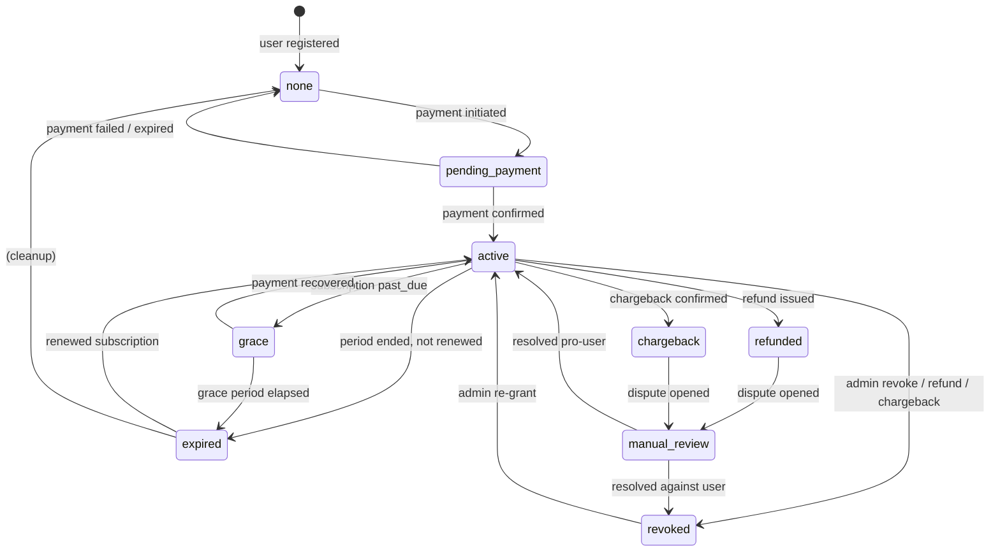

**Fail-closed rule**: Any state not explicitly `active` (or `grace` where grace
is still valid, i.e. `graceUntil > now()`) denies product access.
`packages/entitlements` is the only code allowed to evaluate this.

**Grace period**: 3 days by default (configurable per plan). Grace allows
continued access while a failed payment retries. After grace, access expires.

**Admin override**: An admin can force any state transition and must leave a
reason. All transitions via admin are written to `audit_logs` immediately.

---

## 4. Secrets Domain

### 4.1 ExchangeAccount

An **ExchangeAccount** is a user's registered account on a crypto exchange. It
holds no credentials — it is a metadata record (name, exchange identifier,
label, testnet flag, connection status).

**Key constraint**: One user may have multiple exchange accounts across
different exchanges or multiple accounts on the same exchange (e.g. separate
subaccounts).

### 4.2 ExchangeApiKeySecret

The **ExchangeApiKeySecret** stores ciphertext-only. No plaintext API key or
secret ever appears in this record, in logs, in audit events, or in API
responses.

**Vault design** (from [SECRET_VAULT_DESIGN.md](./SECRET_VAULT_DESIGN.md)):
AES-256-GCM envelope encryption. One KEK (Key Encryption Key) per environment
loaded from env/HSM. Per-secret DEK (Data Encryption Key) encrypted by KEK and
stored alongside the ciphertext. Rotation: new DEK issued, ciphertext
re-encrypted, old key ID retained for rotation audit.

**What this record contains**: `exchangeAccountId`, `keyAlias`,
`ciphertextBlob` (base64), `keyId` (which KEK version was used), `ivHex`,
`tagHex`, `permissions` (e.g. `["read","trade"]`), `createdAt`, `lastTestedAt`,
`revokedAt`.

**What it never contains**: plaintext API key, plaintext secret, any password.

### 4.3 SecretRotationEvent

Audit trail for key rotation lifecycle. Each rotation or revocation writes an
immutable record with `exchangeAccountId`, `fromKeyId`, `toKeyId`,
`rotatedAt`, `reason`, `actorId`.

---

## 5. Bots Domain

### 5.1 BotInstance

A **BotInstance** is the registration of a specific bot product for a specific
user. It ties the user to their exchange account choice and to the bot product.

Attributes: `userId`, `productCode` (`tortila_bot` | `legacy_bot`),
`exchangeAccountId`, `label`, `isActive`, `pairedAt`, `unpairedAt`.

**Invariant**: A BotInstance without an active Entitlement for its productCode
cannot be activated. The entitlement check happens server-side before any config
write.

### 5.2 BotConfig and BotConfigVersion

**BotConfig** is the current configuration for a BotInstance. Configuration is
versioned — every save creates a **BotConfigVersion** (append-only history).

**Legacy Bot config shape** (from discovery of `/home/ubuntu/apps/bot`):

| Parameter | Type | Description |
|---|---|---|
| `symbol` | string | Trading pair, e.g. `BTCUSDT` |
| `rsiEnabled` | bool | Use RSI filter |
| `rsiPeriod` | int | RSI calculation period |
| `rsiOverbought` | float | RSI overbought threshold |
| `rsiOversold` | float | RSI oversold threshold |
| `cciEnabled` | bool | Use CCI filter |
| `cciPeriod` | int | CCI period |
| `averagingLevels` | int | Number of averaging/DCA entries |
| `takeProfitPct` | float | Take-profit % from avg entry |
| `leverageX` | int | Leverage multiplier |
| `balancePct` | float | % of balance to use per trade |
| `stages` | int | Number of stages/slots per symbol |
| `stageConfig` | JSON | Per-stage parameters (price distance, size multiplier) |

**Tortila Bot config shape** (from `turtle_bot` source discovery):

| Parameter | Type | Description |
|---|---|---|
| `symbol` | string | Trading pair |
| `timeframe` | string | Chart timeframe, e.g. `1h` |
| `system` | string | Strategy variant (`turtle`, `atr_gerchik`, etc.) |
| `riskPct` | float | Risk % per trade |
| `leverageX` | int | Leverage |
| `atrPeriod` | int | ATR lookback |
| `atrMultiplier` | float | ATR band multiplier |
| `winnerFilterEnabled` | bool | Winner filter on/off |
| `trailingTflabEnabled` | bool | TFLab trailing on/off |
| `maxPositions` | int | Max concurrent positions |
| `useRecommendedProfile` | bool | Load recommended safe defaults |

**BotConfigVersion** stores `configJson` (the full config snapshot), `version`
(monotonic counter), `createdAt`, `changedBy` (userId or `system`), `note`.

### 5.3 BotRunState

**BotRunState** is the most recent known run status pulled from the adapter.
It is NOT authoritative over the bot process itself — it is a cached view.

States: `unknown`, `running`, `stopped`, `error`, `stale` (last sync > 5 min).

Important: `stopped` in WTC does NOT mean "positions are closed". Bot state is
read-only until a separately audited adapter is approved. WTC never issues stop
orders or process kills.

Known risk signals surfaced as `RunState.warnings[]`:
- `TP_RECONCILIATION_PENDING` — TP reconciliation/restore not yet implemented; relying on TP is risky.
- `MARGIN_PREFLIGHT_MISSING` — Margin pre-flight not yet implemented; increasing position size is risky.
- `TP_REJECTION_101211` — Recent NEAR TP placement rejection from exchange.
- `RATE_LIMIT_100410` — BingX rate-limit or funding warning observed.
- `FILL_LOOKUP_109421` — Fill-detail lookup warning.
- `EXCHANGE_FLAT_MISMATCH` — Exchange position flat vs. local state mismatch detected.

### 5.4 BotMetrics

**BotMetrics** is a periodic snapshot of normalised trading statistics. Both bots
export to the same normalised shape so the unified analytics view can compare
them. See [CANONICAL_ANALYTICS_MODEL.md](./CANONICAL_ANALYTICS_MODEL.md) for
the full field list.

Key fields: `snapshotAt`, `walletEquity`, `closedPnl`, `unrealizedPnl`,
`winRate`, `profitFactor`, `maxDrawdownPct`, `currentDrawdownPct`,
`totalFeesPaid`, `totalFundingPaid`, `openRiskUsd`, `tradeCount`.

### 5.5 BotPosition

**BotPosition** is a periodic snapshot of open positions. Imported from the
adapter. Not authoritative — may be up to N minutes stale (shown in UI).

Key fields: `symbol`, `side` (`long`|`short`), `size`, `entryPrice`,
`markPrice`, `unrealizedPnl`, `leverage`, `tpPrice`, `slPrice`,
`liquidationPrice`, `openedAt`, `snapshotAt`.

### 5.6 BotTrade

**BotTrade** is an imported closed trade record. Immutable once imported.
The `source` field identifies which adapter produced this record.

Tortila-normalised fields (from journal `/api/trades`): `tradeId`, `symbol`,
`side`, `entryPrice`, `exitPrice`, `size`, `realizedPnl`, `fees`,
`fundingPaid`, `openedAt`, `closedAt`, `exitReason` (`tp`|`sl`|`manual`|`liquidation`).

Legacy bot fields (from `/api_management` adapter): same shape after
normalisation; `exitReason` derived from bot stage/order type.

### 5.7 BacktestJob

A **BacktestJob** is an async request to run a strategy simulation on
historical data. WTC stores the job record; the actual computation runs in the
`packages/backtester` local runner or a future managed runner.

**State machine**:

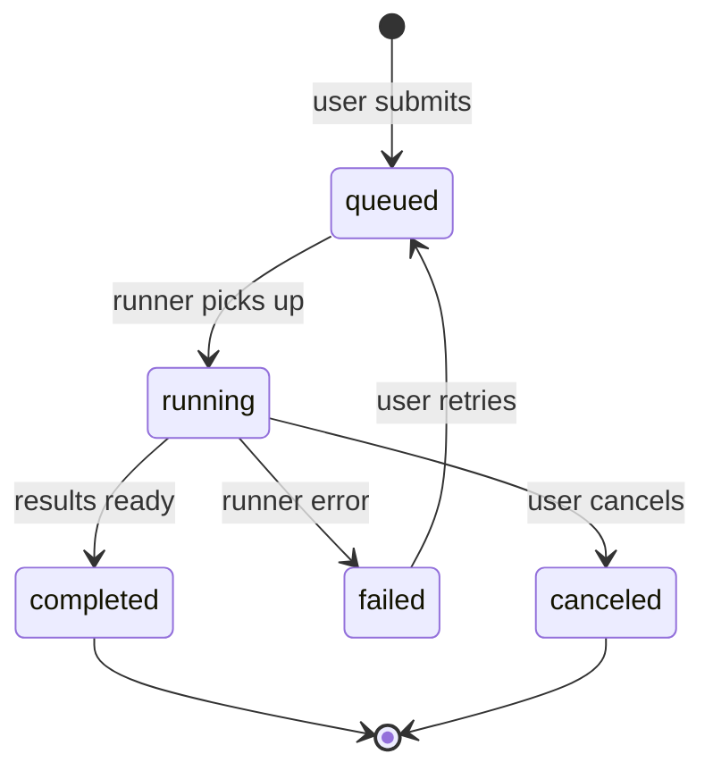

Key fields: `userId`, `botProductCode`, `params` (symbol, timeframe, system,
dateRange, riskPct, etc.), `status`, `queuedAt`, `startedAt`, `completedAt`,
`runnerVersion`, `errorMessage`.

### 5.8 BacktestResult

**BacktestResult** is the output artifact linked to a completed BacktestJob.

Key fields: `backtestJobId`, `summaryJson` (winRate, profitFactor, maxDD,
CAGR, etc.), `equityCurveCsv` (link or inline), `tradesJson`, `artifactUrl`,
`generatedAt`.

Invariant: No fake results. If no runner is configured, the job enters `failed`
with `errorMessage = "no runner configured"`. UI shows the real status; it does
not synthesise placeholder statistics.

---

## 6. Axioma Domain

### 6.1 AxiomaAccountLink

An **AxiomaAccountLink** connects a WTC user to their Axioma account. It stores
only account metadata visible from the WTC side — not Axioma credentials.

Key fields: `userId`, `axiomaUserId` (from journal_server auth), `status`
(`unlinked`|`pending_link`|`linked`|`error`), `linkedAt`, `lastVerifiedAt`,
`errorMessage`.

The link flow: WTC creates a short-lived signed handoff token; Axioma
journal_server validates it and returns the Axioma user ID; WTC stores the
link. If Axioma cannot yet validate WTC tokens, status stays `unlinked` and
the UI shows "Connect Axioma account" instead of silently breaking.

### 6.2 TerminalRelease

**TerminalRelease** is a cached snapshot of Axioma terminal release metadata.
WTC does not store or serve the binary; it caches metadata only.

Key fields: `version`, `channel` (`stable`|`beta`), `publishedAt`,
`releaseNotesMarkdown`, `downloadUrl` (signed, short-lived generated by bridge),
`minSupportedVersion`, `platform` (`win32`|`darwin`|`linux`), `checksum`.

Cache is refreshed by a background worker. If cache is stale, the UI shows
"Release info unavailable" rather than displaying stale version numbers as current.

---

## 7. TradingView Domain

### 7.1 TradingViewProfile

Stores the user's declared TradingView username for a given entitlement period.

Key fields: `userId`, `tvUsername`, `verifiedAt` (null until admin confirms),
`currentGrantId` (FK to active grant, nullable).

### 7.2 TradingViewAccessRequest

A user's request for TradingView indicator access. Created when the user
submits their TV username and has an active `tradingview_indicators`
entitlement.

**State machine**:

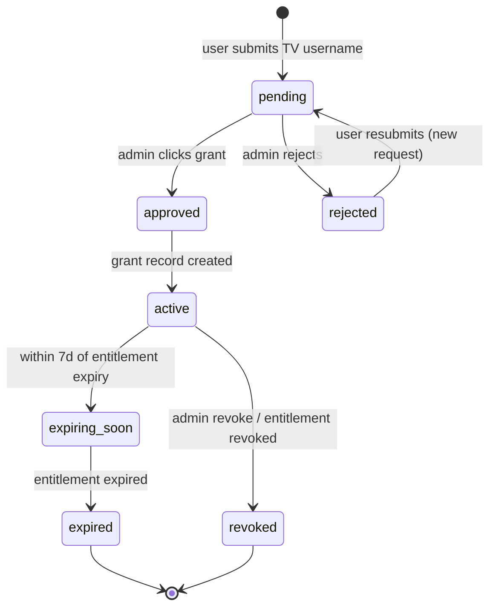

### 7.3 TradingViewAccessGrant

Records that a specific TV username was granted access. Created by admin
action (and optionally by future automation adapter behind feature flag).
Separate from `TradingViewAccessRequest` so the request lifecycle and the grant record are
distinct (requests can exist with no grant; a grant can be revoked while the request is archived).

Key fields: `requestId`, `userId`, `tvUsername`, `grantedAt`, `expiresAt`,
`grantedBy` (admin userId or `automation_adapter`), `grantedByType`,
`revokedAt`, `revokedBy`, `revokeReason`.

Migration 0002 also adds `revokedAt`/`revokedBy` as additive nullable columns to the existing
`tradingview_access_requests` table. The `revokeTvGrant` repo function populates both the
`tradingview_access_grants` revoke fields AND the `tradingview_access_requests` revoke columns,
and writes an in-txn audit row — resolving the actor-dropping debt tracked by the
tradingview-persistence-auditor handoff (Finding 3/6).

### 7.4 TradingViewAccessTask

Task queue entry for admin or automation to action: `grant`, `revoke`,
`verify`. Created by scheduler when entitlement expires. Admin UI reads
pending tasks.

---

## 8. Education Domain

### 8.1 Course

A **Course** is a top-level content unit owned by a teacher. Courses can be
`draft`, `published`, or `archived`. Students can only see published, entitled
courses.

Key attributes: `title`, `slug`, `description`, `productCode` (which product
entitlement gates this course), `teacherProfileId`, `status`,
`coverImageUrl`, `sortOrder`, `createdAt`.

**Teacher object-ownership invariant**: Only the teacher who owns the course
(or an admin) can edit or publish it. `support` and other teachers cannot.

### 8.2 Lesson

A **Lesson** is an ordered item within a Course. It holds content metadata
(not the binary file itself).

Key attributes: `courseId`, `title`, `sortOrder`, `contentType`
(`video`|`embed`|`text`|`link`), `contentUrl`, `durationSeconds`, `status`
(`draft`|`published`), `freeSample` (bool — visible without entitlement).

### 8.3 Material

A **Material** is a file or link attached to a Lesson.

Key attributes: `lessonId`, `type` (`pdf`|`image`|`link`|`zip`),
`filename`, `url`, `sizeBytes`, `createdBy` (teacherProfileId), `createdAt`.

Teacher upload security: files stored in a server-side path with no public
URL inference. Access requires server-side entitlement check before redirect.

### 8.4 TeacherProfile

Extends the user model with teacher-specific metadata. Required before a teacher can own courses
in the full LMS contract (migration 0002 backfills one row per existing course owner).

Key attributes: `userId` (FK, unique), `displayName`, `bio`, `avatarUrl`,
`socialLinks` (JSONB: Telegram, Instagram, YouTube, etc.), `isActive`, `createdAt`, `updatedAt`.

### 8.5 Enrollment

Records a student's enrollment in a specific course. Created when an entitlement is granted for
the course's `productCode`, or manually by an admin. One row per (user, course) pair.

Key attributes: `userId`, `courseId`, `entitlementId` (nullable), `enrolledAt`, `completedAt`.

**Invariant**: A student can only be enrolled once per course. The `completedAt` timestamp is
set when all lessons in the course are marked complete.

### 8.6 LessonProgress

Tracks how far a student has progressed through a specific lesson. UPSERTed on every
`POST /api/education/lessons/:id/progress` call.

Key attributes: `userId`, `lessonId`, `percentComplete` (0–100), `completed`,
`lastAccessedAt`, `createdAt`, `updatedAt`.

**Invariant**: One progress record per (user, lesson). Per-user isolation: a student cannot
read or write another student's progress.

### 8.7 PinnedLink

A community or social link pinned to a teacher profile or a course. Used to surface Telegram
channels, YouTube links, Discord servers, and similar community resources.

Key attributes: `ownerType` (`teacher_profile` | `course`), `ownerId`, `label`, `url`,
`iconType`, `sortOrder`, `isActive`, `createdBy`.

**Invariant**: Links are soft-deactivated (isActive=false) rather than hard-deleted so the
audit trail is preserved.

---

## 9. Ops Domain

### 9.1 AuditLog

**AuditLog** is an immutable append-only event record. No audit record may be
deleted or modified. The `actor` may be a userId, `system`, or `admin:<userId>`.

Required audit events (non-exhaustive):

| EventType | Trigger |
|---|---|
| `user.login` | Successful login |
| `user.login_failed` | Failed login attempt |
| `user.register` | Registration |
| `user.password_changed` | Password change |
| `key.create` | Exchange API key added |
| `key.update` | Key re-encrypted / rotated |
| `key.revoke` | Key deleted |
| `entitlement.grant` | Access granted (billing or admin) |
| `entitlement.revoke` | Access revoked |
| `entitlement.expire` | Access expired |
| `bot.config_save` | Bot config written |
| `bot.instance_pair` | Bot instance created |
| `tv_access.request` | TV username submitted |
| `tv_access.grant` | TV access granted |
| `tv_access.revoke` | TV access revoked |
| `education.material_create` | Material uploaded |
| `education.material_delete` | Material deleted |
| `admin.user_edit` | Admin edits a user record |
| `admin.entitlement_override` | Admin force-transitions entitlement |
| `support.ticket_create` | Support ticket opened |
| `support.ticket_resolve` | Support ticket resolved |

Key fields: `id`, `eventType`, `actorId`, `actorRole`, `targetId`,
`targetType`, `payload` (JSON — MUST NOT contain secrets or plaintext keys),
`ipAddress`, `userAgent`, `createdAt`.

### 9.2 Notification

Platform-generated alerts surfaced in the user's notification centre.

Types: `entitlement_expiring`, `entitlement_expired`, `tv_access_granted`,
`tv_access_expiring`, `support_reply`, `bot_warning`, `billing_action_needed`.

Key fields: `userId`, `type`, `title`, `body`, `linkUrl`, `readAt`,
`createdAt`.

### 9.3 SupportTicket

User-submitted support threads. Read by `support` role and `admin`.

States: `open` → `in_progress` → `resolved` / `closed`.

Key fields: `userId`, `productCode` (optional), `subject`, `status`,
`priority` (`low`|`normal`|`high`|`urgent`), `assignedTo` (support agent userId),
`createdAt`, `updatedAt`.

---

## 10. Key Workflows — State Machines and Sequence Diagrams

### 10.1 Registration and Login

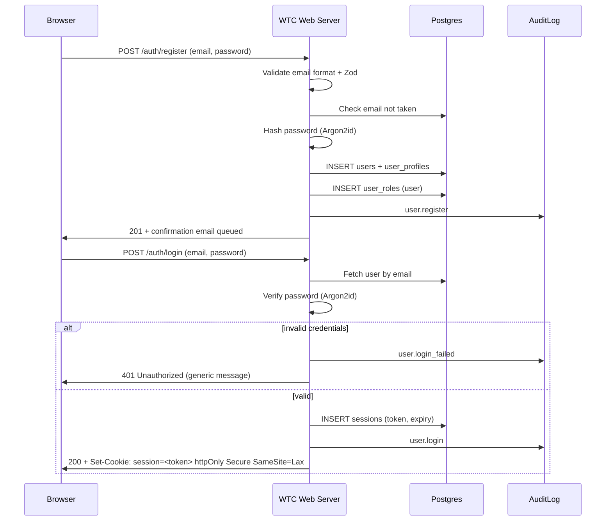

### 10.2 Purchase → Entitlement

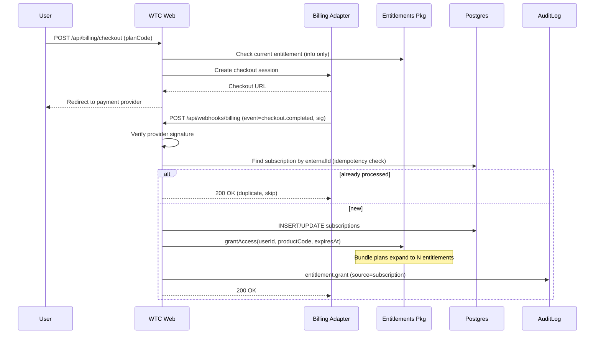

### 10.3 Access Check (Fail-Closed)

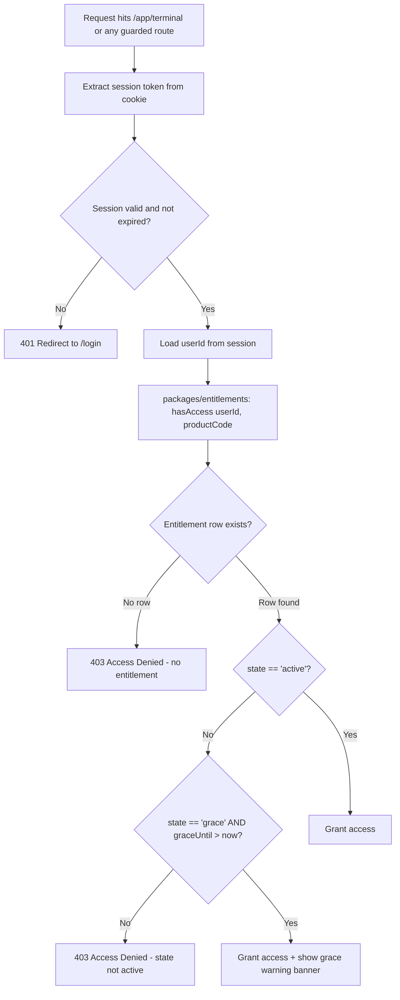

Note: The access check is performed exclusively in `packages/entitlements`.
No other package, component, or route handler may implement its own access logic.

### 10.4 Bot Setup Wizard

```mermaid
flowchart LR
    S1[Step 1: Choose exchange] --> S2[Step 2: Enter API key + secret]
    S2 --> S3[Step 3: Permissions checklist]
    S3 --> S4[Step 4: Demo/Live mode warning + explicit confirmation]
    S4 --> S5[Step 5: Test connection via adapter]
    S5 -- Fail --> S5E[Show error + retry]
    S5 -- Pass --> S6[Step 6: Configure symbols + risk]
    S6 --> S7[Step 7: Configure strategy params]
    S7 --> S8[Step 8: Review config summary]
    S8 --> S9[Step 9: Save config version]
    S9 --> S10[BotInstance active in WTC]
    S10 --> MONITOR[Monitoring view - read only]
```

Key constraints:
- API key is encrypted by `packages/crypto` before any DB write.
- Test connection fires a read-only ping to the exchange via adapter.
- No order is placed during setup.
- Bot controls (start/stop) remain disabled/mock until audited adapters are approved.

### 10.5 Exchange Key Vaulting

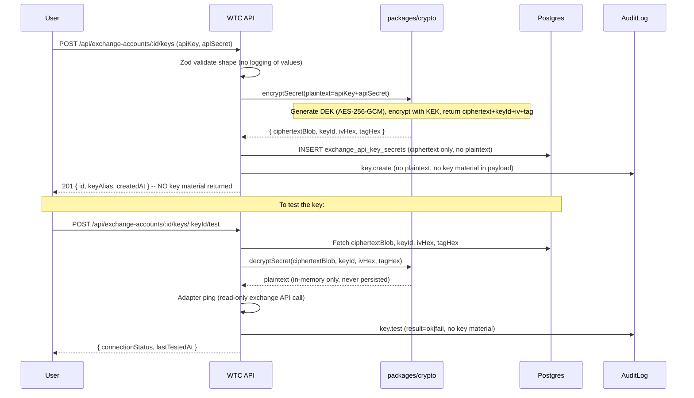

### 10.6 TradingView Access Lifecycle

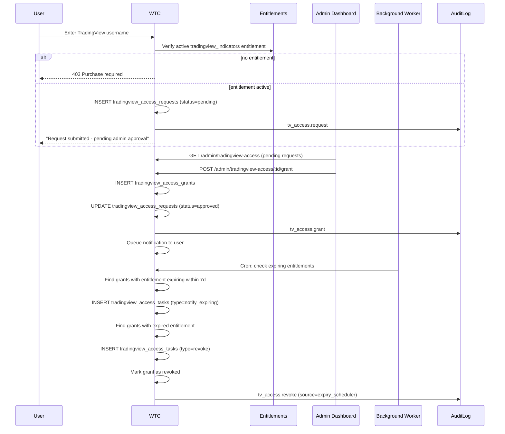

### 10.7 Education Enrollment

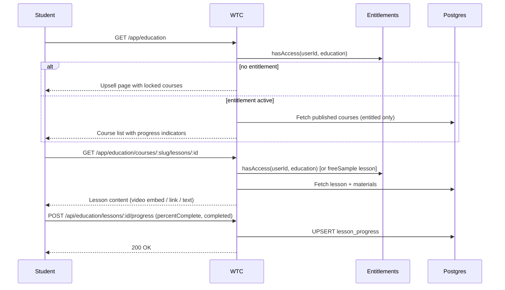

### 10.8 Backtest Job Lifecycle

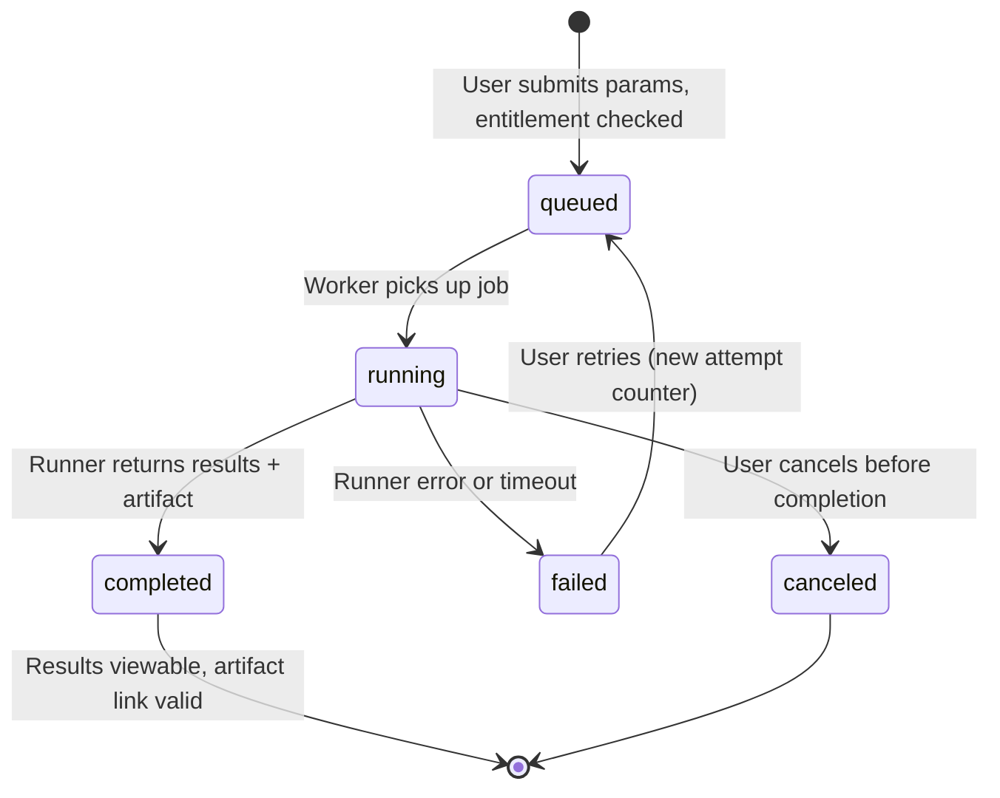

UI shows real job status. If no runner is configured, job immediately enters
`failed` state with a clear "No runner configured" message — no placeholder
results are generated.

---

## 11. Cross-Cutting Invariants

1. **Entitlements fail closed.** Unknown state = deny.
2. **No plaintext keys.** Not in logs, DB, API responses, screenshots, fixtures, audit events, or browser state.
3. **Bot controls are mock.** `stopBot()` / `startBot()` are feature-flagged as disabled until a separately audited adapter is approved by name.
4. **Axioma bridge only.** WTC never copies Axioma runtime; it wraps the product experience.
5. **Teacher object ownership.** A teacher may only edit their own courses and materials.
6. **Audit is mandatory.** Every entitlement change, key write, admin action, and bot config save must write an AuditLog entry.
7. **TradingView is manual-queue by default.** No credential-stuffing or brittle browser automation as production default.
8. **WTC is not an order-execution path.** Even for Axioma, even for bots.

---

## 12. Related Documents

- [DATA_MODEL.md](./DATA_MODEL.md) — physical tables, columns, indexes, migrations
- [SECURITY_MODEL.md](./SECURITY_MODEL.md) — auth, RBAC, session, CSRF
- [RBAC_MATRIX.md](./RBAC_MATRIX.md) — per-role permission matrix
- [SECRET_VAULT_DESIGN.md](./SECRET_VAULT_DESIGN.md) — AES-GCM vault spec
- [ENTITLEMENT_STATE_MACHINE.md](./ENTITLEMENT_STATE_MACHINE.md) — full entitlement rules
- [AUDIT_LOG_SCHEMA.md](./AUDIT_LOG_SCHEMA.md) — audit event catalogue
- [CANONICAL_ANALYTICS_MODEL.md](./CANONICAL_ANALYTICS_MODEL.md) — normalised bot metrics
- [BOT_INTEGRATION_PLAN.md](./BOT_INTEGRATION_PLAN.md) — adapter design
- [CONTRACTS/axioma-bridge.md](./CONTRACTS/axioma-bridge.md) — Axioma bridge contract
- [TRADINGVIEW_ACCESS_PLAN.md](./TRADINGVIEW_ACCESS_PLAN.md) — TV access workflow
- [EDUCATION_LMS_PLAN.md](./EDUCATION_LMS_PLAN.md) — LMS design
