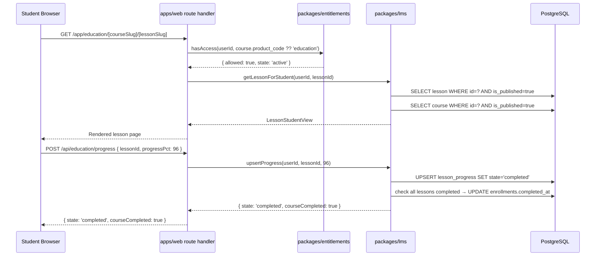
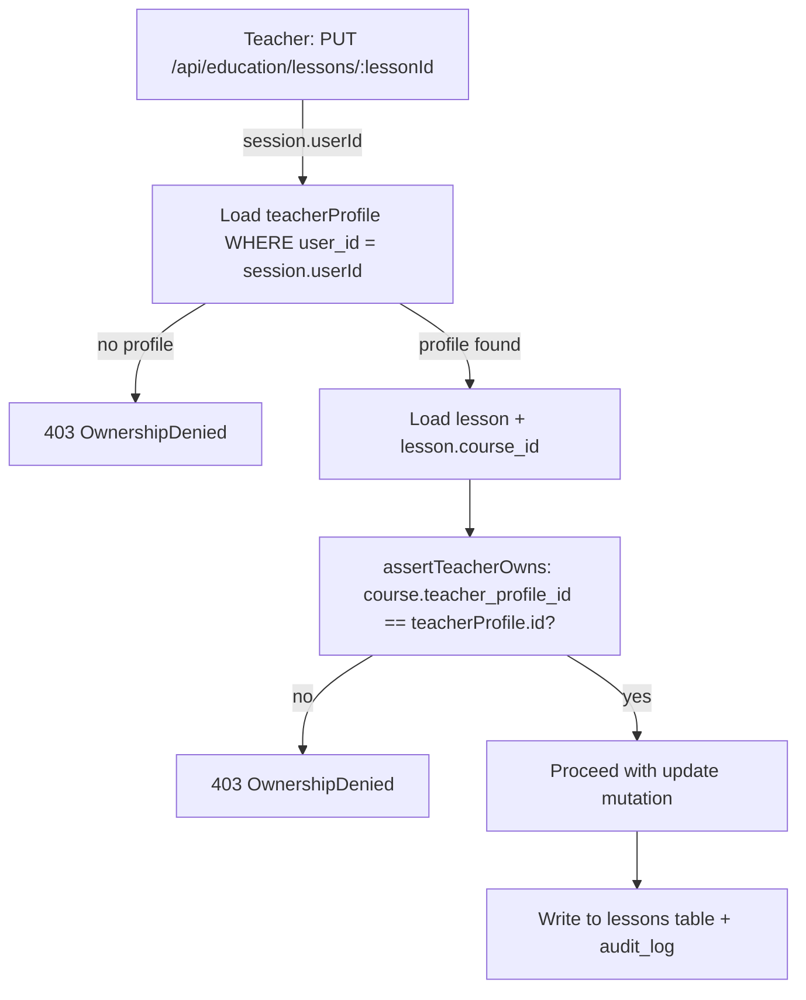

# Education / LMS Plan

_Canonical design for the WTC Education module (product code `education`, route slug `/education`)._
_All access is gated exclusively through `packages/entitlements`. This document is the specification for `packages/lms` and the `/app/education`, `/teacher`, and `/admin/education` route groups in `apps/web`._

> **Implementation status (Phase 1.7, Part E — THIN model only; Phase 2 Wave-2 design complete).**
> This document is the **full / TARGET** LMS design. Layer status:
>
> **REAL (DB-backed, Postgres, PGlite-integration-tested — Phase 1.7):**
> - `createCourse` (in-txn audit `education.course_create`), `listCoursesForTeacher` (owner/admin),
>   `listPublishedCourses`, `listLessonsForStudent` (fail-closed).
> - `/teacher` (course create + list) and `/app/education` (entitled student view) call these via the
>   async `LmsService` selector — DB when `DATABASE_URL` is set, in-memory dev fallback, fail-closed in prod.
> - Tables present: `courses` / `lessons` / `materials` (migration `0000`). Schema is the THIN shape
>   (see §20 for the column drift vs plan).
>
> **DESIGN COMPLETE, implementation PENDING (Phase 2 Wave-2 — see §21 + handoff `20260530-0126-ecosystem-education-implementer.md`):**
> - Additive migration `0002`: `teacher_profiles`, `enrollments`, `lesson_progress`, `pinned_links`
>   plus column additions on `courses`/`lessons`/`materials`.
> - Full repo surface with in-txn audit for all §12 events.
> - Teacher dashboard, course/lesson/material editors, student progress, community links, admin education panel.
> - Exact table DDL, repo signatures, and route scope: see §21 and the implementer handoff.
>
> **NOT built anywhere (→ future, marked TARGET in §18):**
> - Live object-store acceptance, external malware scanning, object-store cleanup/reconciliation, and public upload rollout for
>   `material_type = 'file'`.
> - Email/Telegram notifications on course completion.
> - Certificates, discussion threads, cohort delivery.
>
> **Phase 3.1 (epoch 20260531-0130) update — the FIRST bounded slice of the rich schema SHIPPED (migration 0005).**
> `courses.level` (§4.2), `courses.tags` (§4.2, display/write only), `lessons.content_type` (§4.3, backfilled from `video_url`,
> `deriveContentType` **retired**), and `lessons.external_url` (§4.3, the 'link' companion) are **REAL** as of migration 0005
> (additive, 41 tables). `'embed'` is a forward-compat CHECK value only — **not** writable/renderable until the §9.2 sanitizer
> lands. Teacher create/edit forms + a new `updateLessonAction` write them; catalogue/teacher/admin/student surfaces display them;
> every URL write path is now https-only (a pre-existing javascript:/data: href gap was closed). See **ADR-021** + the aggregate
> [`20260531-0130-phase-3-1-lms-rich.md`](handoffs/20260531-0130-phase-3-1-lms-rich.md) (cites 5 per-agent audit handoffs).
> **Still deferred to a later slice** (each with a live blocker): `lessons.embed_html` (§4.3, needs the sanitizer),
> `materials` file-meta (§4.4, upload review BLOCKED), `lesson_progress.state` (§4.6, `deriveLessonState` still works — no
> scrub consumer), `courses.slug` (§4.2, no slug-URL routing), `pinned_links owner_type='global'` (§4.7, non-additive + Q-6),
> while teacher-profile social links plus teacher/course pinned-link web surfaces are **REAL as of Phase 3.3**.
>
> **Phase 3.3 (epoch 20260531-1310) update - teacher/community web surfaces SHIPPED.**
> `/teacher/community` manages teacher profile/social links and teacher-profile pinned links; `/teacher/materials` lists and
> deletes linked materials; `/teacher/courses/[id]` manages course pinned links and per-lesson materials; `/app/education`
> renders teacher/community links from `loadStudentCatalogue` instead of hardcoded placeholders. See aggregate
> [`20260531-1310-phase-3-3-bot-education-rooms.md`](handoffs/20260531-1310-phase-3-3-bot-education-rooms.md).
>
> **Phase 3.17 (epoch 20260601-2303) update - local LMS file lifecycle metadata SHIPPED.**
> File materials now persist `storage_provider`, non-public `storage_key`, `scan_status`, `scan_checked_at`,
> `quarantine_reason`, `retained_until`, and `deleted_at` on the current `materials` table (migration `0012`).
> Local uploads still store bytes in Postgres, but are prepared through `@wtc/lms` with deterministic `db-local` keys,
> binary MIME sniffing, local signature scan/quarantine, and 365-day retention metadata. Downloads fail closed unless
> the file row is active, published, entitlement-checked, hash-valid, and `scan_status = 'clean'`. Teacher/student views
> expose scan state but never expose `storage_key`. Real object storage, a production malware engine, signed-object URL
> redirects, and DB-backed browser acceptance remain TARGET work before public production upload rollout.
>
> **Phase 3.29 (epoch 20260602-0317) update - local S3/R2 adapter boundary SHIPPED, live object-store acceptance still TARGET.**
> `LMS_FILE_STORAGE_PROVIDER=s3-r2` is now typed/configured and locally covered with mocked SigV4 upload plus short-lived
> signed redirect delivery. Uploads prove lesson/course ownership before external writes, object-store rows persist no inline
> DB bytes, and retained artifact scanning rejects signed URL tokens. No live S3/R2 credentials, external scanner,
> object-store delete/reconciliation, DB-browser object-store acceptance, or public upload rollout was run in this phase.
>
> **Phase 3.30 (epoch 20260602-0341) update - local external scanner adapter boundary SHIPPED, live scanner acceptance still TARGET.**
> `LMS_FILE_SCANNER_MODE=external` now requires an HTTPS endpoint and bearer token, calls the scanner before storage writes,
> fails closed on scanner errors/timeouts, and keeps scanner endpoint/token assignments out of retained artifacts. Clean
> verdicts may store; quarantined `s3-r2` verdicts are non-downloadable metadata rows and do not write unsafe bytes to the
> standard object bucket. No live scanner credentials, live scanner clean/quarantine/failure acceptance, object-store cleanup,
> DB-browser scanner acceptance, or public upload rollout was run in this phase.
>
> **Phase 3.31 (epoch 20260602-0406) update - local object-store cleanup/reconciliation boundary SHIPPED, live object-store acceptance still TARGET.**
> The worker now has a separate local `s3-r2` cleanup path for expired file rows. Clean soft-deleted object rows are
> hard-deleted from DB only after SigV4 `DELETE` succeeds or returns already-absent `404`; unsafe non-clean rows are treated
> as metadata-only under the Phase 3.30 no-standard-object-write invariant and are purged without remote object calls. Failed
> object deletes retain retryable DB rows and surface count-only worker health. No live S3/R2 credentials, live
> upload/download/delete/reconcile acceptance, live scanner acceptance, DB-browser object-store acceptance, object PUT
> compensating delete/outbox design, or public upload rollout was run in this phase.
>
> **Phase 3.32 (epoch 20260602-0429) update - local upload compensation boundary SHIPPED, durable retry still TARGET.**
> The teacher material upload path now has best-effort synchronous compensation for the local gap where a clean `s3-r2`
> object PUT succeeds but material DB creation fails. `createMaterialAction` delegates through a testable orchestrator that
> attempts a signed object `DELETE`, treats already-absent `404` as reconciled, skips quarantined metadata-only inputs, and
> preserves the original DB/material creation error if cleanup itself fails. This is not durable outbox/pending-row/staging-key
> retry. Failed compensation DELETE, process interruption, live S3/R2 acceptance, live scanner acceptance, DB-browser
> object-store acceptance, and public upload rollout remain TARGET work.
>
> **Phase 3.33 (epoch 20260602-0506) update - local durable upload cleanup boundary SHIPPED, live acceptance still TARGET.**
> Clean `s3-r2` uploads now create a private `lms_object_cleanup_tasks` row before object PUT, complete it in the same DB
> transaction as successful material creation, and leave it retryable when material creation fails and immediate compensation
> DELETE fails or the request is interrupted. The worker now deletes pending upload objects that have no material row, treats
> DELETE `2xx` and `404` as resolved, retries failed deletes with generic backoff, and dead-letters after max attempts.
> Health, audit, logs, artifacts, and UI remain count-only/no-key. Live S3/R2 acceptance, live scanner acceptance,
> DB-browser object-store acceptance, dead-letter operational review, shared object-store primitives, and public upload
> rollout remain TARGET work.
>
> **Phase 3.34 (epoch 20260602-0523) update - local cleanup dead-letter ops review SHIPPED, acknowledgement still TARGET.**
> `/admin/system-health` now has a count-only LMS upload cleanup review card backed by a DB summary that does not select
> cleanup task IDs or storage keys. Dead-letter transitions write summary-only cleanup audit events, and admin health projects
> only counts, timestamps, and generic error code. Live S3/R2 acceptance, live scanner acceptance, DB-browser object-store
> acceptance, dead-letter acknowledgement/retry workflow, shared object-store primitives, and public upload rollout remain
> TARGET work.
>
> **Phase 3.36 (epoch 20260602-0609) update - local cleanup dead-letter acknowledgement/retry SHIPPED.**
> Dead-letter acknowledgement metadata is now durable on private cleanup rows, while confirmed cleanup completion keeps its
> separate `completed` semantics. `/admin/system-health` exposes only count/timestamp/generic-code summaries plus aggregate
> CSRF-protected ack/retry controls. The server reselects guarded cohorts by expected count/latest timestamp, writes
> summary-only admin audit rows, and retry only requeues rows for the worker without admin-side object DELETE or attempt reset.
> Live S3/R2 acceptance, live scanner acceptance, DB-browser object-store acceptance, assignment/ownership workflow, and public
> upload rollout remain TARGET work.
>
> **Phase 3.37 (epoch 20260602-0634) update - local live S3/R2 acceptance preflight SHIPPED, live credentials still TARGET.**
> Shared object-store tests now pin exact deterministic SigV4 PUT, DELETE, and signed-read URL vectors. The new
> `accept:lms:object-storage` command defaults to dry-run/no-network, writes redacted summary evidence, and live mode refuses
> to run unless public uploads are disabled and explicit live/throwaway consent flags are set. Generated-artifact scanning now
> rejects object-store env assignments, signed object headers, provider body markers, and request IDs. No live S3/R2
> credentials, live scanner credentials, DB-browser object-store acceptance, cleanup/reconcile live run, or public upload
> rollout was run in this phase.
>
> **Phase 3.38 (epoch 20260602-0659) update - local live external scanner preflight SHIPPED, live credentials still TARGET.**
> `@wtc/lms` now owns the external scanner request/response helpers and the web upload path uses them. The new
> `accept:lms:external-scanner` command defaults to dry-run/no-network, writes redacted summary evidence, and live mode
> refuses to run unless public uploads are disabled and explicit live/quarantine-corpus consent flags are set. Generated
> artifact scanning now rejects scanner request headers, live scanner consent envs, octet-stream request markers, and raw
> provider verdict JSON. No live scanner endpoint/token, live S3/R2 credentials, DB-browser object-store acceptance,
> cleanup/reconcile live run, or public upload rollout was run in this phase.
>
> **PG7 (Phase 2.10, epoch 20260530-2330) update — the §4 RICH schema stays TARGET; rich migration 0005 is a Phase-3 plan.**
> A 5-auditor read-only fan-out **unanimously** deferred the rich LMS columns (the `slug`/`level`/`tags` in §4.2,
> `slug`/`content_type`/`embed_html` in §4.3, file-meta in §4.4, the `lesson_progress` explicit state in §4.6, and the
> `pinned_links` `'global'` owner_type in §4.7) to **Phase-3**, because none has a consumer this phase and the
> dead-code-avoidance discipline (PG4/PG6) is binding. _(Phase 3.1 has since landed level/tags/content_type/external_url — see
> the banner above; the remaining items stay deferred.)_ **Per-field blockers a future single migration-0005 wave must respect:**
> - `lessons.embed_html` — only after the server-side sanitizer in §4.3 is actually **built + security-reviewed** (it does
>   not exist in the codebase today; storing raw embed HTML without it is a stored-XSS surface).
> - `materials` file-meta (`file_key`/`file_name`/`file_size_bytes`/`mime_type`) — **partly superseded by Phase 3.15/3.17**:
>   local DB bytes, sanitized metadata, non-public storage keys, scan/quarantine state, retention metadata, a local
>   S3/R2-compatible adapter boundary, a local external scanner adapter boundary, and a local object-store cleanup boundary are
>   real. Live object-store acceptance, live malware-engine acceptance, object PUT compensation/outbox coverage, and public
>   upload rollout remain blocked.
> - `lessons.content_type` and `lesson_progress.state` — must be **co-landed with retiring** `deriveContentType` /
>   `deriveLessonState` (`packages/lms/src/completion.ts`) to avoid dual-source-of-truth; include the backfill.
> - `courses.slug` — needs slug-URL routing (routes use `[courseId]` UUID today) + a unique-collision backfill before it has a consumer.
> - `pinned_links` `owner_type='global'` — **non-additive**: it requires a `DROP CONSTRAINT … ; ADD CONSTRAINT …` on the
>   migration-0002 CHECK, which **drizzle-kit generate cannot emit safely** (it appends a second ADD CONSTRAINT, leaving both
>   live). A Phase-3 db-architect must **hand-edit** migration 0005 for this one; also gated on Q-6 (club+education bundling).
> The done-this-phase LMS security work (denial → audit+throw, CSRF-first) is in
> [`20260530-2330-phase-2-10-lms-rbac-throw-csrf-first.md`](handoffs/20260530-2330-phase-2-10-lms-rbac-throw-csrf-first.md);
> the per-field DDL sketch is in `handoffs/20260530-2330-ecosystem-db-architect.md`.
> **Superseded by Phase 3.3:** the pinned-link community page + the teacher-profile edit UI are now wired in `apps/web`.
> Global pinned links, upload file metadata, embed HTML, and slug routing remain TARGET.

---

## 1. Overview

The Education module is a first-class WTC product, not a blog section or embedded iframe. It provides:

- A **student experience**: entitled students browse courses, watch video lessons, access linked materials, and track progress.
- A **teacher experience**: teachers manage their own courses, lessons, materials, and community links via a dedicated dashboard.
- An **admin experience**: admins have full CRUD across all education objects, can override teacher assignments, and audit all education events.
- **Entitlement gating**: every course and lesson access check calls `packages/entitlements`. The UI never infers access from role labels, component props, or client-side state.

Product code: `education`  
Canonical plan codes: `education_lifetime`, `bundle_pro`, `bundle_starter`  
Route namespace: `/app/education` (student), `/teacher` (teacher), `/admin/education` (admin)  
Package: `packages/lms`

---

## 2. Role Matrix

| Action | `admin` | `teacher` | `user` (student) | `support` |
|--------|---------|-----------|------------------|-----------|
| List all courses (including hidden/draft) | yes | own courses only | no | read-only via admin view |
| Create course | yes | yes (owns it) | no | no |
| Edit course | yes | own courses only | no | no |
| Delete course | yes | own courses only (if no enrollees) | no | no |
| Publish/unpublish course | yes | own courses only | no | no |
| Create lesson inside own course | yes | own courses only | no | no |
| Edit lesson | yes | own courses only | no | no |
| Delete lesson | yes | own courses only (if no progress records) | no | no |
| Reorder lessons inside course | yes | own courses only | no | no |
| Upload/link material | yes | own courses only | no | no |
| Edit/delete material | yes | own course materials only | no | no |
| Pin community/social link | yes | yes (own pinned links) | no | no |
| View course list | yes | yes (all published + own drafts) | entitled and published only | no |
| View lesson content | yes | own course lessons | entitled and published only | no |
| View materials | yes | own course materials | entitled and lesson-visible only | no |
| View student list (own course) | yes | own courses only | no | no |
| View student list (all courses) | yes | no | no | no |
| Track / view own progress | yes | yes (if enrolled) | yes | no |
| Grant/revoke enrollment | yes | no | no | no |
| Impersonate student view | yes | no | no | no |
| View audit log for education | yes | no | no | read-only |

**Object-ownership enforcement rules (non-negotiable):**
1. A teacher's session token carries `userId`. Every mutation route in `packages/lms` verifies `course.teacher_profile_id = teacherProfile.id` AND `teacherProfile.user_id = session.userId` before allowing write access.
2. A teacher cannot list, view, edit, or delete another teacher's draft courses or unpublished materials. The server query always adds `WHERE teacher_profile_id = $own` for teacher-role requests.
3. Students cannot enumerate hidden or draft courses, hidden or draft lessons, or lessons belonging to courses for which they have no active entitlement. The query layer in `packages/lms` applies entitlement and visibility filters unconditionally — there is no "skip filter" flag available to non-admin callers.
4. All ownership checks are server-side, inside `packages/lms` service methods. UI route guards are defence-in-depth only and must never be the sole enforcement.

---

## 3. Entitlement Integration

### 3.1 Access check flow

```
Student requests lesson page
  → apps/web route handler calls lms.getLessonForUser(userId, lessonId)
  → packages/lms calls packages/entitlements: hasAccess(userId, 'education')
  → if entitlement.state !== 'active' (or valid 'grace') → throw EntitlementDenied
  → if lesson.published === false → throw NotFound (never leak draft existence)
  → if lesson.course.published === false → throw NotFound
  → return lesson content
```

The `hasAccess` function in `packages/entitlements` is the **only** place that decides whether a student has education access. The LMS service never reads the `entitlements` table directly — it calls the entitlements package API.

### 3.2 Entitlement states and LMS behaviour

| Entitlement state | LMS behaviour |
|-------------------|---------------|
| `none` | All gated content returns 403. Course list returns only public previews (title, description, thumbnail, no lessons). |
| `pending_payment` | Same as `none`. Show "payment pending" banner. |
| `active` | Full access to entitled courses. |
| `grace` | Full access. Show "subscription expiring soon" banner. |
| `expired` | Revoke access. Show "subscription expired — renew to continue" wall. Progress records preserved. |
| `revoked` | Hard deny. Show "access revoked — contact support". |
| `refunded` / `chargeback` | Hard deny. |
| `manual_review` | Deny. Show "account under review" message. |
| Any other / unknown | Fail closed — deny access. |

### 3.3 Product-specific education access

Certain courses can be assigned to a **specific product** in addition to the generic `education` product. Examples:

- A course tagged `product_code = 'tortila_bot'` is visible only to students who have **either** an active `education` entitlement **or** an active `tortila_bot` entitlement.
- A course tagged `product_code = 'axioma_terminal'` requires active `axioma_terminal` or `education` entitlement.
- A course tagged `product_code = NULL` (general) requires active `education` entitlement only.

The `packages/lms` `getCourseAccess` function checks: `hasAccess(userId, course.product_code ?? 'education')`.

Bundle expansion (`bundle_pro`, `bundle_starter`) is handled by `packages/entitlements` before the LMS sees the result — the LMS never reasons about bundles.

### 3.4 API endpoint entitlement enforcement pattern

Every LMS route handler in `apps/web/src/app/(app)/education/` calls a server action or route handler. Server actions live in `packages/lms/src/actions.ts` and follow:

```ts
// packages/lms/src/actions.ts  (illustrative, not final code)
export async function getLesson(
  session: ServerSession,
  lessonId: string
): Promise<LessonView> {
  const access = await entitlements.explainAccess(session.userId, 'education');
  if (!access.allowed) throw new EntitlementDenied(access.reason);
  const lesson = await db.lessons.findPublished(lessonId);
  if (!lesson) throw new NotFound();
  await audit.log({ event: 'education.lesson.view', userId: session.userId, lessonId });
  return lessonToView(lesson);
}
```

---

## 4. Data Shapes

All tables live in the `Education` bounded context. Column names use `snake_case`. All IDs are `uuid` (PostgreSQL `gen_random_uuid()`). All timestamps are `timestamptz` stored in UTC.

### 4.1 `teacher_profiles`

One record per teacher user. A user with role `teacher` must have a `teacher_profiles` row before they can own any course.

```
teacher_profiles
  id              uuid PK default gen_random_uuid()
  user_id         uuid NOT NULL REFERENCES users(id) ON DELETE CASCADE
  display_name    text NOT NULL
  bio             text
  avatar_url      text                         -- absolute URL, not a file path
  social_links    jsonb default '{}'::jsonb    -- { telegram, instagram, youtube, twitter, ... }
  is_active       boolean NOT NULL default true
  created_at      timestamptz NOT NULL default now()
  updated_at      timestamptz NOT NULL default now()

  UNIQUE (user_id)
  INDEX ix_teacher_profiles_user_id ON teacher_profiles(user_id)
```

`social_links` JSON shape:
```json
{
  "telegram": "https://t.me/example",
  "instagram": "https://instagram.com/example",
  "youtube":   "https://youtube.com/@example",
  "twitter":   "https://x.com/example",
  "website":   "https://example.com"
}
```

All values validated with Zod url() in `packages/lms/src/schemas.ts`.

### 4.2 `courses`

```
courses
  id                  uuid PK default gen_random_uuid()
  teacher_profile_id  uuid NOT NULL REFERENCES teacher_profiles(id)
  title               text NOT NULL
  slug                text NOT NULL                        -- URL-safe, unique
  description         text
  thumbnail_url       text
  product_code        text                                 -- NULL = general education;
                                                          --   or 'tortila_bot', 'axioma_terminal', etc.
  level               text NOT NULL default 'beginner'    -- beginner | intermediate | advanced
  tags                text[] NOT NULL default '{}'
  is_published        boolean NOT NULL default false
  is_featured         boolean NOT NULL default false      -- admin-set; shown in curated lists
  sort_order          integer NOT NULL default 0          -- global ordering within a published list
  created_at          timestamptz NOT NULL default now()
  updated_at          timestamptz NOT NULL default now()

  UNIQUE (slug)
  INDEX ix_courses_teacher_profile_id ON courses(teacher_profile_id)
  INDEX ix_courses_product_code       ON courses(product_code)
  INDEX ix_courses_is_published       ON courses(is_published)
```

### 4.3 `lessons`

```
lessons
  id              uuid PK default gen_random_uuid()
  course_id       uuid NOT NULL REFERENCES courses(id) ON DELETE CASCADE
  title           text NOT NULL
  slug            text NOT NULL
  description     text
  content_type    text NOT NULL     -- 'video' | 'embed' | 'article' | 'link'
  video_url       text              -- hosted video URL (e.g. Vimeo, private YouTube, self-hosted)
  embed_html      text              -- iframe/embed HTML (sanitized before storage)
  article_body    text              -- markdown body for article type
  external_url    text              -- for 'link' type lessons
  duration_sec    integer           -- for video type: duration hint in seconds
  is_published    boolean NOT NULL default false
  is_preview      boolean NOT NULL default false  -- if true, visible without entitlement (preview only)
  sort_order      integer NOT NULL default 0
  created_at      timestamptz NOT NULL default now()
  updated_at      timestamptz NOT NULL default now()

  UNIQUE (course_id, slug)
  INDEX ix_lessons_course_id ON lessons(course_id)
```

`embed_html` is sanitized by a server-side HTML sanitizer (e.g. DOMPurify in Node, or a Rust-based HTML cleaner via WASM) before writing. Raw HTML from teacher input is never rendered without sanitization. The sanitizer allowlist includes: `iframe` with `src`, `width`, `height`, `allowfullscreen` only; no `script`, `on*` attributes, or `data:` URIs.

### 4.4 `materials`

Downloadable or linked files attached to a lesson. Each material record points to a stored file or an external URL.

```
materials
  id              uuid PK default gen_random_uuid()
  lesson_id       uuid NOT NULL REFERENCES lessons(id) ON DELETE CASCADE
  title           text NOT NULL
  material_type   text NOT NULL     -- 'file' | 'link'
  file_key        text              -- storage key for type='file' (e.g. S3/R2 object key)
  file_name       text              -- original filename shown to user
  file_size_bytes bigint            -- for display
  mime_type       text              -- for display and Content-Type header
  external_url    text              -- for type='link'
  sort_order      integer NOT NULL default 0
  created_at      timestamptz NOT NULL default now()

  INDEX ix_materials_lesson_id ON materials(lesson_id)
```

File upload rules:
- Max file size: 50 MB per material (configurable via `packages/config`).
- Allowed MIME types: `application/pdf`, `text/plain`, `image/png`, `image/jpeg`, `image/webp`, `video/mp4`, `application/zip`, `application/x-zip-compressed`, `application/msword`, `application/vnd.openxmlformats-officedocument.wordprocessingml.document`, `application/vnd.ms-excel`, `application/vnd.openxmlformats-officedocument.spreadsheetml.sheet`.
- Files are stored in the application object store (S3-compatible). `file_key` is never a public URL — the server generates a short-lived signed URL at download time.
- `file_key` is never returned in API responses; the API returns a `/api/education/materials/:id/download` endpoint that verifies entitlement, then redirects to a signed URL.

### 4.5 `enrollments`

Tracks which students are enrolled in which courses. Enrollment is created automatically when a student accesses a course while entitled. Admin can also create enrollments manually.

```
enrollments
  id              uuid PK default gen_random_uuid()
  user_id         uuid NOT NULL REFERENCES users(id) ON DELETE CASCADE
  course_id       uuid NOT NULL REFERENCES courses(id) ON DELETE CASCADE
  enrolled_at     timestamptz NOT NULL default now()
  completed_at    timestamptz                          -- null until all lessons completed
  source          text NOT NULL default 'entitlement'  -- 'entitlement' | 'manual_admin'

  UNIQUE (user_id, course_id)
  INDEX ix_enrollments_user_id   ON enrollments(user_id)
  INDEX ix_enrollments_course_id ON enrollments(course_id)
```

Note: `enrollments` is informational for progress tracking and teacher analytics. It is **not** the access gate. Access is always determined by `packages/entitlements`. A student can be enrolled but have their entitlement revoked; access will be denied on the next attempt.

### 4.6 `lesson_progress`

```
lesson_progress
  id              uuid PK default gen_random_uuid()
  user_id         uuid NOT NULL REFERENCES users(id) ON DELETE CASCADE
  lesson_id       uuid NOT NULL REFERENCES lessons(id) ON DELETE CASCADE
  course_id       uuid NOT NULL REFERENCES courses(id) ON DELETE CASCADE  -- denormalized for query
  state           text NOT NULL default 'started'  -- 'started' | 'completed'
  progress_pct    integer NOT NULL default 0        -- 0-100, for video scrub position
  started_at      timestamptz NOT NULL default now()
  completed_at    timestamptz                        -- set when state = 'completed'
  last_seen_at    timestamptz NOT NULL default now()

  UNIQUE (user_id, lesson_id)
  INDEX ix_lesson_progress_user_course ON lesson_progress(user_id, course_id)
  INDEX ix_lesson_progress_lesson_id   ON lesson_progress(lesson_id)
```

Progress tracking rules:
- `progress_pct` is updated by the client on video timeupdate events, debounced to at most one update per 10 seconds.
- `state` transitions to `completed` when `progress_pct >= 95` (video) or when the student clicks "Mark complete" (article/link lessons).
- Progress records are preserved after entitlement expiry. If the student renews, their progress is retained.
- `course_id` is denormalized here to avoid a join when computing per-course completion rate.

### 4.7 `pinned_links` (community/social area)

A course or teacher can pin community links (Telegram channel, Instagram, external resources) that appear in the student's education sidebar.

```
pinned_links
  id                  uuid PK default gen_random_uuid()
  owner_type          text NOT NULL  -- 'teacher_profile' | 'course' | 'global'
  owner_id            uuid           -- teacher_profile.id | course.id | NULL for global
  label               text NOT NULL  -- display text
  url                 text NOT NULL  -- validated as https:// URL
  icon_type           text           -- 'telegram' | 'instagram' | 'youtube' | 'link' | 'discord'
  sort_order          integer NOT NULL default 0
  is_active           boolean NOT NULL default true
  created_by_user_id  uuid NOT NULL REFERENCES users(id)
  created_at          timestamptz NOT NULL default now()

  INDEX ix_pinned_links_owner ON pinned_links(owner_type, owner_id)
```

- Teachers can create pinned links for their own `teacher_profile` and for courses they own.
- Admins can create global pinned links (owner_type = 'global') visible in all student education sidebars.
- All URLs are validated as `https://` only.

---

## 5. `packages/lms` Service Surface

The `packages/lms` package exposes typed service functions and Zod schemas. It never imports from `apps/web`. It imports from: `packages/db`, `packages/entitlements`, `packages/audit`, `packages/shared`.

### 5.1 Package structure

```
packages/lms/
  src/
    index.ts              -- public API barrel
    schemas.ts            -- Zod schemas for all LMS domain objects
    types.ts              -- TypeScript types derived from schemas
    service/
      courses.ts          -- course CRUD + listing
      lessons.ts          -- lesson CRUD + listing
      materials.ts        -- material CRUD + signed URL generation
      enrollments.ts      -- enrollment create/update/list
      progress.ts         -- progress record upsert + completion logic
      teacher-profiles.ts -- teacher profile CRUD
      pinned-links.ts     -- pinned link CRUD
    guards/
      ownership.ts        -- assertTeacherOwns(teacherProfileId, courseId, db)
      entitlement.ts      -- assertEducationAccess(userId, entitlements)
    errors.ts             -- LmsError, EntitlementDenied, OwnershipDenied, NotFound
  package.json
  tsconfig.json
```

### 5.2 Key function signatures

```ts
// courses.ts
export function listPublishedCourses(
  filters: { productCode?: string; level?: string; tag?: string }
): Promise<CourseCardView[]>

export function listTeacherCourses(
  teacherProfileId: string
): Promise<CourseAdminView[]>

export function getCourseWithLessons(
  userId: string,
  courseId: string,
  role: 'admin' | 'teacher' | 'student'
): Promise<CourseDetailView>

export function createCourse(
  teacherProfileId: string,
  input: CreateCourseInput
): Promise<CourseAdminView>

export function updateCourse(
  teacherProfileId: string,
  courseId: string,
  input: UpdateCourseInput
): Promise<CourseAdminView>
// internally calls: assertTeacherOwns(teacherProfileId, courseId)

export function deleteCourse(
  teacherProfileId: string,
  courseId: string
): Promise<void>
// blocks if enrollments exist, returns error listing enrolled count

export function publishCourse(
  teacherProfileId: string,
  courseId: string
): Promise<void>

export function unpublishCourse(
  teacherProfileId: string,
  courseId: string
): Promise<void>
```

```ts
// lessons.ts
export function getLessonForStudent(
  userId: string,
  lessonId: string
): Promise<LessonStudentView>
// calls assertEducationAccess, then checks lesson.is_published + lesson.course.is_published

export function getLessonForTeacher(
  teacherProfileId: string,
  lessonId: string
): Promise<LessonAdminView>
// calls assertTeacherOwns(teacherProfileId, lesson.course_id)

export function createLesson(
  teacherProfileId: string,
  courseId: string,
  input: CreateLessonInput
): Promise<LessonAdminView>

export function updateLesson(
  teacherProfileId: string,
  lessonId: string,
  input: UpdateLessonInput
): Promise<LessonAdminView>

export function reorderLessons(
  teacherProfileId: string,
  courseId: string,
  orderedLessonIds: string[]
): Promise<void>
```

```ts
// materials.ts
export function createMaterial(
  teacherProfileId: string,
  lessonId: string,
  input: CreateMaterialInput
): Promise<MaterialView>

export function getMaterialDownloadUrl(
  userId: string,
  materialId: string
): Promise<{ signedUrl: string; expiresAt: Date }>
// checks entitlement, checks lesson published, generates signed URL (TTL 60s)
// NEVER returns file_key directly

export function deleteMaterial(
  teacherProfileId: string,
  materialId: string
): Promise<void>
```

```ts
// enrollments.ts
export function ensureEnrolled(
  userId: string,
  courseId: string
): Promise<Enrollment>
// upserts enrollment with source='entitlement'; called when student opens course page

export function adminCreateEnrollment(
  adminUserId: string,
  userId: string,
  courseId: string
): Promise<Enrollment>
// source='manual_admin'; writes audit log

export function getCourseStudentList(
  teacherProfileId: string,
  courseId: string
): Promise<StudentProgressSummary[]>
// asserts ownership, returns user display info + lesson completion counts
// never returns email/secret fields
```

```ts
// progress.ts
export function upsertProgress(
  userId: string,
  lessonId: string,
  progressPct: number
): Promise<LessonProgressRecord>
// debounce enforced server-side: no-op if last update < 10s ago (use updated_at check)
// transitions state to 'completed' when progressPct >= 95

export function markLessonComplete(
  userId: string,
  lessonId: string
): Promise<LessonProgressRecord>

export function getCourseProgress(
  userId: string,
  courseId: string
): Promise<CourseProgressSummary>
// returns { totalLessons, completedLessons, progressPct, completedAt }
```

### 5.3 Zod schemas (key shapes)

```ts
// packages/lms/src/schemas.ts

export const CreateCourseSchema = z.object({
  title:        z.string().min(3).max(200),
  slug:         z.string().regex(/^[a-z0-9-]+$/).min(3).max(120),
  description:  z.string().max(2000).optional(),
  thumbnailUrl: z.string().url().optional(),
  productCode:  z.enum(['tortila_bot','legacy_bot','axioma_terminal',
                         'tradingview_indicators','education','club']).optional(),
  level:        z.enum(['beginner','intermediate','advanced']).default('beginner'),
  tags:         z.array(z.string().max(40)).max(10).default([]),
});

export const CreateLessonSchema = z.object({
  title:        z.string().min(3).max(300),
  slug:         z.string().regex(/^[a-z0-9-]+$/).min(3).max(120),
  description:  z.string().max(1000).optional(),
  contentType:  z.enum(['video','embed','article','link']),
  videoUrl:     z.string().url().optional(),
  embedHtml:    z.string().max(5000).optional(),   // sanitized by service
  articleBody:  z.string().max(100000).optional(), // markdown
  externalUrl:  z.string().url().optional(),
  durationSec:  z.number().int().positive().optional(),
  isPreview:    z.boolean().default(false),
  sortOrder:    z.number().int().default(0),
});

export const UpsertProgressSchema = z.object({
  lessonId:    z.string().uuid(),
  progressPct: z.number().int().min(0).max(100),
});

export const CreateMaterialSchema = z.discriminatedUnion('materialType', [
  z.object({
    materialType: z.literal('file'),
    title:        z.string().min(1).max(200),
    fileKey:      z.string().min(1),   // set by upload handler, not teacher input
    fileName:     z.string().min(1).max(500),
    fileSizeBytes:z.number().int().positive(),
    mimeType:     z.string().min(1),
    sortOrder:    z.number().int().default(0),
  }),
  z.object({
    materialType: z.literal('link'),
    title:        z.string().min(1).max(200),
    externalUrl:  z.string().url().startsWith('https://'),
    sortOrder:    z.number().int().default(0),
  }),
]);

export const PinnedLinkSchema = z.object({
  label:     z.string().min(1).max(100),
  url:       z.string().url().startsWith('https://'),
  iconType:  z.enum(['telegram','instagram','youtube','link','discord']).default('link'),
  sortOrder: z.number().int().default(0),
});
```

### 5.4 Error types

```ts
// packages/lms/src/errors.ts
export class LmsError extends Error { constructor(msg: string) { super(msg); } }
export class EntitlementDenied extends LmsError { code = 'ENTITLEMENT_DENIED' }
export class OwnershipDenied    extends LmsError { code = 'OWNERSHIP_DENIED' }
export class LmsNotFound        extends LmsError { code = 'NOT_FOUND' }
export class LmsConflict        extends LmsError { code = 'CONFLICT' }
```

Route handlers map these to HTTP status codes: `EntitlementDenied → 403`, `LmsNotFound → 404`, `LmsConflict → 409`, `OwnershipDenied → 403`.

---

## 6. Route Structure

### 6.1 Student routes (`(app)/education/`)

```
/app/education
  page.tsx                  -- course catalogue: entitled courses + public previews
  /[courseSlug]
    page.tsx                -- course overview: description, lessons list, progress bar
    /[lessonSlug]
      page.tsx              -- lesson page: video/embed/article/link + materials + progress
```

**Student catalogue page** (`/app/education`):
- Calls `lms.listPublishedCourses()` server-side.
- For each course, checks entitlement via `lms.getCourseAccess(userId, course)`.
- Entitled courses: show full card with CTA "Continue" or "Start Course", progress ring, completion badge.
- Unentitled courses: show preview card with title, description, thumbnail, lock icon, and "Upgrade" CTA linking to `/app/billing`.
- Draft or unpublished courses: never returned for students.
- Community/social pinned links area: rendered from `lms.listPinnedLinks({ ownerType: 'global' })` in a sidebar section.

**Lesson page** (`/app/education/[courseSlug]/[lessonSlug]`):
- All rendering is server-side. The lesson content type determines which renderer is used:
  - `video`: renders a `<video>` tag or private embed. Client-side player tracks `timeupdate` and calls `/api/education/progress` (debounced).
  - `embed`: renders sanitized `embed_html` inside an `<iframe>` sandbox.
  - `article`: renders `article_body` (markdown → HTML, sanitized).
  - `link`: shows a styled CTA card with the external link and description.
- Materials section: lists material titles and download buttons. Download links go to `/api/education/materials/[id]/download`, which verifies entitlement before issuing a signed URL redirect.
- Navigation: prev/next lesson buttons, breadcrumb back to course.
- Progress bar: shows current lesson position in course (e.g. "Lesson 3 of 8").

### 6.2 Teacher routes (`/teacher/`)

```
/teacher
  page.tsx                         -- teacher dashboard overview
  /courses
    page.tsx                       -- own course list
    /new
      page.tsx                     -- create course form
    /[courseId]
      page.tsx                     -- course detail / edit form
      /lessons
        /new
          page.tsx                 -- create lesson form
        /[lessonId]
          page.tsx                 -- edit lesson form
          /materials
            page.tsx               -- material management for this lesson
  /students
    page.tsx                       -- student list across own courses with progress
  /community
    page.tsx                       -- manage own pinned links and social profile
```

**Teacher dashboard** (`/teacher`):
- Summary cards: total courses, total lessons, total enrolled students, average completion rate.
- Recent activity: last 10 lesson views across own courses (from `lesson_progress`).

**Course management** (`/teacher/courses/[courseId]`):
- Edit course metadata (title, description, slug, thumbnail, level, tags, product_code).
- Reorder lessons via drag-and-drop (sort_order updates batched via `lms.reorderLessons`).
- Publish/unpublish toggle with confirmation modal.
- Student count badge.

**Lesson editor** (`/teacher/courses/[courseId]/lessons/[lessonId]`):
- Content type selector: Video / Embed / Article / Link.
- Video URL field with format hint (Vimeo, self-hosted).
- Embed HTML textarea with sanitization preview.
- Article body with markdown editor (client-side, e.g. `@uiw/react-md-editor`).
- Preview toggle: shows rendered output.
- Materials panel below the lesson form.

### 6.3 Admin routes (`/admin/education/`)

```
/admin/education
  page.tsx                         -- education admin overview
  /courses
    page.tsx                       -- all courses (all teachers, all states)
    /[courseId]
      page.tsx                     -- course detail + admin edit
  /teachers
    page.tsx                       -- teacher profiles list
    /[profileId]
      page.tsx                     -- teacher profile edit + assign user role
  /enrollments
    page.tsx                       -- manual enrollment management
  /audit
    page.tsx                       -- education audit log (filtered from audit_logs)
```

Admin can:
- View all courses regardless of teacher or published state.
- Edit any course or lesson.
- Set `is_featured` on courses.
- Create manual enrollments.
- Revoke enrollments (does not change entitlement; handled separately).
- View all teacher profiles and activate/deactivate them.
- Filter audit log by `context = 'education'`.

---

## 7. Teacher Dashboard — Detailed View

The teacher dashboard renders entirely from `packages/lms` service calls. Key screens:

### 7.1 Course list card

| Field | Source |
|-------|--------|
| Course title | `courses.title` |
| Lesson count | `COUNT(lessons WHERE is_published)` |
| Enrolled students | `COUNT(DISTINCT enrollments.user_id)` |
| Avg. completion | `AVG(course_completion_pct)` from `lesson_progress` |
| Status badge | `is_published` → Published / Draft |
| Last updated | `courses.updated_at` |

### 7.2 Student list (own course)

Returns from `lms.getCourseStudentList(teacherProfileId, courseId)`:

| Field | Notes |
|-------|-------|
| Display name | from `user_profiles.display_name` |
| Enrolled at | `enrollments.enrolled_at` |
| Lessons completed / total | count from `lesson_progress` |
| Last active | `MAX(lesson_progress.last_seen_at)` |
| Completion % | computed |

Email addresses and sensitive PII are **not** returned to the teacher. Teachers see display names and enrollment progress only.

### 7.3 Community / social links panel

The teacher's `teacher_profiles.social_links` jsonb is editable via a form with individual fields for Telegram, Instagram, YouTube, Twitter, and Website. Each field is validated as `https://` URL.

Pinned links (beyond the profile social links) are managed via the `/teacher/community` page, which lists all `pinned_links` with `owner_type = 'teacher_profile'` and `owner_id = teacherProfile.id`.

---

## 8. Progress Tracking

### 8.1 Video progress

The client video player (custom `<video>` element wrapper in `packages/ui`) emits `progress` events. The frontend calls `POST /api/education/progress` with `{ lessonId, progressPct }`. The server:
1. Validates with `UpsertProgressSchema`.
2. Checks entitlement (fail fast if expired mid-session).
3. Calls `lms.upsertProgress(userId, lessonId, progressPct)`.
4. Returns `{ state, progressPct }`.

Client-side debounce: at most one API call per 10 seconds per lesson. Server-side guard: ignores updates if `last_seen_at > NOW() - INTERVAL '8 seconds'` (accounts for clock drift).

### 8.2 Article / link lesson completion

Students click "Mark complete" button → `POST /api/education/progress/complete` → `lms.markLessonComplete(userId, lessonId)`.

### 8.3 Course completion

When all `is_published` lessons in a course have `state = 'completed'` in `lesson_progress`, `lms.upsertProgress` (or `markLessonComplete`) calls a `checkCourseCompletion` helper that:
1. Counts published lessons in course.
2. Counts completed lessons by user in course.
3. If `completed == published`, sets `enrollments.completed_at = NOW()`.
4. Writes `audit_logs` entry: `{ event: 'education.course.completed', userId, courseId }`.

### 8.4 Progress API endpoints

```
POST  /api/education/progress          { lessonId, progressPct }   → { state, progressPct }
POST  /api/education/progress/complete { lessonId }                → { state, courseCompleted }
GET   /api/education/progress/course/:courseId                     → CourseProgressSummary
```

---

## 9. Content Delivery and Embed Safety

### 9.1 Video hosting strategy

WTC does not self-host video streaming (no CDN/HLS at MVP). Supported approaches:

| Approach | Notes |
|----------|-------|
| Vimeo (private embed) | Preferred. Teachers provide Vimeo player URL. `video` type. |
| YouTube (unlisted) | Supported. `video_url` normalized to `https://www.youtube-nocookie.com/embed/...`. |
| Self-hosted `.mp4` | Supported via `file_key` in materials. Signed URL TTL = 4 hours for video. |
| Custom embed HTML | Teacher provides iframe HTML. Sanitized server-side before storage. |

### 9.2 Embed sanitizer

`packages/lms/src/service/lessons.ts` calls a `sanitizeEmbedHtml(raw: string): string` utility. Rules:

- Allowlist: `iframe` tag only, with attributes: `src` (must be `https://`), `width`, `height`, `frameborder`, `allow`, `allowfullscreen`, `loading`, `title`.
- Strip all `script`, `on*`, `style`, `data:` content.
- Strip any `src` that does not start with `https://`.
- Result stored in `lessons.embed_html`.
- On render, the stored value is output as raw HTML inside a sandboxed `<iframe srcdoc>` wrapper or directly as HTML — this is safe because the stored value has already been sanitized.

### 9.3 Material download flow

```
Student clicks "Download PDF"
  → GET /api/education/materials/:materialId/download
  → Server: assertEducationAccess(userId)
  → Server: load material record (file_key, mime_type)
  → Server: generateSignedUrl(file_key, TTL=60s)
  → Server: 302 redirect to signed URL
  → file_key is never returned to client
```

---

## 10. Admin-Level Features

### 10.1 Full CRUD

Admins access all courses, lessons, and materials through `/admin/education`. Unlike teacher views, admin queries have no `teacher_profile_id` filter. Admin mutations still write to `audit_logs` with `actor_id = adminUserId`.

### 10.2 Manual enrollment

Admin creates an enrollment record with `source = 'manual_admin'`. This does not grant an entitlement — it only registers the student in the teacher's course view. Entitlement must still be granted separately via `packages/entitlements`. If a student loses entitlement, the enrollment record remains (for re-enrollment after renewal), but `lms.getCourseWithLessons` will deny content access.

### 10.3 Featured course flag

Admins can set `is_featured = true` on courses. The public `/education` page and student catalogue show featured courses at the top of the list in a "Featured" row.

### 10.4 Teacher profile administration

Admins can:
- Create a teacher profile for any user.
- Set `is_active = false` to disable a teacher's ability to manage courses (their published courses remain visible to students, but CRUD is blocked until re-enabled).
- Edit `display_name`, `bio`, `avatar_url`, `social_links`.

Admins cannot perform teacher CRUD actions without writing an audit log entry.

---

## 11. Student-Visible Features Summary

When a student visits `/app/education`:

1. **Course catalogue**: grid of course cards. Entitled courses show progress. Locked courses show upgrade prompt.
2. **Pinned community links**: sidebar section with global + course-level pinned links (Telegram, Instagram, etc.).
3. **Course page**: course description, teacher profile (name, bio, avatar, social links), lesson list with completion checkmarks and lock icons for unavailable lessons.
4. **Lesson page**: video player (or embed/article/link), material download list, prev/next navigation, "Mark complete" button, progress bar.
5. **Progress state persistence**: progress survives page refresh; video resumes near last position.
6. **Entitlement wall**: if entitlement is not `active` or valid `grace`, a full-page wall is shown with renewal CTA. No lesson content is rendered, not even partially.
7. **Teacher info**: teacher display name, bio, avatar, and social links are visible to entitled students on course and lesson pages.

---

## 12. Audit Log Events

All LMS mutations write to `audit_logs` via `packages/audit`. Education-specific events:

| Event | Trigger | Actor |
|-------|---------|-------|
| `education.course.created` | `lms.createCourse` | teacher / admin |
| `education.course.updated` | `lms.updateCourse` | teacher / admin |
| `education.course.deleted` | `lms.deleteCourse` | teacher / admin |
| `education.course.published` | `lms.publishCourse` | teacher / admin |
| `education.course.unpublished` | `lms.unpublishCourse` | teacher / admin |
| `education.lesson.created` | `lms.createLesson` | teacher / admin |
| `education.lesson.updated` | `lms.updateLesson` | teacher / admin |
| `education.lesson.deleted` | `lms.deleteLesson` | teacher / admin |
| `education.lesson.view` | `lms.getLessonForStudent` | student |
| `education.material.created` | `lms.createMaterial` | teacher / admin |
| `education.material.deleted` | `lms.deleteMaterial` | teacher / admin |
| `education.material.downloaded` | `lms.getMaterialDownloadUrl` | student |
| `education.enrollment.created` | `lms.adminCreateEnrollment` | admin |
| `education.course.completed` | `lms.checkCourseCompletion` (internal) | student (auto) |
| `education.teacher_profile.created` | admin action | admin |
| `education.teacher_profile.updated` | admin action | admin |
| `education.teacher_profile.deactivated` | admin action | admin |

Audit log schema: see `docs/AUDIT_LOG_SCHEMA.md`. Education events use `context = 'education'` and include `metadata: { courseId?, lessonId?, materialId?, targetUserId? }`.

Sensitive fields never written to audit log: file contents, signed URLs, student email.

---

## 13. Product-Specific Education Access — Mapping

The `courses.product_code` column ties a course to a specific WTC product. This enables scenarios such as:

- Subscribers to `tortila_bot` get a free "Tortila setup guide" course without needing the generic `education` entitlement.
- Subscribers to `axioma_terminal` get a free "Terminal walkthrough" course.
- Subscribers to `bundle_pro` or `bundle_starter` get the general education library.

Access logic in `packages/lms`:

```ts
// service/courses.ts
async function canAccessCourse(userId: string, course: Course): Promise<boolean> {
  const targetProduct = course.product_code ?? 'education';
  const access = await entitlements.hasAccess(userId, targetProduct);
  return access.allowed;
}
```

If `course.product_code = 'education'` or `NULL`, access requires `education` entitlement.  
If `course.product_code = 'tortila_bot'`, access requires `tortila_bot` entitlement.  
Bundle expansion is resolved inside `packages/entitlements` before `hasAccess` returns.  
The LMS never queries the `subscriptions` or `entitlements` tables directly.

---

## 14. Diagram: Education Access Flow



---

## 15. Diagram: Teacher Ownership Enforcement



---

## 16. UI Design Tokens

Education UI inherits the global WTC design token set from `packages/ui`:

```
--bg:       #050a12
--panel:    #0b1423
--panel2:   #0e1a2b
--stroke:   rgba(148,163,184,.16)
--text:     #f1f5f9
--muted:    #94a3b8
--gold:     #d5a94f
--green:    #54d6a1
--cyan:     #69e2ff
--red:      #ff6b74
```

Education-specific component notes:
- Course cards: dark panel background (`--panel`), gold accent border on hover, gold progress ring.
- Lesson sidebar navigation: dark `--panel2`, active lesson highlighted with left gold border.
- Progress bar: `--green` fill on `--stroke` track.
- Locked lesson icons: `--dim` color lock icon, no hover state.
- Completion badge: `--green` checkmark.
- Teacher avatar: circular, `--stroke` border.
- Community link pills: `--panel2` background, icon + label, `--cyan` hover state.
- Entitlement wall: full-panel overlay, `--gold` upgrade CTA button, no partial content leak.

---

## 17. Security Notes

1. **Object-ownership enforcement** is the primary security control for teacher isolation. It is enforced in `packages/lms/src/guards/ownership.ts`, called inside every teacher-facing service method before any DB mutation. There is no shortcut parameter to bypass it.

2. **Student enumeration prevention**: queries for students use `WHERE is_published = true` plus entitlement check. No query path exposes draft course IDs, lesson IDs, or material names to non-owner, non-admin callers. Error responses for unpublished content return `404`, not `403`, to avoid leaking existence.

3. **Signed download URLs**: material `file_key` values are never returned in any API response. The signed URL endpoint verifies entitlement on every call before generating the URL. URL TTL is 60 seconds for documents, 4 hours for video files.

4. **Embed sanitization**: `embed_html` is sanitized before storage and the stored form is treated as safe-for-output. The sanitizer is a server-side operation using an allowlist, not a denylist.

5. **Progress API rate limiting**: the progress endpoint is rate-limited to 6 calls per minute per user per lesson to prevent abuse. Rate limiting is applied by `packages/auth` middleware.

6. **Student PII in teacher views**: teacher student-list queries return only `display_name`, enrollment date, and progress metrics. Email addresses, user IDs, and session data are excluded from the service response type `StudentProgressSummary`.

7. **Audit completeness**: every mutation — including by admins overriding teacher content — writes a non-deletable `audit_logs` entry. Audit log rows are append-only; no LMS function provides a delete method for audit records.

---

## 18. Mock-vs-Real Status and Open TODOs

> NOTE (Phase 1.7): "Implemented" below means the capability exists in the **in-memory `@wtc/lms` model**.
> Only the thin course/lesson read+create path is **DB-backed** today (see the status banner at the top);
> progress/completion/enrollment/teacher-profile/material-upload persistence is Phase 1.8 (§20).

| Capability | MVP status | TODO |
|------------|------------|------|
| Course / lesson / material CRUD | Implemented in `packages/lms` | — |
| Entitlement integration | Implemented (calls `packages/entitlements`) | — |
| Video player (external URL) | Implemented (custom `<video>` + Vimeo embed) | Self-hosted HLS: future |
| Material file upload | Interface + S3 adapter stub | Wire real S3/R2 bucket in Phase 4 devops |
| Material signed URL | Interface defined, TTL logic implemented | Requires real object storage in production |
| Progress tracking (video) | Implemented | — |
| Progress tracking (article) | Implemented (manual complete) | — |
| Course completion badge | Implemented | — |
| Teacher profile social links | Implemented | — |
| Pinned community links | Implemented | — |
| Email notification on course completion | Not implemented | Phase 5 worker job |
| Telegram notification on new lesson | Not implemented | Phase 5 worker job |
| Teacher can grant free enrollment override | Not implemented | Phase 4 admin enhancement |
| Course certificate generation | Not implemented | Future |
| Discussion / comments per lesson | Not implemented | Future |
| Cohort-based delivery (batch unlock) | Not implemented | Future |

---

## 19. Cross-References

- Entitlement state machine: [`docs/ENTITLEMENT_STATE_MACHINE.md`](./ENTITLEMENT_STATE_MACHINE.md)
- RBAC matrix: [`docs/RBAC_MATRIX.md`](./RBAC_MATRIX.md)
- Audit log schema: [`docs/AUDIT_LOG_SCHEMA.md`](./AUDIT_LOG_SCHEMA.md)
- Data model (table DDL): [`docs/DATA_MODEL.md`](./DATA_MODEL.md)
- Product brief: [`docs/PRODUCT_BRIEF.md`](./PRODUCT_BRIEF.md)
- Architecture: [`docs/ARCHITECTURE.md`](./ARCHITECTURE.md)
- packages/lms location: `packages/lms/`
- packages/entitlements: `packages/entitlements/`
- packages/audit: `packages/audit/`
- packages/db (schema group Education): `packages/db/`

---

## 20. Phase 1.8 — Full LMS build (copy-pasteable new-session prompt)

> Run as its OWN new session (one phase per session — `docs/SESSION_PROTOCOL.md`). Phase 1.7 Part E shipped
> only the THIN course/lesson model (§ status banner); this phase builds the rest of the contract above.

```
Phase 1.8 — Full LMS (Education) persistence + workflows.

New session. Do not continue from memory. First read: AGENTS.md, docs/SESSION_PROTOCOL.md,
docs/handoffs/0000-orchestrator-seed.md, docs/STATUS.md, docs/IMPLEMENTED_FILES.md, docs/NEXT_ACTIONS.md,
docs/EDUCATION_LMS_PLAN.md (the full contract), and the latest phase aggregate handoff.

MUST launch background read-only auditors BEFORE any edit. If agent tooling is unavailable, STOP and
report BLOCKED. Minimum auditors: lms-schema-migration-auditor, lms-repository-auditor, lms-frontend-auditor,
security-auditor (RBAC/ownership/audit), qa-gates-auditor. Each writes docs/handoffs/<YYYYMMDD-HHMM>-<agent>.md;
the operator writes the aggregate and cites every per-agent handoff (npm run governance:check enforces this).

Scope:
- Additive migration 0002: teacher_profiles, enrollments, lesson_progress, pinned_links, plus the §4 column
  additions to courses/lessons/materials (slug/level/tags/is_featured/sort_order/updated_at, etc.). Do NOT
  edit 0000/0001. If the courses owner FK is repointed users -> teacher_profiles, backfill a teacher_profiles
  row per existing teacher BEFORE the repoint so existing course rows survive.
- @wtc/db repos + in-txn audit for the §12 events: lesson/material CRUD, enrollment, lesson_progress upsert +
  course completion, teacher-profile + pinned-links CRUD, admin manual enrollment + featured flag. Every
  mutation: zod -> server-side RBAC -> entitlement check -> act -> audit (in same txn) -> never log secrets.
- Wire /teacher (lesson/material editors, student list, community links), /app/education (progress, completion,
  materials), /admin/education (full CRUD, teacher-profile admin). Reconcile packages/lms with the new repos.

Hard nevers (unchanged): no real object storage (material upload stays interface + dev stub, documented TODO),
no live servers/bots/SSH, no real billing, no Axioma production handoff, no TradingView automation, no real
db:migrate/db:seed unless a throwaway DATABASE_URL is provided, no production-ready claim.

Tests: PGlite integration per new repo (enrollment, progress upsert + completion, ownership denial, admin
override, featured); typecheck must catch missed awaits; e2e for the new teacher/student/admin flows.
Gates (sequential): governance:check, check:core, lint, typecheck, typecheck -w @wtc/web, test, secret:scan,
coverage, build -w @wtc/web, e2e. Real Postgres = NOT RUN unless throwaway creds are provided.
```

---

## 21. Phase 2 Wave-2 — Full LMS design (additive on the thin model)

> Design-only section. Canonical for the implementer; see also `docs/handoffs/20260530-0126-ecosystem-education-implementer.md`.
> No code in this section — only table proposals, repo signatures, and route scope.

### 21.1 Column drift: what the thin tables are missing

The migration `0002` must ADD these columns (never ALTER or rename existing 0000 columns — the thin model rows
must survive). Because the existing `courses.owner_teacher_id` already points to `users.id`, migration 0002
adds the `teacher_profiles` table and a new FK column `courses.teacher_profile_id` while keeping
`owner_teacher_id` in place; repos that join through `teacher_profiles` use the new column, repos that use the
thin model continue to use `owner_teacher_id` until a future migration finalises the rename.

**`courses` — additive columns only:**
```
slug            text UNIQUE NOT NULL   -- added with a migration-time backfill: slugify(title, id)
thumbnail_url   text
level           text NOT NULL DEFAULT 'beginner'
tags            text[] NOT NULL DEFAULT '{}'
is_featured     boolean NOT NULL DEFAULT false
sort_order      integer NOT NULL DEFAULT 0
updated_at      timestamptz NOT NULL DEFAULT now()
teacher_profile_id  uuid REFERENCES teacher_profiles(id)  -- nullable at add time; populated by backfill
```
`is_published` is an ALIAS VIEW concept only — the thin column is `published`; leave the column name alone.

**`lessons` — additive columns only:**
```
slug            text NOT NULL DEFAULT ''   -- backfill: slugify(title, id); then add UNIQUE(course_id, slug)
description     text
content_type    text NOT NULL DEFAULT 'video'
embed_html      text
article_body    text
external_url    text
duration_sec    integer
is_preview      boolean NOT NULL DEFAULT false
sort_order      integer NOT NULL DEFAULT 0
created_at      timestamptz NOT NULL DEFAULT now()
updated_at      timestamptz NOT NULL DEFAULT now()
```
Keep existing `body`, `video_url`, `order`, `published` columns; repos read whichever is populated.

**`materials` — additive columns only:**
```
title           text NOT NULL DEFAULT ''   -- backfill from label; then kept in sync
material_type   text NOT NULL DEFAULT 'link'
file_key        text                        -- DEV-STUB: populated by upload handler (not implemented)
file_name       text
file_size_bytes bigint
mime_type       text
external_url    text
sort_order      integer NOT NULL DEFAULT 0
created_at      timestamptz NOT NULL DEFAULT now()
```
Keep existing `label`, `url`, `kind` columns.

### 21.2 New tables for migration 0002

**`teacher_profiles`**
```sql
CREATE TABLE teacher_profiles (
  id              uuid PRIMARY KEY DEFAULT gen_random_uuid(),
  user_id         uuid NOT NULL REFERENCES users(id) ON DELETE CASCADE,
  display_name    text NOT NULL,
  bio             text,
  avatar_url      text,
  social_links    jsonb NOT NULL DEFAULT '{}',
  is_active       boolean NOT NULL DEFAULT true,
  created_at      timestamptz NOT NULL DEFAULT now(),
  updated_at      timestamptz NOT NULL DEFAULT now(),
  CONSTRAINT uq_teacher_profiles_user_id UNIQUE (user_id)
);
CREATE INDEX ix_teacher_profiles_user_id ON teacher_profiles(user_id);
```

`social_links` JSON shape: `{ telegram?, instagram?, youtube?, twitter?, website? }` — all `https://` URLs,
validated by Zod in `packages/lms/src/schemas.ts` before any write. The shape is intentionally open (jsonb),
so adding a new platform does not require a schema change.

**`enrollments`**
```sql
CREATE TABLE enrollments (
  id              uuid PRIMARY KEY DEFAULT gen_random_uuid(),
  user_id         uuid NOT NULL REFERENCES users(id) ON DELETE CASCADE,
  course_id       uuid NOT NULL REFERENCES courses(id) ON DELETE CASCADE,
  enrolled_at     timestamptz NOT NULL DEFAULT now(),
  completed_at    timestamptz,
  source          text NOT NULL DEFAULT 'entitlement',  -- 'entitlement' | 'manual_admin'
  CONSTRAINT uq_enrollments_user_course UNIQUE (user_id, course_id)
);
CREATE INDEX ix_enrollments_user_id   ON enrollments(user_id);
CREATE INDEX ix_enrollments_course_id ON enrollments(course_id);
```

Enrollment is informational: it is NOT the access gate (entitlements own that). `completed_at` is set by the
progress completion check. `source = 'manual_admin'` requires an `education.enrollment.created` audit row.

**`lesson_progress`**
```sql
CREATE TABLE lesson_progress (
  id              uuid PRIMARY KEY DEFAULT gen_random_uuid(),
  user_id         uuid NOT NULL REFERENCES users(id) ON DELETE CASCADE,
  lesson_id       uuid NOT NULL REFERENCES lessons(id) ON DELETE CASCADE,
  course_id       uuid NOT NULL REFERENCES courses(id) ON DELETE CASCADE,
  state           text NOT NULL DEFAULT 'started',   -- 'started' | 'completed'
  progress_pct    integer NOT NULL DEFAULT 0,        -- 0-100
  started_at      timestamptz NOT NULL DEFAULT now(),
  completed_at    timestamptz,
  last_seen_at    timestamptz NOT NULL DEFAULT now(),
  CONSTRAINT uq_lesson_progress_user_lesson UNIQUE (user_id, lesson_id)
);
CREATE INDEX ix_lesson_progress_user_course ON lesson_progress(user_id, course_id);
CREATE INDEX ix_lesson_progress_lesson_id   ON lesson_progress(lesson_id);
```

`course_id` is denormalised (avoids a lessons JOIN in course-completion queries). `upsertProgress` is idempotent
via `ON CONFLICT (user_id, lesson_id) DO UPDATE`. Server-side guard: ignore updates where
`last_seen_at > NOW() - INTERVAL '8 seconds'` (no-op return, not an error).

**`pinned_links`**
```sql
CREATE TABLE pinned_links (
  id                  uuid PRIMARY KEY DEFAULT gen_random_uuid(),
  owner_type          text NOT NULL,   -- 'teacher_profile' | 'course' | 'global'
  owner_id            uuid,            -- FK resolved at app layer; NULL for 'global'
  label               text NOT NULL,
  url                 text NOT NULL,   -- https:// only (Zod validated)
  icon_type           text,            -- 'telegram' | 'instagram' | 'youtube' | 'discord' | 'link'
  sort_order          integer NOT NULL DEFAULT 0,
  is_active           boolean NOT NULL DEFAULT true,
  created_by_user_id  uuid NOT NULL REFERENCES users(id),
  created_at          timestamptz NOT NULL DEFAULT now()
);
CREATE INDEX ix_pinned_links_owner ON pinned_links(owner_type, owner_id);
```

No FK on `owner_id` (it points at two different tables depending on `owner_type`). The app layer validates the
combination before writing. Admins write `owner_type = 'global'` (`owner_id = NULL`).

### 21.3 Repo functions Wave-2 needs (packages/db/src/repositories.ts)

All mutations follow the pattern: validate inputs (Zod, done at route layer before calling repo) → assert
ownership/role → run mutation → write audit log IN THE SAME TRANSACTION. All repos are async over Drizzle `Db`.

**Teacher profiles**
```ts
createTeacherProfile(db, input: { userId, displayName, bio?, avatarUrl?, socialLinks? }): Promise<TeacherProfileDTO>
  // audit: education.teacher_profile.created (actorRole='admin', targetType='teacher_profile')
  // enforces UNIQUE(user_id) via DB constraint; maps 23505 → friendly error

getTeacherProfileByUserId(db, userId): Promise<TeacherProfileDTO | null>

updateTeacherProfile(db, teacherProfileId, actorUserId, isAdmin, patch): Promise<TeacherProfileDTO>
  // asserts: isAdmin || profile.user_id === actorUserId
  // audit: education.teacher_profile.updated

setTeacherProfileActive(db, teacherProfileId, isActive, adminUserId): Promise<void>
  // admin only; audit: education.teacher_profile.deactivated or .reactivated
```

**Courses (additive on top of existing thin repos)**
```ts
updateCourse(db, courseId, actorUserId, isAdmin, patch: UpdateCoursePatch): Promise<CourseDTO>
  // patch covers: title, description, slug, thumbnailUrl, level, tags, productCode, sortOrder
  // asserts teacher owns course OR isAdmin; audit: education.course.updated

publishCourse(db, courseId, actorUserId, isAdmin): Promise<void>
  // sets published=true; audit: education.course.published

unpublishCourse(db, courseId, actorUserId, isAdmin): Promise<void>
  // sets published=false; audit: education.course.unpublished

deleteCourse(db, courseId, actorUserId, isAdmin): Promise<void>
  // blocks if enrollments.count > 0 (returns LmsConflict); audit: education.course.deleted

setCourseFeatured(db, courseId, isFeatured, adminUserId): Promise<void>
  // admin only; audit: education.course.featured_set
```

**Lessons**
```ts
createLesson(db, courseId, actorUserId, isAdmin, input: CreateLessonInput): Promise<LessonDTO>
  // asserts teacher owns course OR isAdmin; audit: education.lesson.created

updateLesson(db, lessonId, actorUserId, isAdmin, patch: UpdateLessonPatch): Promise<LessonDTO>
  // asserts teacher owns lesson's course OR isAdmin
  // sanitizeEmbedHtml(patch.embedHtml) called INSIDE repo before write if embed_html is in patch
  // audit: education.lesson.updated

deleteLesson(db, lessonId, actorUserId, isAdmin): Promise<void>
  // blocks if lesson_progress records exist for this lesson (returns LmsConflict)
  // audit: education.lesson.deleted

reorderLessons(db, courseId, orderedLessonIds: string[], actorUserId, isAdmin): Promise<void>
  // batch update sort_order; asserts ownership; single txn; audit: education.lesson.reordered

getLessonForStudent(db, lessonId, userId): Promise<LessonStudentDTO>
  // returns null (not 403) if lesson not found or not published or course not published
  // does NOT check entitlement — caller (route) does that via packages/entitlements
  // audit: education.lesson.view
```

**Materials**
```ts
createMaterial(db, lessonId, actorUserId, isAdmin, input: CreateMaterialInput): Promise<MaterialDTO>
  // input is discriminated union: { materialType:'link', title, externalUrl, sortOrder }
  //   or { materialType:'file', title, fileKey, fileName, fileSizeBytes, mimeType, sortOrder }
  //   fileKey is set by the upload handler (DEV-STUB: caller provides it; no storage in this phase)
  // asserts teacher owns lesson's course OR isAdmin; audit: education.material.created

deleteMaterial(db, materialId, actorUserId, isAdmin): Promise<void>
  // asserts ownership; audit: education.material.deleted

getMaterialDownloadUrl(db, materialId, userId): Promise<{ signedUrl: string; expiresAt: Date }>
  // DEV-STUB: returns a placeholder URL ("download unavailable in dev") unless a real storage adapter is
  // injected; production wires the real S3/R2 adapter (Phase 4 devops)
  // never returns file_key in the response
  // audit: education.material.downloaded
```

**Enrollments**
```ts
ensureEnrolled(db, userId, courseId): Promise<EnrollmentDTO>
  // upsert ON CONFLICT (user_id, course_id) DO NOTHING (idempotent)
  // source='entitlement'; called when student opens a published course page
  // no audit (high-frequency idempotent upsert; enrollment.created only for admin path)

adminCreateEnrollment(db, adminUserId, userId, courseId): Promise<EnrollmentDTO>
  // source='manual_admin'; audit: education.enrollment.created

getCourseStudentList(db, courseId, actorUserId, isAdmin): Promise<StudentProgressSummary[]>
  // asserts teacher owns course OR isAdmin
  // joins enrollments + lesson_progress + user_profiles; returns displayName, enrolledAt,
  //   completedLessons, totalLessons, lastSeenAt — never email or userId in the DTO
```

**Lesson progress**
```ts
upsertProgress(db, userId, lessonId, courseId, progressPct: number): Promise<LessonProgressDTO>
  // ON CONFLICT (user_id, lesson_id) DO UPDATE progress_pct, last_seen_at
  // server-side debounce: if existing.last_seen_at > NOW() - 8s → return existing row unchanged
  // auto-transition state='completed' when progressPct >= 95
  // after state→'completed': call checkCourseCompletion in the same txn
  // no per-upsert audit (too frequent); course completion IS audited

markLessonComplete(db, userId, lessonId, courseId): Promise<LessonProgressDTO>
  // sets state='completed', progress_pct=100; calls checkCourseCompletion in same txn

getCourseProgress(db, userId, courseId): Promise<CourseProgressSummary>
  // { totalLessons, completedLessons, progressPct, completedAt }

checkCourseCompletion(tx, userId, courseId): Promise<void>   // called WITHIN an existing txn
  // counts published lessons vs completed lesson_progress rows
  // if completed == published: UPDATE enrollments SET completed_at = NOW()
  // audit: education.course.completed
```

**Pinned links**
```ts
listPinnedLinks(db, ownerType: string, ownerId?: string): Promise<PinnedLinkDTO[]>
  // for ownerType='global' ownerId is null; for others ownerId is required

createPinnedLink(db, actorUserId, isAdmin, input: CreatePinnedLinkInput): Promise<PinnedLinkDTO>
  // teacher may create for their own teacher_profile or their own courses
  // admin may create for any owner including global
  // url validated https:// by Zod before call
  // audit: education.pinned_link.created

deletePinnedLink(db, linkId, actorUserId, isAdmin): Promise<void>
  // asserts creator === actorUserId OR isAdmin; audit: education.pinned_link.deleted
```

### 21.4 Audit event normalisation

All audit events use `context = 'education'` (pass in `after.context` or as a dedicated column when the audit
schema supports it). The `targetType` values per event:

| Event | targetType | targetId |
|---|---|---|
| `education.course.created` | `course` | courseId |
| `education.course.updated` | `course` | courseId |
| `education.course.published` | `course` | courseId |
| `education.course.unpublished` | `course` | courseId |
| `education.course.deleted` | `course` | courseId |
| `education.course.featured_set` | `course` | courseId |
| `education.course.completed` | `enrollment` | enrollmentId |
| `education.lesson.created` | `lesson` | lessonId |
| `education.lesson.updated` | `lesson` | lessonId |
| `education.lesson.deleted` | `lesson` | lessonId |
| `education.lesson.reordered` | `course` | courseId |
| `education.lesson.view` | `lesson` | lessonId |
| `education.material.created` | `material` | materialId |
| `education.material.deleted` | `material` | materialId |
| `education.material.downloaded` | `material` | materialId |
| `education.enrollment.created` | `enrollment` | enrollmentId |
| `education.teacher_profile.created` | `teacher_profile` | profileId |
| `education.teacher_profile.updated` | `teacher_profile` | profileId |
| `education.teacher_profile.deactivated` | `teacher_profile` | profileId |
| `education.pinned_link.created` | `pinned_link` | linkId |
| `education.pinned_link.deleted` | `pinned_link` | linkId |

### 21.5 Route trees: existing pages vs new pages, and landable scope

#### Existing (already rendered, thin data):
- `/app/(app)/app/education/page.tsx` — entitled course catalogue (REAL, thin). Wave-2 wires progress ring,
  community sidebar via `listPinnedLinks`, course slugs for navigation.
- `/teacher/page.tsx` — course create + list (REAL, thin). Wave-2 wires teacher-profile display, lesson count,
  enrolled-student count, avg completion.

#### New pages Wave-2 must add (landable in one implementer session — kept tight):

**Student routes** (inside `(app)/app/education/`):
```
/[courseSlug]/page.tsx
  -- server component; calls getLessonForStudent implicitly (course overview);
     calls ensureEnrolled on page load; shows lesson list with progress checkmarks

/[courseSlug]/[lessonSlug]/page.tsx
  -- server component; calls getLessonForStudent; renders content_type-specific component
     (video/embed/article/link); materials list; prev/next; progress bar
  -- client island: ProgressTracker (video timeupdate → POST /api/education/progress)
  -- client island: MarkCompleteButton (article/link → POST /api/education/progress/complete)
```

**API routes** (Next.js route handlers):
```
POST /api/education/progress
  → body: { lessonId, courseId, progressPct }
  → calls upsertProgress; returns { state, progressPct }

POST /api/education/progress/complete
  → body: { lessonId, courseId }
  → calls markLessonComplete; returns { state, courseCompleted }

GET  /api/education/materials/[materialId]/download
  → verifies entitlement; calls getMaterialDownloadUrl
  → 302 redirect to signedUrl (DEV-STUB: placeholder URL)
```

**Teacher routes** (expand skeletons and add new):
```
/teacher/page.tsx               -- EXTEND: add teacher-profile summary, course stat cards
/teacher/courses/page.tsx       -- FILL: course list with lesson count, enrolled count, publish toggle
/teacher/courses/new/page.tsx   -- NEW: CreateCourseForm (slug, level, tags, thumbnail_url, product_code)
/teacher/courses/[id]/page.tsx  -- FILL: course editor (metadata + lesson list + reorder + publish/unpublish)
/teacher/courses/[id]/lessons/new/page.tsx         -- NEW: CreateLessonForm (content_type, fields)
/teacher/courses/[id]/lessons/[lessonId]/page.tsx  -- NEW: LessonEditor (content_type fields, embed preview, is_preview)
/teacher/courses/[id]/lessons/[lessonId]/materials/page.tsx -- NEW: MaterialsManager (link add; file = metadata stub)
/teacher/students/page.tsx      -- FILL: getCourseStudentList across own courses
/teacher/community/page.tsx     -- NEW: TeacherProfileEditor (social_links form) + PinnedLinksManager
```

**Admin routes** (new route group):
```
/admin/education/page.tsx              -- overview: all courses all states, teacher count, enrollment count
/admin/education/courses/page.tsx      -- all courses; set is_featured; publish/unpublish
/admin/education/courses/[id]/page.tsx -- admin course editor (same as teacher editor, no owner filter)
/admin/education/teachers/page.tsx     -- teacher_profiles list; activate/deactivate
/admin/education/teachers/[id]/page.tsx -- teacher profile editor + assign user role
/admin/education/enrollments/page.tsx  -- manual enrollment management (adminCreateEnrollment)
/admin/education/audit/page.tsx        -- audit_logs filtered by action LIKE 'education.%'
```

#### Landable scope vs TARGET for one implementer session:

| Item | Phase-2 LANDABLE | DEV-STUB | TARGET (defer) |
|---|---|---|---|
| Migration 0002 (4 new tables + additive columns) | LANDABLE | — | — |
| Schema.ts updates | LANDABLE | — | — |
| All repo functions §21.3 | LANDABLE | getMaterialDownloadUrl (stub URL) | — |
| packages/lms refactor to service/ + guards/ | LANDABLE | — | — |
| Zod schemas (schemas.ts) + errors.ts | LANDABLE | — | — |
| Student lesson page + navigation | LANDABLE | — | — |
| Student progress API routes | LANDABLE | — | — |
| Material download route | LANDABLE | DEV-STUB (no real storage) | — |
| Teacher course editor + lesson editor | LANDABLE | file upload (metadata only) | — |
| Teacher materials page | LANDABLE | file upload (metadata only) | — |
| Teacher community page | LANDABLE | — | — |
| Teacher student list | LANDABLE | — | — |
| Admin education panel + course/teacher admin | LANDABLE | — | — |
| Admin enrollment manual create | LANDABLE | — | — |
| Admin audit filter | LANDABLE | — | — |
| PGlite tests (ownership, progress, completion, admin override) | LANDABLE | — | — |
| Email/Telegram notifications on completion | — | — | TARGET Phase 5 |
| Real object storage (S3/R2) | — | DEV-STUB only | TARGET Phase 4 devops |
| Course certificate | — | — | TARGET future |
| Discussion / comments | — | — | TARGET future |
| Cohort delivery | — | — | TARGET future |

**db-architect coordination note:** migration 0002 should land as a single forward-only additive migration. The
`courses.teacher_profile_id` column is NULLABLE at add time; a subsequent migration (0003, a future phase) can
add the NOT NULL constraint + drop `owner_teacher_id` once all rows are backfilled and the thin repos are
retired. The implementer should NOT attempt to make `teacher_profile_id` NOT NULL in migration 0002 — that would
break existing course rows that pre-date the teacher_profiles table.
