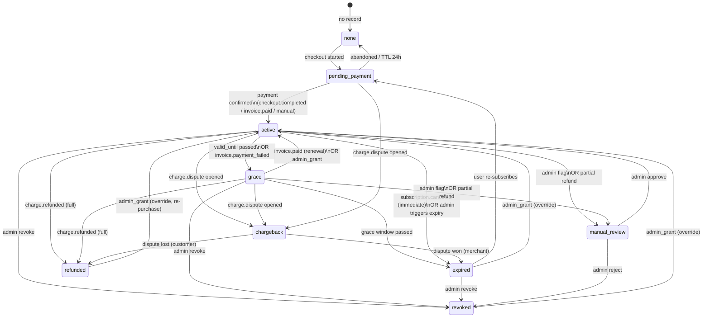

# Entitlement State Machine

**Owner:** `packages/entitlements`
**Status:** Phase 0 canonical reference — binding for all implementers.

This document defines the complete state machine for product entitlements in the WTC Ecosystem Platform.
All access decisions MUST flow through `packages/entitlements`. No component, route handler, or API
may grant or deny access by reading subscription/billing tables directly.

---

## 1. States

| State | Description | Access Granted? |
|---|---|---|
| `none` | No entitlement record exists for this user + product pair | NO |
| `pending_payment` | Checkout initiated; payment not yet confirmed | NO |
| `active` | Payment confirmed or admin-granted; within validity period | YES |
| `grace` | Subscription period ended; grace window still open (configurable, default 3 days) | YES (degraded UI banner) |
| `expired` | Grace window passed; all access revoked | NO |
| `revoked` | Explicitly cancelled by admin or triggered by policy; no grace | NO |
| `refunded` | Payment refunded by provider; access revoked immediately | NO |
| `chargeback` | Dispute filed; access revoked immediately and flagged for review | NO |
| `manual_review` | Flagged by admin or billing system; access suspended pending review | NO |

**Fail-closed rule:** Any state not in the above list, any `null`, any missing record, any DB error, or
any unknown value evaluates as `none` → access DENIED. There is no "default open" path.

---

## 2. Full Transition Table

| Trigger | From State(s) | To State | Notes |
|---|---|---|---|
| User starts checkout | `none` | `pending_payment` | Creates entitlement row with `pending_payment` |
| Checkout abandoned / TTL expired | `pending_payment` | `none` | Worker job: pending_payment older than 24 h |
| `checkout.session.completed` (Stripe) / payment confirmed (crypto/manual) | `pending_payment` | `active` | Sets `valid_from`, `valid_until` per plan |
| Subscription invoice paid (`invoice.paid`) | `active`, `grace`, `expired` | `active` | Extends `valid_until`; clears grace/expired if renewal arrives in time |
| Subscription renewal paid in grace window | `grace` | `active` | Treated identically to `invoice.paid` |
| Admin manual grant | any | `active` | Overrides billing; plan code `admin_grant`; fully audited |
| `valid_until` timestamp passes (worker job) | `active` | `grace` | For subscription plans; not triggered for lifetime/one-time |
| Grace window passes (`valid_until + grace_days`) | `grace` | `expired` | Worker job checks every hour |
| `invoice.payment_failed` (past due) | `active` | `grace` | Same as expiry path; grace countdown starts immediately |
| `subscription.canceled` (immediate) | `active`, `grace` | `expired` | Provider marks cancel_at_period_end=false; immediate |
| `subscription.canceled` (at period end) | `active` | `active` (until `valid_until`), then normal expiry path | cancel_at_period_end=true; no immediate state change |
| `charge.refunded` | `active`, `grace`, `expired` | `refunded` | Full refund revokes immediately; partial refund → `manual_review` |
| `charge.dispute` (chargeback opened) | any non-terminal | `chargeback` | Immediate revocation; creates `manual_review` audit record |
| Chargeback won (dispute closed in merchant favor) | `chargeback` | `expired` | Admin resolves → `expired` (no automatic re-activation) |
| Chargeback lost (dispute closed in customer favor) | `chargeback` | `refunded` | No re-activation |
| Admin revoke | any | `revoked` | Permanent until admin re-grants |
| Admin flag for review | any | `manual_review` | Suspends access; admin must resolve |
| Admin clears manual_review (approve) | `manual_review` | `active` | Manual resolution; fully audited |
| Admin clears manual_review (reject) | `manual_review` | `revoked` | Manual resolution; fully audited |
| One-time purchase paid | `none`, `pending_payment` | `active` | `valid_until = NULL` (lifetime) or fixed date |
| Bundle purchase paid | `none`, `pending_payment` | `active` (expanded per bundle rules) | See Section 5 |
| Re-subscription after expiry | `expired` | `pending_payment` | User initiates new checkout |

### Terminal / absorbing states

`revoked`, `refunded`, `chargeback` are terminal from a billing perspective.
Only an admin manual grant can create a new `active` entitlement for that user+product.

---

## 3. State Diagram



---

## 4. Product Code + Plan Code Registry

### Product Codes (`ProductCode` enum)

| Code | Route Slug | Display Name | Runtime Owner |
|---|---|---|---|
| `tortila_bot` | `tortila` | Tortila Bot | Tortila journal `:8080` (adapter, read-only) |
| `legacy_bot` | `legacy` | Legacy Bot | Old bot `:8000` (adapter, read-only) |
| `axioma_terminal` | `terminal` | Axioma Terminal | journal_server `:8123` / axi-o.ma (bridge) |
| `tradingview_indicators` | `indicators` | TradingView Indicators | manual/admin access queue |
| `education` | `education` | Education / LMS | internal LMS module |
| `club` | `club` | Private Club | internal access flag |

### Plan Codes (`PlanCode` enum)

| Code | Product(s) | Billing Type | Duration | Notes |
|---|---|---|---|---|
| `tortila_monthly` | `tortila_bot` | recurring | 1 month | Standard |
| `tortila_yearly` | `tortila_bot` | recurring | 12 months | Discounted |
| `legacy_monthly` | `legacy_bot` | recurring | 1 month | Standard |
| `axioma_monthly` | `axioma_terminal` | recurring | 1 month | Standard |
| `axioma_yearly` | `axioma_terminal` | recurring | 12 months | Discounted |
| `indicators_quarterly` | `tradingview_indicators` | recurring | 3 months | Standard |
| `indicators_yearly` | `tradingview_indicators` | recurring | 12 months | Discounted |
| `education_lifetime` | `education` | one-time | indefinite | `valid_until = NULL` |
| `club_monthly` | `club` | recurring | 1 month | Standard |
| `bundle_pro` | (see §5) | recurring | 12 months | Expands to 4 products |
| `bundle_starter` | (see §5) | recurring | 1 month or 12 months | Expands to 2 products |
| `admin_grant` | any | manual | admin-specified | Override plan; no billing provider |

---

## 5. Bundle Expansion Rules

Bundles do NOT create a single "bundle" entitlement. They expand into individual product-level
entitlements at purchase/grant time. Each member entitlement has the same `valid_from`/`valid_until`
as the bundle subscription. If the bundle expires/is revoked, all member entitlements transition
in the same webhook handler call.

### `bundle_pro`

Expands to:
- `tortila_bot`
- `axioma_terminal`
- `tradingview_indicators`
- `education`

### `bundle_starter`

Expands to:
- `tortila_bot`
- `education`

### Bundle expansion rules

1. **Atomic creation:** all member entitlements are created in a single DB transaction.
   If any member insert fails, the entire transaction is rolled back and the event is
   marked for retry.
2. **Unified expiry:** `valid_until` is the same timestamp across all members.
3. **Partial revocation NOT allowed via bundle:** admin can revoke individual member
   entitlements, but revoking the bundle revokes all members atomically.
4. **Renewal extends all members:** a renewal `invoice.paid` for a bundle subscription
   extends all member `valid_until` values in a single transaction.
5. **Upgrade path:** if a user already holds an active `tortila_monthly` and purchases
   `bundle_pro`, the `tortila_bot` entitlement is upgraded (plan_code updated;
   `valid_until` replaced if bundle is longer). No duplicate `active` entitlements for
   the same product are allowed.
6. **Downgrade path:** if a bundle lapses and user reactivates only `tortila_monthly`,
   `axioma_terminal` / `tradingview_indicators` / `education` (gained via bundle) must
   transition to `expired`. Worker runs bundle cleanup after renewal confirms.

---

## 6. Manual Grant / Revoke Precedence

Manual admin actions always take precedence over billing state.

Rules:

1. **Admin grant** creates or updates an entitlement row with `status = active`, `plan_code = admin_grant`, and a custom `valid_until` (or `NULL` for indefinite). It does not require a billing provider event.
2. **Admin revoke** transitions any state to `revoked` immediately, regardless of `valid_until`. Even a paid active subscription is overridden.
3. **Admin flag for review** transitions any state to `manual_review`. The user loses access immediately.
4. **Billing events do NOT override a manual `revoked` record.** If an `invoice.paid` webhook arrives for a user whose entitlement is `revoked`, the webhook is idempotently acknowledged (HTTP 200) but the entitlement remains `revoked` and a `manual_override_preserved` audit event is written.
5. **Billing events do NOT automatically clear `manual_review`.** Only an admin action can resolve `manual_review`.
6. **All manual grant/revoke/flag actions write a record to `audit_logs`** with `actor_id` (admin user ID), `action`, `before_state`, `after_state`, `reason` (free text, required), `product_code`, `plan_code`, and `valid_until`.

---

## 7. Subscription Expiry and Grace Period

### Configuration

| Parameter | Default | Configurable |
|---|---|---|
| `GRACE_PERIOD_DAYS` | 3 | Yes, per plan (env var or DB config) |
| `PENDING_PAYMENT_TTL_HOURS` | 24 | Yes (env var) |
| `EXPIRY_CHECK_INTERVAL` | every 1 hour | Worker job frequency |

### Expiry flow

1. Worker runs every hour; queries `entitlements` where `status = active` AND `valid_until < NOW()`.
2. Each row transitions to `grace`. `grace_until = valid_until + GRACE_PERIOD_DAYS * 86400 seconds`.
3. Worker also queries `status = grace` AND `grace_until < NOW()`. Each row transitions to `expired`.
4. On every `invoice.paid` event (renewal), if current status is `grace` or `expired` (and
   `valid_until` was within the allowed renewal window of 7 days), the entitlement is restored to `active`.
5. Lifetime plans (`valid_until = NULL`) never enter the expiry path.
6. One-time purchases with a fixed `valid_until` follow the same path as subscriptions.

### Grace-period UI signals

- `active` → normal access, no banner.
- `grace` → full access, but dashboard shows a prominent warning: "Your subscription ended on [date]. Renew before [grace_until] to keep access."
- `expired` → access blocked; dashboard shows upgrade/renew CTA.

---

## 8. Refund and Chargeback Revocation

### Full refund (`charge.refunded`, full amount)

1. Entitlement transitions from `active`/`grace`/`expired` → `refunded` immediately.
2. `valid_until` set to the current timestamp (access ends now).
3. Writes audit log with `billing_event_id`, provider event ID, refund amount.
4. No grace period for refunds. Access is cut immediately.

### Partial refund (`charge.refunded`, partial amount)

1. Entitlement transitions to `manual_review` (cannot automatically determine correct access state).
2. Admin receives notification: "Partial refund received — entitlement suspended pending review."
3. Admin must resolve to `active` (re-grant for partial period), `revoked`, or `refunded`.

### Chargeback (`charge.dispute` created)

1. Entitlement transitions to `chargeback` immediately from any non-terminal state.
2. `valid_until` set to the current timestamp.
3. Creates a `manual_review` audit record tagged `chargeback`.
4. Admin is notified.
5. When dispute is resolved:
   - Won → admin transitions to `expired` (user must re-purchase; no auto re-grant).
   - Lost → transitions to `refunded`.
6. Chargebacks are never automatically re-activated.

---

## 9. Admin Override Audit

Every admin action on an entitlement writes the following fields to `audit_logs`:

```
id                UUID
created_at        TIMESTAMPTZ
actor_type        'admin' | 'system' | 'billing_webhook'
actor_id          UUID (user_id of admin, or system service ID)
target_type       'entitlement'
target_id         UUID (entitlement.id)
user_id           UUID (affected user)
product_code      ProductCode
plan_code         PlanCode
action            'grant' | 'revoke' | 'flag_review' | 'resolve_review' | 'expire' | 'refund' | 'chargeback'
before_state      EntitlementState
after_state       EntitlementState
reason            TEXT NOT NULL (required for all manual actions)
billing_event_id  TEXT | NULL (provider event ID for webhook-driven transitions)
metadata          JSONB (additional context: refund_amount, dispute_id, etc.)
```

Manual actions with `reason = ''` (empty) are rejected by the server-side validation layer.

---

## 10. Fail-Closed Behavior for Unknown / Unmapped States

The `packages/entitlements` `hasAccess(userId, productCode)` function follows this logic:

```
1. If no entitlement row exists for (userId, productCode) → DENY, reason: blocked_no_entitlement
2. If row.status not in known enum values → DENY, reason: blocked_no_entitlement (log anomaly)
3. If row.status === 'active' AND (valid_until IS NULL OR valid_until > NOW()) → ALLOW
4. If row.status === 'grace' AND grace_until > NOW() → ALLOW (with degraded flag)
5. All other states (pending_payment, expired, revoked, refunded, chargeback, manual_review,
   none, or any unrecognized string) → DENY
6. If DB is unreachable or throws → DENY (never open-fail on error)
```

Fail-closed on DB errors is intentional. A brief DB outage must not grant unauthorized access.
The UI must show a generic error ("Unable to verify access. Please try again.") rather than
silently admitting the user.

---

## 11. `explainAccess` Reason Taxonomy

The `explainAccess(userId, productCode)` function returns a typed reason for access decisions.
This is used for UI messaging, admin diagnostics, and audit trail — never for access gating
(access decisions are always binary `allow/deny` from `hasAccess`).

| Reason Code | Meaning | UI Message (user-facing) |
|---|---|---|
| `allowed` | `status = active` within validity window | (no banner; normal access) |
| `grace` | `status = grace` within grace window | "Subscription ended — renew by [date] to keep access" |
| `blocked_no_entitlement` | No row, unknown state, or `status = none` | "You don't have access to this product. View plans →" |
| `expired` | `status = expired` | "Your access has expired. Renew to continue →" |
| `pending_payment` | `status = pending_payment` | "Payment pending. Check your email or retry checkout →" |
| `manual_review` | `status = manual_review` | "Your account is under review. Contact support →" |
| `revoked` | `status = revoked` | "Access has been revoked. Contact support →" |
| `refunded` | `status = refunded` | "This purchase was refunded. Re-purchase to restore access →" |
| `chargeback` | `status = chargeback` | "Your account has been suspended. Contact support →" |
| `blocked_unknown_state` | Unknown/unmapped state (fail-closed) | "Unable to verify access. Please try again." |

UI components MUST use these reason codes — never inspect raw `status` values directly.
Import the reasons from `packages/entitlements/src/reasons.ts`.

---

## 12. Implementation Notes

- `packages/entitlements` is the only package that reads/writes the `entitlements` table directly.
- All other packages call `hasAccess`, `explainAccess`, `grantAccess`, `revokeAccess`, `syncBillingState`.
- Server Actions and Route Handlers MUST await `hasAccess` server-side. Client-side state is purely cosmetic.
- The `product_access_events` table records every state transition with a full snapshot (not just diffs),
  enabling point-in-time replays and billing dispute resolution.
- Tests: Vitest unit tests for every state transition must run without a live DB (use a mock repository).

---

## 13. Entitlement Status Display Model (Phase 2 — Part 9a)

This section defines the canonical typed view object that every product surface renders. It is
derived entirely server-side from `explainAccess`. No UI layer may construct or infer this object
from client state, roles, or raw subscription tables.

### Typed view object: `ProductAccessView`

```typescript
// packages/entitlements/src/view.ts  (TARGET — to be created)

import type { AccessReason } from './engine';
import type { EntitlementStatus } from './state-machine';
import type { ProductCode } from './registry';

/**
 * The single typed object every product surface (public page, /app product card,
 * bot page, terminal page, indicators page, education page) renders.
 * Produced server-side only; never passed as a prop from a client component.
 */
export interface ProductAccessView {
  /** Canonical product identifier. */
  productCode: ProductCode;

  /** Human-facing product name (from PRODUCTS registry). */
  productName: string;

  /** Whether the user currently has access. Drives gate/show logic. */
  allowed: boolean;

  /**
   * Granular reason code from explainAccess. Drives banner, tone, and CTA copy.
   * Never use entitlement.status directly in UI — always use this reason.
   */
  reason: AccessReason;

  /**
   * Human-readable status label for the status pill/badge.
   * Mapped from reason via reasonLabel() in apps/web/src/lib/access.ts.
   */
  statusLabel: string;

  /**
   * Visual tone: 'ok' | 'warn' | 'bad' | 'neutral'.
   * Mapped from reason via reasonTone() in apps/web/src/lib/access.ts.
   * Drives colour of status pill and banner severity.
   */
  tone: 'ok' | 'warn' | 'bad' | 'neutral';

  /**
   * Full human-readable explanation sentence shown below the status pill.
   * Derived from the reason taxonomy in §11 above.
   * Never empty — every reason has a defined message.
   */
  message: string;

  /**
   * Hard expiry or renewal deadline as an ISO string, or null.
   * - For `grace`: this is graceUntil → shown as "Renew by [date]".
   * - For `active` recurring: this is currentPeriodEnd → shown as "Renews [date]".
   * - For `active` lifetime: null → no expiry shown.
   * - For `expired`/`refunded`/`revoked`: this is the date access ended.
   * - Otherwise null.
   */
  expiresAt: string | null;

  /**
   * The primary CTA the surface renders.
   * - `allowed` + no expiry risk  → null (no CTA; user is inside the product).
   * - `grace`                     → { label: 'Renew now', href: '/app/billing' }
   * - `expired`                   → { label: 'Renew to continue', href: '/app/billing' }
   * - `blocked_no_entitlement`    → { label: 'Get access', href: '/pricing' }
   * - `pending_payment`           → { label: 'Check payment status', href: '/app/billing' }
   * - `refunded`                  → { label: 'Re-purchase', href: '/pricing' }
   * - `revoked` | `chargeback` | `manual_review` → { label: 'Contact support', href: '/support' }
   * - `blocked_unknown_state`     → { label: 'Try again', href: window.location (reload) }
   */
  cta: { label: string; href: string } | null;

  /**
   * Whether the grace-period banner should be shown (allowed = true but expiring soon).
   * True only when reason === 'grace'.
   */
  showGraceBanner: boolean;
}
```

### Factory function: `buildProductAccessView`

```typescript
// packages/entitlements/src/view.ts  (TARGET)

import { explainAccess, type Entitlement } from './engine';
import { PRODUCTS } from './registry';
import type { ProductCode } from './registry';

const MESSAGES: Record<string, string> = {
  allowed:               '',   // no message; user is inside the product
  grace:                 'Subscription ended — renew before {expiresAt} to keep access.',
  blocked_no_entitlement:'You do not have access to this product.',
  expired:               'Your access has expired.',
  pending_payment:       'Payment pending. Check your email or retry checkout.',
  manual_review:         'Your account is under review. Contact support.',
  revoked:               'Access has been revoked. Contact support.',
  refunded:              'This purchase was refunded.',
  chargeback:            'Your account has been suspended. Contact support.',
  blocked_unknown_state: 'Unable to verify access. Please try again.',
};

const CTAS: Record<string, { label: string; href: string } | null> = {
  allowed:               null,
  grace:                 { label: 'Renew now', href: '/app/billing' },
  blocked_no_entitlement:{ label: 'Get access', href: '/pricing' },
  expired:               { label: 'Renew to continue', href: '/app/billing' },
  pending_payment:       { label: 'Check payment status', href: '/app/billing' },
  manual_review:         { label: 'Contact support', href: '/support' },
  revoked:               { label: 'Contact support', href: '/support' },
  refunded:              { label: 'Re-purchase', href: '/pricing' },
  chargeback:            { label: 'Contact support', href: '/support' },
  blocked_unknown_state: { label: 'Try again', href: '/app' },
};

export function buildProductAccessView(
  entitlements: Entitlement[],
  productCode: ProductCode,
  now: number,
): ProductAccessView {
  const decision = explainAccess(entitlements, productCode, now);
  const product = PRODUCTS[productCode];
  const reason = decision.reason;
  const ent = decision.entitlement;

  // Resolve expiresAt
  let expiresAt: string | null = null;
  if (ent) {
    const ts =
      reason === 'grace' ? ent.graceUntil :
      reason === 'allowed' ? (ent.currentPeriodEnd ?? ent.expiresAt ?? undefined) :
      ent.expiresAt ?? ent.currentPeriodEnd ?? undefined;
    if (typeof ts === 'number') expiresAt = new Date(ts).toISOString();
  }

  const message = (MESSAGES[reason] ?? '').replace(
    '{expiresAt}',
    expiresAt ? new Date(expiresAt).toLocaleDateString() : 'the deadline',
  );

  const tone: 'ok' | 'warn' | 'bad' | 'neutral' =
    reason === 'allowed' ? 'ok' :
    (reason === 'grace' || reason === 'pending_payment' || reason === 'manual_review') ? 'warn' :
    reason === 'blocked_no_entitlement' ? 'neutral' : 'bad';

  return {
    productCode,
    productName: product?.name ?? productCode,
    allowed: decision.allowed,
    reason,
    statusLabel: reason === 'allowed' ? 'Active' :
      reason === 'grace' ? 'Grace period' :
      reason === 'blocked_no_entitlement' ? 'Not owned' :
      reason === 'pending_payment' ? 'Payment pending' :
      reason === 'expired' ? 'Expired' :
      reason === 'revoked' ? 'Revoked' :
      reason === 'refunded' ? 'Refunded' :
      reason === 'chargeback' ? 'Suspended' :
      reason === 'manual_review' ? 'Under review' : 'Unknown',
    tone,
    message,
    expiresAt,
    cta: CTAS[reason] ?? null,
    showGraceBanner: reason === 'grace',
  };
}
```

### Surface rendering contract

Every product surface MUST:

1. Call `buildProductAccessView` (or the equivalent `accessFor` + `reasonLabel` + `reasonTone` chain
   already in `apps/web/src/lib/access.ts`) server-side. Never derive access state on the client.
2. Render the `statusLabel` in a `StatusPill` with the `tone` colour.
3. When `!allowed`: render a `RiskWarningBanner` with `detail = view.message`. Never silently hide
   gated content — the page must explain why access is blocked.
4. When `showGraceBanner`: render a prominent warning banner even though `allowed = true`.
5. Render `view.cta` as the primary action button. Never render a buy/renew CTA unless `view.cta`
   is non-null (i.e., do not add CTA logic outside this object).
6. When `reason === 'blocked_unknown_state'` or DB error: render a generic "Unable to verify access"
   message. Never open-fail silently.

### Per-surface mapping

| Surface | Route | Product code | Access source | Gate behaviour |
|---|---|---|---|---|
| Public product page | `/products/[slug]` | derived from slug | none (public; no user session) | Shows product info + "Create account / See pricing" CTA regardless of login |
| App overview (cockpit) | `/app` | all 6 products | `explainAccess` per product | `ProductStatusCard` per product showing statusLabel + tone + CTA |
| App billing page | `/app/billing` | all owned entitlements | entitlementsOf | Table: product, plan, effective status, expiresAt. Mock checkout dev-only |
| Bot pages (tortila/legacy) | `/app/bots/[bot]` | `tortila_bot` / `legacy_bot` | `accessFor` | Hard gate: `!allowed` → `RiskWarningBanner` + billing CTA. No data rendered |
| Terminal page | `/app/terminal` | `axioma_terminal` | `accessFor` | Renders download/journal disabled if `!allowed`; `reasonLabel` in header pill |
| Indicators page | `/app/indicators` | `tradingview_indicators` | `accessFor` | Submit form disabled if `!allowed`; banner with `reasonLabel` |
| Education page | `/app/education` | `education` | `accessFor` | Hard gate: `!allowed` → banner + billing CTA. Course list only rendered if allowed |
| Public pricing page | `/pricing` | n/a (plan list) | none | Static plan cards; "Get started → /register" CTA |

### Gap: club product surface

The `club` product has no dedicated `/app/club` page yet. When created, it must follow the same
pattern: `accessFor(userId, 'club')` server-side, `ProductAccessView` rendered, and a CTA to
`/app/billing` or `/pricing` when not active.

---

## Related Documents

- [BILLING_PROVIDER_PLAN.md](./BILLING_PROVIDER_PLAN.md)
- [PAYMENT_WEBHOOK_STATE_MACHINE.md](./PAYMENT_WEBHOOK_STATE_MACHINE.md)
- [CONTRACTS/billing-webhooks.md](./CONTRACTS/billing-webhooks.md)
- [DOMAIN_MODEL.md](./DOMAIN_MODEL.md)
- [RBAC_MATRIX.md](./RBAC_MATRIX.md)
- [AUDIT_LOG_SCHEMA.md](./AUDIT_LOG_SCHEMA.md)
