# WTC Ecosystem Platform — Integration Map

> Owner: ecosystem-platform-architect | Updated Phase 2 epoch 20260530-0126 | First written 2026-05-29
>
> Related: [ARCHITECTURE.md](./ARCHITECTURE.md) · [BOT_INTEGRATION_PLAN.md](./BOT_INTEGRATION_PLAN.md) · [CONTRACTS/tortila-adapter.md](./CONTRACTS/tortila-adapter.md) · [CONTRACTS/legacy-bot-adapter.md](./CONTRACTS/legacy-bot-adapter.md) · [CONTRACTS/axioma-bridge.md](./CONTRACTS/axioma-bridge.md) · [BOT_CONTROL_SAFETY_MODEL.md](./BOT_CONTROL_SAFETY_MODEL.md)

---

## 1. System Integration Flowchart

```mermaid
flowchart TD
    subgraph User["User / Trader"]
        Browser["Browser"]
        AxiomaApp["Axioma Desktop Terminal\n(Electron 33, local)"]
    end

    subgraph WTC["WTC Ecosystem Platform (Control Plane)"]
        WebApp["apps/web\nNext.js 15 / React 19"]
        Worker["apps/worker\nBackground jobs"]
        DB[("PostgreSQL 17\npackages/db")]

        subgraph Packages["packages/*"]
            Ent["packages/entitlements\nFail-closed access engine"]
            Audit["packages/audit\nAppend-only audit log"]
            Crypto["packages/crypto\nAES-256-GCM vault"]
            Auth["packages/auth\nSessions · RBAC · Argon2id"]
            Billing["packages/billing\nStripe adapter / mock"]
            BotAdapters["packages/bot-adapters\nAdapter interfaces + mocks"]
            AxiomaBridge["packages/axioma-bridge\nBridge + handoff tokens"]
            LMS["packages/lms\nEducation domain"]
            TVAccess["packages/tradingview-access\nManual queue"]
            Analytics["packages/analytics\nCanonical metrics model"]
        end
    end

    subgraph External["External / Product Services"]
        TortilaJournal["Tortila Journal\n0.0.0.0:8080\n(systemd turtle-journal)"]
        LegacyBot["Legacy Bot FastAPI\n0.0.0.0:8000\n(tmux bot)"]
        AxiomaServer["Axioma journal_server\n127.0.0.1:8123\nnginx: axi-o.ma"]
        BillingProvider["Billing Provider\n(Stripe / mock)"]
        TVPlatform["TradingView Platform\n(manual admin action)"]
    end

    Browser --> WebApp
    WebApp --> Auth
    WebApp --> Ent
    WebApp --> Audit
    WebApp --> Crypto
    WebApp --> Billing
    WebApp --> BotAdapters
    WebApp --> AxiomaBridge
    WebApp --> LMS
    WebApp --> TVAccess
    WebApp --> Analytics
    WebApp --> DB

    Worker --> Ent
    Worker --> Billing
    Worker --> TVAccess
    Worker --> BotAdapters
    Worker --> AxiomaBridge
    Worker --> DB

    BotAdapters -->|"HTTP GET read-only\n(server-side only)"| TortilaJournal
    BotAdapters -->|"HTTP GET read-only\n(server-side only)"| LegacyBot
    AxiomaBridge -->|"HTTPS via axi-o.ma\nJWT service token"| AxiomaServer
    Billing -->|"HTTPS webhook\nSignature verified"| BillingProvider
    TVAccess -->|"Admin manual action\n(no automation default)"| TVPlatform

    AxiomaApp -->|"HTTPS direct\nAxioma JWT"| AxiomaServer
    AxiomaApp -.->|"local only\norder execution\nNEVER via WTC"| ExchangeKeys[("Exchange keys\nlocal safeStorage")]

    Auth --> DB
    Ent --> DB
    Audit --> DB
    Crypto --> DB
    Billing --> DB
    LMS --> DB
    TVAccess --> DB
    BotAdapters --> DB
    AxiomaBridge --> DB

    style ExchangeKeys fill:#2a0a0a,stroke:#ff6b74,color:#ff6b74
    style AxiomaApp fill:#0b1423,stroke:#d5a94f,color:#d5a94f
    style TortilaJournal fill:#0b1423,stroke:#94a3b8,color:#f1f5f9
    style LegacyBot fill:#0b1423,stroke:#94a3b8,color:#f1f5f9
    style AxiomaServer fill:#0b1423,stroke:#69e2ff,color:#69e2ff
```

---

## 2. Non-Negotiable Boundaries

These constraints are enforced at the architecture level and cannot be overridden by feature flags or shortcuts:

1. **WTC never executes orders.** No order routing, no position opening/closing, no leverage adjustment passes through the WTC platform. Axioma Desktop handles local order execution entirely independently.

2. **WTC never controls live bots until adapters are separately audited.** `startBot`, `stopBot`, and `applyConfig` methods exist in the adapter interface but throw `NotImplementedError` until the bot-control safety audit is complete and the feature flag `BOT_ADAPTER_MODE=audited` is explicitly set. "Stop bot" in the UI is a mock control that shows a status message; it does not send any command to the live process.

3. **Exchange keys are never transmitted via WTC.** Exchange API keys stored in WTC's vault (AES-256-GCM encrypted) are only decrypted server-side within `packages/crypto` for config validation operations. They are never returned in any API response, never written to logs, never present in audit payloads, never visible in browser state.

4. **Axioma is a bridge product, not a runtime copy.** WTC integrates with `axi-o.ma` via `packages/axioma-bridge` to read license state, release metadata, and account-link status. The Axioma desktop terminal source (`C:\Users\maxib\TV_GREENFIELD_TERMINAL`) and `journal_server` source are not copied into the WTC codebase.

5. **TradingView access is manual-only by default.** No browser automation or credential-stuffing in any production code path. The TV access workflow creates admin tasks; a human admin performs the grant action.

6. **Entitlements are the only access source of truth and fail closed.** Every product-gated route and UI element checks `packages/entitlements.hasAccess()`; access is denied for any state that is not explicitly `active` or valid `grace`. Roles and client-side flags do not grant product access.

---

## 3. External Touchpoint Table

Each row represents one external service that WTC integrates with. All adapter calls originate from WTC server-side code (route handlers or worker jobs); no external service is called directly from the browser.

---

### Tortila Journal `:8080`

| Field | Value |
|---|---|
| **Service** | Tortila Journal (`turtle-journal.service`) |
| **Host** | `<shared-vps-ip>:8080` (direct; no nginx reverse proxy discovered) |
| **Adapter package** | `packages/bot-adapters` → `TortilaAdapter` |
| **Direction** | WTC → Tortila (outbound read-only) |
| **Auth method** | None currently (open port). WTC adapter should add a shared secret header (`JOURNAL_READ_TOKEN`) before any `BOT_ADAPTER_MODE=read-only` deployment. |
| **Read / Write** | Read only (GET endpoints only). `/api/marks` is explicitly excluded — WTC must never call it. |
| **Mock vs real** | Mock default (`BOT_ADAPTER_MODE=mock`). Real adapter (`BOT_ADAPTER_MODE=read-only`) requires `TORTILA_JOURNAL_URL` set and API token auth configured. |
| **Adapter Phase 2.4 status** | CURRENT — health/summary/equity/trades mappings confirmed via journal source audit. `getPositions` via `open_position_summaries`. unrealizedPnl always N/A (marks excluded). |
| **Timeout** | 5 s connect / 10 s read |
| **Rate limit** | Unknown upstream limit; WTC enforces max 1 req/5 s per endpoint per worker cycle |

**Worker health collector:** `apps/worker` runs a `snapshotTortilaJournal` job on every tick (60 s
cadence) guarded by `TORTILA_JOURNAL_URL`. In mock mode, writes synthetic snapshots to
`bot_metric_snapshots` with `sourceAdapter='tortila-mock'`. In read-only mode, calls real journal
and writes real health to `integration_health_checks` with `target='tortila-journal'`.

**Known endpoints (CURRENT — read-only adapter):**

| Endpoint | Response shape | WTC status |
|---|---|---|
| `GET /api/health` | `{"ok": bool, "ts": string}` | CURRENT — maps to `processAlive / status / warnings` |
| `GET /api/summary` | Account summary + open positions | CURRENT — maps to `CanonicalMetricsInput`; fees sign-inverted |
| `GET /api/equity` | Equity time-series `{ts:[], equity:[]}` | CURRENT — maps to `EquityPoint[]`; zero-filtered |
| `GET /api/trades/list` | Paginated closed trades | CURRENT — preferred over `/api/trades`; includes `fees_pnl` |
| `GET /api/trades` | Simple trade list (no fees_pnl) | Fallback only — prefer `/api/trades/list` |
| `GET /api/overview` | All-in-one bundle | Available but not primary path |
| `GET /api/decisions` | Recent strategy decisions | Available; not mapped in Phase 2.4 |
| `GET /api/marks` | BingX mark prices | **EXCLUDED — NEVER CONSUME FROM WTC** |

**Known risk signals (must surface as WTC audit warnings, never hidden):**
- Repeated TP/stop missing and re-placement events
- Exchange-flat position mismatch reconciliation events
- NEAR TP placement rejection: error code `101211` ("Order price should be higher than...")
- BingX rate-limit / funding warnings: error code `100410`
- Fill-detail lookup failure: error code `109421` ("order not exist")
- Margin-preflight block (visible on LINK position add)

These signals are read from the journal's decision/safety endpoints. The WTC `TortilaAdapter.getWarnings()` method aggregates and classifies them. The WTC UI always renders a `WarnBanner` component if any active warnings are present; a green "healthy" card is never shown when unresolved P0/P1 signals exist.

---

### Legacy Bot `:8000`

| Field | Value |
|---|---|
| **Service** | Old Bot (FastAPI, tmux session `bot`) |
| **Host** | `<shared-vps-ip>:8000` (direct; no nginx reverse proxy discovered) |
| **Adapter package** | `packages/bot-adapters` → `LegacyBotAdapter` |
| **Direction** | WTC → Legacy Bot (outbound read-only for MVP) |
| **Auth method** | The legacy bot has `/auth/login` → JWT. WTC adapter stores a service-level JWT (not tied to any user's credentials) obtained from the bot's own auth endpoint. This service credential is stored in `packages/config` (env var, never in DB). |
| **Read / Write** | Read only for MVP. Config write operations are defined in the interface but mock-only until audited. |
| **Mock vs real** | `MockLegacyBotAdapter` for dev/test |
| **Timeout** | 5 s connect / 10 s read |
| **Rate limit** | Unknown upstream; WTC enforces max 1 req/10 s per endpoint |

**Known endpoints:**

| Endpoint | Method | Description | WTC use |
|---|---|---|---|
| `/auth/login` | POST | Obtain JWT | Adapter auth only; not exposed to users |
| `/auth/register` | POST | Not used by WTC | N/A |
| `/api_management/` | GET | List all API key configs | Read bot instances |
| `/api_management/{api_id}` | GET | Single API key config + status | Read config detail |
| `/api_management/{api_id}/settings` | GET | Symbol/risk/leverage settings | Read monitoring state |
| `/api_management/{api_id}/stage_config` | GET | Stage/slot configuration | Display in WTC config view |
| `/api_management/{api_id}/retest` | POST | Trigger connection retest | Future: validated control action (mock for now) |

**Config concepts exposed in WTC UI:** exchange, API key (display masked), symbol list, RSI/CCI settings, averaging levels, take-profit percent, leverage, balance percent, stages/slots. All rendered read-only in MVP; form mutations saved to WTC DB only (not forwarded to live bot until audited).

---

### Axioma Journal Server `:8123` / `axi-o.ma`

| Field | Value |
|---|---|
| **Service** | Axioma `journal_server` (uvicorn, FastAPI + Alembic, 2 workers) |
| **Host** | Internal: `127.0.0.1:8123`; public: `https://axi-o.ma` (nginx TLS termination) |
| **Adapter package** | `packages/axioma-bridge` |
| **Direction** | WTC → Axioma Server (outbound read, token-gated) |
| **Auth method** | WTC calls `axi-o.ma` using a WTC service JWT (issued by the Axioma `journal_server` auth endpoint for a dedicated WTC service account). The JWT is stored in `packages/config` (env var). Per-user Axioma account-link tokens are managed separately and scoped to the user's identity. |
| **Read / Write** | Read only for release/license/download data. Account-link initiation is a write operation (POST); it creates a short-lived link token on the Axioma side and is audited. |
| **Mock vs real** | `MockAxiomaBridge` for dev/test; real bridge activated in deployment phase 3 |
| **Timeout** | 5 s connect / 15 s read (download URL generation may take longer) |
| **Rate limit** | Axioma server has its own rate limiting (observed in tests). WTC bridge caches release metadata in `terminal_release_cache` (TTL 10 min, per axioma-bridge contract §5.4 / worker §15) to reduce calls. |

**Known API areas (from discovery map; full contract in [CONTRACTS/axioma-bridge.md](./CONTRACTS/axioma-bridge.md)):**

| Area | Direction | Description |
|---|---|---|
| `GET /health` | WTC reads | Health check: `{"status":"ok","db":"connected","service":"journal-server"}` |
| Auth endpoints | WTC writes (service account setup) | Service account JWT acquisition only |
| Entitlement endpoints | WTC reads | Check user's Axioma license state |
| Terminal release metadata | WTC reads | Latest version, release notes, min supported version |
| Terminal downloads | WTC reads | Signed download URL for authorized user |
| User settings | WTC reads (partial) | Account-link state only |
| Journal / trades | User accesses directly via Axioma Desktop | WTC provides "Open Journal" CTA link only |
| Stats / analytics | Not surfaced in WTC MVP | Future phase |
| Feedback / support | WTC writes (support ticket bridge) | Submit support events to Axioma if needed |

**Axioma Desktop Terminal** (`C:\Users\maxib\TV_GREENFIELD_TERMINAL`) connects to `axi-o.ma` independently using its own JWT. Exchange keys are encrypted locally using Electron `safeStorage`; local `license.enc` vault. WTC never receives these keys and never becomes part of the Axioma local order-execution path.

---

### Billing Provider (Stripe / mock)

| Field | Value |
|---|---|
| **Service** | Stripe (production) / `MockBillingAdapter` (dev/test) |
| **Direction** | Bidirectional: WTC creates checkout sessions (outbound); Stripe sends webhooks (inbound) |
| **Auth method** | Outbound: Stripe secret key (env var, never logged). Inbound webhooks: `Stripe-Signature` header verified with `STRIPE_WEBHOOK_SECRET` before any state change. |
| **Read / Write** | WTC reads: customer/subscription state. WTC writes: checkout session creation, subscription cancellation. Stripe writes: webhook events (payment_intent.succeeded, invoice.paid, customer.subscription.deleted, charge.dispute.created, etc.) |
| **Mock vs real** | `MockBillingAdapter` in dev; `StripeAdapter` activated by `BILLING_PROVIDER=stripe` env flag |
| **Timeout** | 10 s for Stripe API calls |
| **Rate limit** | Stripe: 100 req/s (well within normal usage) |
| **Idempotency** | Webhook events de-duplicated by `stripe_event_id` in the `subscriptions` / `entitlements` tables before any state transition |
| **Non-negotiable** | Refund, chargeback, cancel, and past_due events all transition entitlement state machine. A chargeback immediately moves entitlement to `chargeback` state (access denied). No payment status is read from client-side; only the server-side webhook + Stripe API confirm state. |

**Webhook events handled:**

| Event | Action |
|---|---|
| `checkout.session.completed` | Move entitlement `pending_payment → active` |
| `invoice.paid` | Renew/extend subscription; ensure `active` state |
| `invoice.payment_failed` | Start grace period or move to `expired` |
| `customer.subscription.deleted` | Expire entitlement |
| `charge.dispute.created` | Move to `chargeback`; revoke access immediately |
| `charge.refunded` | Move to `refunded`; revoke access |

---

### TradingView Platform

| Field | Value |
|---|---|
| **Service** | TradingView (external SaaS, no official partner API for indicator access) |
| **Direction** | WTC → TradingView (admin manual action; no automated API call in production default) |
| **Auth method** | None from WTC perspective; admin manually performs access grant via TradingView UI using the Pine Script indicator access management page |
| **Read / Write** | Write only (admin grants/revokes invite-only access to indicator scripts) |
| **Mock vs real** | Always manual by default. An optional `TVAutomationAdapter` behind feature flag `TRADINGVIEW_AUTOMATION=enabled` is defined in the interface but ships only as a documented stub. |
| **Timeout** | N/A (no programmatic call) |
| **Rate limit** | N/A |
| **Non-negotiable** | No credential-stuffing. No headless browser automation in any production code path. Any browser-automation approach is marked experimental, documented separately, and requires explicit opt-in. |

**WTC workflow:**
1. User has active `tradingview_indicators` entitlement and submits TradingView username via `/app/indicators`.
2. WTC creates a `tradingview_access_request` record and a `tradingview_access_task` for the admin queue.
3. Admin sees pending tasks at `/admin/tradingview-access`.
4. Admin grants access manually on TradingView and marks the task `granted` in WTC.
5. WTC updates `tradingview_access_grants` and emits an audit event.
6. Worker sweep monitors entitlement expiry; on expiry, revokes WTC-side access through `atomicRevokeTv` and queues one unique manual admin task to revoke access on TradingView.
7. User sees grant status (`pending | granted | expiring_soon | expired | revoked`) on their indicators page.

---

## 4. Adapter Status Summary

| Adapter / Bridge | Phase available | Current mode | Control write | Notes |
|---|---|---|---|---|
| `TortilaAdapter` | Phase 2.4 (read-only CURRENT) | Mock (default) / read-only when `TORTILA_JOURNAL_URL` set | Never (hard-disabled) | health/summary/equity/trades CURRENT; marks excluded; /api/marks never consumed |
| `LegacyBotAdapter` | BLOCKED | Mock (returns legacy_plaintext_keys error) | Never | All 5 security gates NOT STARTED; plaintext-key issue unresolved |
| `AxiomaBridge` | Phase 3 | Mock → Real | N/A (read + link) | Bridges to `axi-o.ma`; no order path |
| `BillingAdapter` (Stripe) | Phase 2 | Mock → Real | Write (checkout, cancel) | Webhook-driven; idempotent |
| `TVAccessAdapter` | Phase 5 | Manual queue | Manual admin only | No automation in prod default |
| `BacktesterAdapter` | Phase 6 | Stub | Job submission | Local runner packaging |

---

## 5. Internal Module Communication

All communication between `packages/*` happens in-process (function calls), not over HTTP. There is no internal microservice mesh. The only cross-process communication is:

- `apps/web` ↔ `apps/worker`: today there is **no cross-process queue** — the worker runs independent cron-style sweeps via shared `@wtc/db` repositories (shared Postgres pool). The `job_queue` table is **RESERVED**, not yet enqueued or consumed.
- `apps/web` / `apps/worker` ↔ External services: outbound HTTPS via `fetch` (Node 18+ built-in), always server-side.

This keeps the system simple and debuggable while maintaining clear package boundaries. If a package must scale independently in a later phase, it can be extracted to a separate service using the existing interface contracts.

---

## 6. Phase 2 Integration Deltas

> Added epoch 20260530-0126. Records what changes in Wave-2 at the integration boundary level.

### 6.1 Billing Provider — StripeAdapter activation

| Field | Wave-2 change |
|---|---|
| Current mode | `MockBillingAdapter` (in-process, dev only) |
| Wave-2 target | `StripeAdapter` wired when `BILLING_PROVIDER=stripe`; requires `STRIPE_SECRET_KEY` + `STRIPE_WEBHOOK_SECRET` in env |
| New inbound route | `POST /api/billing/webhook` — Stripe sends signed events here; WTC verifies `Stripe-Signature` before any state change |
| Idempotency | `stripe_event_id` de-duplication in `subscriptions` / `entitlements` tables; written in the same DB transaction as entitlement state change |
| Mock-vs-real gate | `BILLING_PROVIDER` env var; `MockBillingAdapter` remains active when unset or `=mock`; self-grant dev shortcut remains fenced by `assertNotProduction()` |

No other external touchpoint changes for billing. All Stripe calls are outbound from `packages/billing` server-side only.

### 6.2 Axioma Bridge — ES256/JWKS upgrade

| Field | Wave-2 change |
|---|---|
| Handoff signer | HS256 dev stub → ES256 (ECDSA P-256) per `AXIOMA_HANDOFF_TOKEN_SPEC.md`; private key in env (`AXIOMA_HANDOFF_SIGNING_KEY`); JWKS public endpoint published at `/.well-known/axioma-jwks.json` (Next.js App Router: `apps/web/src/app/.well-known/axioma-jwks.json/route.ts`). **Note: an earlier draft of this document incorrectly listed `/api/axioma/.well-known/jwks.json` — the correct path is `/.well-known/axioma-jwks.json`.** |
| JTI revocation | Each handoff token issued with a unique `jti`; WTC side maintains a `jti` revocation store in table `axioma_handoff_jti_revocations` (migration 0004, PG6). Consume = atomic single-statement UPDATE (no TOCTOU). Axioma may also call WTC's consume endpoint (`POST /api/axioma/jti/consume`) if using Option A replay check. |
| Bridge activation | `AxiomaBridgeAdapter` promoted from mock to real when `AXIOMA_BRIDGE_API_TOKEN` is set (deployment phase 3); mock remains default. Real activation also requires `AXIOMA_HANDOFF_SIGNING_KEY` + `AXIOMA_HANDOFF_KEY_ID` and `APP_ENV=staging\|production`. |
| Mock-vs-real | `AXIOMA_BRIDGE_API_TOKEN` absent → `MockAxiomaBridge`; present → real HTTPS calls to `axi-o.ma` |

### 6.3 Bot Adapters — read-only promotion path (Phase 4, NOT Wave-2)

Bot adapters remain in mock mode through Wave-2. The Phase-4 read-only promotion (`:8080` / `:8000`) requires:
1. Confirmed endpoint shapes from the live journal.
2. Shared-secret header configured on Tortila journal side.
3. Legacy bot plaintext-key fix upstream.
4. Explicit operator approval to promote `BOT_ADAPTER_MODE` to `read-only`.

The integration table rows for Tortila Journal and Legacy Bot (§3) are unchanged. Mock adapters feed `@wtc/analytics` `computeMetrics` for the dashboard display.

### 6.4 Integration health check surface

The `integration_health_checks` table (`packages/db`) already exists. Wave-2 adds a health-check record per worker cycle for: `tortila-journal`, `legacy-bot`, `axioma-bridge`, `billing-provider`. The admin `/api/admin/system-health` route reads these records. All checks are server-side; no external service is polled from the browser.

---

## 7. Phase 2.4 Integration Deltas

> Added epoch 20260530-1625. Records what changed at the integration boundary in Phase 2.4.
> Authoritative record: `docs/handoffs/20260530-1355-phase-2-4-real-bot-readonly-access-ops.md`.

### 7.1 Tortila adapter — read-only CURRENT (updated status)

The adapter status table in §4 is updated: `TortilaAdapter` is now CURRENT (not mock-only) for
`health`/`summary`/`equity`/`trades` endpoint mappings. Updated table row:

| Adapter / Bridge | Phase available | Current mode | Control write | Notes |
|---|---|---|---|---|
| `TortilaAdapter` | Phase 2.4 | Mock (default) / read-only when `BOT_ADAPTER_MODE=read-only` AND `TORTILA_JOURNAL_URL` set | Never (hard-disabled) | health/summary/equity/trades CURRENT with Zod validation + 11 fixtures; `/api/marks` NEVER consumed; fees sign-inverted; mark price honestly unavailable |
| `LegacyBotAdapter` | BLOCKED | Stub (throws on all reads) | Never | 5 security gates NOT STARTED; plaintext-key issue unresolved; Phase Group 3 adds a compile-time `LegacyBlockedAdapter` gate |
| `AxiomaBridge` | Phase Group 6 | Mock → Real | N/A (read + link) | ES256 signer + JWKS route exist (Phase 2.1); needs provisioned P-256 key + confirmed endpoint shapes |
| `BillingAdapter` (Stripe) | Phase Group 4 | Mock → Real | Write (test checkout, cancel TARGET) | Webhook-driven; `billing_webhook_events` durable idempotency CURRENT; test-mode checkout creation CURRENT; local replay preflight CURRENT; Stripe CLI/Dashboard replay NOT RUN |
| `TVAccessAdapter` | Phase Group 5 | Manual queue | Manual admin only | `atomicGrantTv`/`atomicRevokeTv` CURRENT; `sweepTvExpiry`→`atomicRevokeTv` fix pending |
| `BacktesterAdapter` | Phase Group 10 | Stub | Job submission | Scope decision (real or locked) pending |

### 7.2 Billing webhook idempotency — updated touchpoint

The billing provider touchpoint (§3) is updated: the idempotency store is now `billing_webhook_events`
(UNIQUE `(provider, event_id)`, migration 0003). The INSERT-then-detect-conflict pattern replaces the
earlier select-then-insert approach. The `webhook_idempotency_keys` name (Phase 0 design) was never
built; `billing_webhook_events` is the only correct reference.

### 7.3 Missing-userId manual_review — new internal touchpoint

A new internal flow exists: when a Stripe webhook event cannot be matched to a WTC user (missing or
ambiguous), the billing route writes a `billing_manual_review_items` record and notifies admins. No
external service is called. The admin queue at `/admin/entitlements/review` shows these items. Admin
approve/reject/dismiss actions call the existing `resolveManualReviewItem` + `grantProduct` repos.
This flow is fully internal (WTC ↔ WTC DB) with no new external touchpoint.

### 7.4 Non-negotiable boundary reaffirmation (Phase 2.4)

All six non-negotiable boundaries from §2 remain fully in force and are confirmed by Phase 2.4
implementation:

1. **WTC never executes orders.** Confirmed — no order routing added.
2. **WTC never controls live bots until adapters are separately audited.** Confirmed — `startBot`/
   `stopBot`/`applyConfig` still throw; legacy BLOCKED.
3. **Exchange keys never transmitted via WTC.** Confirmed — `packages/crypto` only; never in API
   responses, fixtures, or screenshots.
4. **Axioma is a bridge, not a runtime copy.** Confirmed — ES256 signer + JWKS route are the only
   Axioma-facing additions; no order execution path.
5. **TradingView access is manual-only.** Confirmed — `atomicGrantTv`/`atomicRevokeTv` are admin
   server actions; no automation.
6. **Entitlements fail closed.** Confirmed — missing-userId events → `manual_review` (never
   auto-grant); `hasAccess()` is the only access path.

---

## 8. Phase Group 6 Integration Deltas — Axioma Non-Blocked Surface

> Added epoch 20260530-2230. Pre-implementation audit handoff: `docs/handoffs/20260530-2230-ecosystem-platform-architect.md`.
> Scope: jti replay store, ES256 signer wiring behind staging+prod fence, APP_ENV discriminator. CTAs remain DISABLED (B4).

### 8.1 New internal touchpoint: `axioma_handoff_jti_revocations` table

| Field | Value |
|---|---|
| **Table** | `axioma_handoff_jti_revocations` (migration 0004, PG6) |
| **Direction** | Internal write at token issuance (WTC → WTC DB); internal atomic consume on replay check |
| **Auth** | Not an external touchpoint; direct Drizzle repository call |
| **Read/Write** | Write at issuance (`insertJti`); atomic update at consumption (`consumeJti`); periodic purge by worker (`purgeExpiredJtis`) |
| **Mock vs real** | Always real (DB write). PGlite integration tests cover the consume atomicity. |
| **Non-negotiable** | `consumeJti` is a single atomic UPDATE (never SELECT-then-UPDATE); 0 rows updated = replay, reject |

### 8.2 Updated: JWKS endpoint path (corrects §6.2 stale reference)

| Field | Corrected value |
|---|---|
| **JWKS route** | `GET /.well-known/axioma-jwks.json` |
| **File location** | `apps/web/src/app/.well-known/axioma-jwks.json/route.ts` |
| **Cache-Control** | `public, max-age=300` when configured; `no-store` on fail-closed errors |
| **Auth** | None (public endpoint; emits only public key JWKs; private scalar structurally excluded by `publicJwk()` hard assertion) |
| **When empty** | Returns `503 { "error": "jwks_not_configured" }` when `AXIOMA_HANDOFF_SIGNING_KEY` / `AXIOMA_HANDOFF_KEY_ID` are absent or invalid |

**Previous value in §6.2 was incorrect:** `/api/axioma/.well-known/jwks.json`. The actual route has been at `/.well-known/axioma-jwks.json` since Phase 2.1.

### 8.3 New env discriminator: `APP_ENV`

| Field | Value |
|---|---|
| **Variable** | `APP_ENV` in `packages/config/src/env.ts` |
| **Values** | `development \| test \| staging \| production` (default: `development`) |
| **Purpose** | Deployment-env discriminator for business-logic fences (staging+production must use ES256; dev/test may use HS256 stub) |
| **Relationship to `NODE_ENV`** | `NODE_ENV` is Next.js/Vitest convention (`development\|test\|production`); `APP_ENV` is WTC deployment semantics. Both coexist. |
| **Bridge impact** | `@wtc/axioma-bridge` never reads `APP_ENV` directly (pure package constraint). The resolved value is passed in from the web layer via `getAxiomaSignerOrNull()`. |

### 8.4 Axioma bridge touchpoint status update

| Functionality | Pre-PG6 status | PG6 target status | Notes |
|---|---|---|---|
| ES256 signer | Built (es256.ts); not wired into bridge | Wired into bridge factory behind APP_ENV fence | Key must be provisioned by OP to activate |
| jti replay prevention | Not durable (optional in-memory callback only) | Durable (DB table + atomic consume) | Cross-process safe after 0004 lands |
| JWKS endpoint | Correct route exists (since Phase 2.1) | Doc fix applied (§6.2 path corrected) | No code change needed |
| Download / Open-Journal / OTC CTAs | DISABLED (B4) | DISABLED (B4, unchanged) | Requires EXT+OP clearance |
| `AXIOMA_HANDOFF_SIGNING_KEY` in env schema | Raw `process.env` (unvalidated) | Formalized in `envSchema` | Startup validation added |

### 8.5 Non-negotiable boundary reaffirmation (PG6)

All six boundaries from §2 remain fully in force:

1. **WTC never executes orders.** Confirmed — jti store + ES256 wiring add no order path.
2. **WTC never controls live bots.** Confirmed — unchanged.
3. **Exchange keys never transmitted via WTC.** Confirmed — unchanged.
4. **Axioma is a bridge, not a runtime copy.** Confirmed — PG6 is purely the security/token layer; no Axioma runtime is imported.
5. **TradingView access is manual-only.** Confirmed — unchanged.
6. **Entitlements fail closed.** Confirmed — handoff token issuance requires an active entitlement check before `insertJti`.
