# Payment Webhook State Machine

**Owner:** `packages/billing` (webhook handler) + `packages/entitlements` (state transitions)
**Status:** Phase 0 canonical reference — binding for all implementers.

This document specifies: signature verification, idempotency, duplicate/out-of-order event
handling, and the full event coverage matrix mapping each provider event to an entitlement
state transition.

---

## 1. Webhook Endpoint

```
POST /api/billing/webhook
```

A single unified path. The provider is detected from the signature header present in the
request (`stripe-signature` → Stripe; `x-nowpayments-sig` / `x-coingate-sig` → crypto).
The earlier form `POST /api/webhooks/billing/:provider` (with per-provider path segments) is
superseded. See §10 for the full rationale and migration note.

**Implementation:** `apps/web/src/app/api/billing/webhook/route.ts` — EXISTS (landed Phase 2.3; uses `@wtc/billing` `createStripeProvider().parseWebhook` from Phase 2.1). Requires `STRIPE_WEBHOOK_SECRET` to process any event.

The route handler:
1. Reads the raw request body as `Buffer` (never parse JSON before signature verification).
2. Passes raw body + headers to `BillingProvider.handleWebhook(rawBody, headers, idempotencyStore)`.
3. If `handleWebhook` throws `WebhookSignatureError` → respond HTTP 400 immediately.
4. If `handleWebhook` throws `IdempotentDuplicate` → respond HTTP 200 (already processed).
5. If `handleWebhook` returns transitions → call `entitlements.syncBillingState(transitions)`.
6. If `syncBillingState` throws → respond HTTP 500 and do NOT retry the transition manually.
   Provider will retry; idempotency prevents double-application.
7. Respond HTTP 200 after successful transition commit.

**Hard rule:** Never respond HTTP 2xx before verifying the signature. A 200 with no signature
verification would allow any attacker to forge payment confirmations.

---

## 2. Signature Verification

### Stripe

```typescript
const sig = headers['stripe-signature'];
if (!sig) throw new WebhookSignatureError('Missing stripe-signature header');
const event = stripe.webhooks.constructEvent(rawBody, sig, STRIPE_WEBHOOK_SECRET);
// constructEvent throws StripeSignatureVerificationError on failure
```

- `STRIPE_WEBHOOK_SECRET` is the `whsec_...` value from Stripe Dashboard → Webhooks.
- The raw body must be the exact bytes Stripe sent. Any intermediate JSON parse/re-serialize will
  invalidate the signature. Use `express.raw()` or Next.js `request.arrayBuffer()` / `Buffer`.
- Stripe's timestamp tolerance: the SDK enforces a 300-second clock tolerance by default.
  Do not increase this tolerance.
- Both live-mode (`whsec_live_...`) and test-mode (`whsec_test_...`) secrets are supported via env vars.

### Crypto Provider

```typescript
const sig = headers['x-nowpayments-sig'] ?? headers['x-coingate-sig'];
if (!sig) throw new WebhookSignatureError('Missing provider signature header');
const computed = hmacSha512(CRYPTO_WEBHOOK_SECRET, rawBody);
if (!timingSafeEqual(Buffer.from(computed, 'hex'), Buffer.from(sig, 'hex'))) {
  throw new WebhookSignatureError('HMAC signature mismatch');
}
```

- HMAC algorithm and header name vary by provider; configured via `CRYPTO_PROVIDER_NAME`.
- Always use `crypto.timingSafeEqual` for comparison to prevent timing attacks.
- `CRYPTO_WEBHOOK_SECRET` is stored encrypted in the secret vault; never in plaintext env files.

### Manual Provider

The manual provider has no webhooks. If a POST arrives at `/api/webhooks/billing/manual`,
the route handler returns HTTP 404 immediately.

---

## 3. Idempotency

### Design

Every webhook event has a globally unique event ID assigned by the provider:
- Stripe: `event.id` (e.g., `evt_1OXxxx...`)
- Crypto: `payment_id` or `invoice_id` from the processor

The idempotency store records processed event IDs with a TTL of 90 days (Stripe replays up to 72 hours;
90 days provides sufficient buffer for manual retries and dispute resolution).

### Implementation (AS-BUILT — Phase 2.3)

The idempotency store through Phase 2.3 is the existing `audit_logs` ledger — no additional table.

The route handler calls `applyStripeEvent` (in `packages/db/src/repositories.ts`) which:
1. SELECTs `audit_logs` WHERE `action = 'billing.webhook_received'` AND `target_id = <eventId>`.
2. If a row exists → return `{ applied: false, productsChanged: 0 }` (idempotent no-op).
3. If no row → process event → INSERT `audit_logs` row in the same transaction.

This approach has a concurrent-duplicate weakness: two simultaneous deliveries of the same event can
both pass the SELECT with no existing row before either commits. This is documented as a known risk in
`docs/CONTRACTS/billing-webhooks.md §7`.

### Durable store (Phase 2.4 — migration 0003)

A dedicated `billing_webhook_events` table with UNIQUE `(provider, event_id)` replaces the
`audit_logs` select-then-insert approach. The INSERT-then-detect-conflict pattern is the only safe
approach under concurrent delivery. The table name is `billing_webhook_events` (NOT
`webhook_idempotency_keys` — that earlier design name was never implemented).

```sql
-- Table: billing_webhook_events (CURRENT — migration 0003)
-- Group: Ops (billing bounded context)
id            UUID PRIMARY KEY DEFAULT gen_random_uuid()
provider      TEXT NOT NULL              -- 'stripe' | 'crypto'
event_id      TEXT NOT NULL              -- provider-assigned event ID
status        TEXT NOT NULL DEFAULT 'pending'
created_at    TIMESTAMPTZ NOT NULL DEFAULT NOW()
processed_at  TIMESTAMPTZ
meta          JSONB
UNIQUE (provider, event_id)             -- the idempotency gate
```

Do NOT create a `webhook_idempotency_keys` table — it was a superseded TARGET design name.
The `billing_webhook_events` table from migration 0003 is the canonical durable store.

### Idempotency check flow

```
1. Compute key: `${providerName}:${eventId}`
2. idempotencyStore.has(key)?
   YES → log 'duplicate_event_skipped', return HTTP 200 (acknowledged: true, transitions: [])
   NO  → process event
3. After successful processing → idempotencyStore.set(key, 90 * 24 * 3600)
4. On processing error → do NOT set idempotency key (allow retry)
```

This means: a failed event that did not commit to DB will be retried by the provider.
A successfully committed event will never be re-applied.

---

## 4. Duplicate Event Handling

Providers retry webhook delivery when they do not receive HTTP 200 within their timeout window.
Stripe retries up to 3 days; crypto processors vary (typically 24-72 hours).

Duplicate handling rules:

1. **Exact duplicate** (same event ID): caught by idempotency store. No-op. HTTP 200.
2. **Semantic duplicate** (different event ID, same logical outcome): e.g., two `invoice.paid` events
   for the same subscription period. Handled by state machine logic:
   - If DB state is already `active` with `valid_until >= event.period_end` → no-op, log `idempotent_no_change`.
   - If DB state is `active` with `valid_until < event.period_end` → update `valid_until` (valid renewal).
3. **Conflicting duplicate** (e.g., `invoice.paid` after `charge.refunded` already processed):
   - Refunded state is terminal. `invoice.paid` is a no-op; log `billing_state_conflict_no_op`.

---

## 5. Out-of-Order Event Handling

Events may arrive out of chronological order due to provider retry queues, network partitions,
or provider infrastructure delays.

### Out-of-order detection

Each webhook event carries a timestamp (`event.created` in Stripe). Compare with the last
billing event timestamp stored in `product_access_events.billing_event_created_at`.

```
if event.created < lastEventCreatedAt:
  log 'out_of_order_event_received' with event details
  apply conservative resolution (see below)
```

### Conservative resolution table

| Out-of-order scenario | Action |
|---|---|
| `invoice.paid` arrives after `charge.refunded` already processed | No-op; `refunded` state preserved |
| `invoice.paid` arrives after `subscription.canceled` already processed | No-op; `expired` state preserved (unless admin re-grants) |
| `invoice.payment_failed` arrives after `invoice.paid` already processed for same period | No-op; `active` state preserved (paid wins) |
| `charge.dispute.created` arrives after `charge.refunded` already processed | No-op; `refunded` state preserved |
| `checkout.session.completed` arrives twice (duplicate session ID) | Idempotency catches; second is no-op |
| `customer.subscription.deleted` arrives before `invoice.paid` (late renewal detection) | Process deletion → `expired`; if `invoice.paid` arrives within 7 days → restore to `active` |

### Late renewal window

A `customer.subscription.deleted` event followed by an `invoice.paid` within 7 days is treated
as a delayed renewal (common in payment retry scenarios). The window is configurable via
`BILLING_LATE_RENEWAL_WINDOW_DAYS` env var (default: 7).

---

## 6. Event Coverage Matrix

### Stripe Events

| Stripe Event Type | Trigger Scenario | From State(s) | To State | valid_until | Notes |
|---|---|---|---|---|---|
| `checkout.session.completed` | User completes checkout flow | `pending_payment` | `active` | plan period from NOW() | Extract userId/planCode from session metadata |
| `invoice.paid` | Subscription renewal paid | `active`, `grace`, `expired` | `active` | subscription.current_period_end | Extends period; clears grace/expired within late-renewal window |
| `invoice.payment_failed` | Renewal payment declined | `active` | `grace` | unchanged | Grace countdown starts from original `valid_until` |
| `invoice.payment_action_required` | 3DS/SCA required | `active` | `grace` | unchanged | Same as payment_failed; user must complete auth |
| `customer.subscription.updated` | Plan change / quantity change | `active` | `active` | updated period_end | Log the change; no state transition usually |
| `customer.subscription.deleted` | Subscription canceled (immediate) | `active`, `grace` | `expired` | NOW() | `cancel_at_period_end=false` → immediate |
| `customer.subscription.deleted` (at period end) | Subscription lapsed | `active` | normal expiry via worker | unchanged | `cancel_at_period_end=true` → no immediate DB change; worker handles |
| `charge.refunded` (full) | Full refund issued | `active`, `grace`, `expired` | `refunded` | NOW() | Immediate access cut |
| `charge.refunded` (partial) | Partial refund issued | any | `manual_review` | unchanged | Admin must resolve |
| `charge.dispute.created` | Chargeback opened | any non-terminal | `chargeback` | NOW() | Immediate access cut; admin notified |
| `charge.dispute.closed` (won) | Dispute closed: merchant won | `chargeback` | `expired` | unchanged | No auto re-grant; user must re-purchase |
| `charge.dispute.closed` (lost) | Dispute closed: refund issued | `chargeback` | `refunded` | unchanged | Permanent; admin override only |
| `payment_intent.payment_failed` | One-time payment failed | `pending_payment` | `none` (TTL cleanup) | — | Worker cleans pending_payment TTL |
| `customer.subscription.trial_will_end` | Trial ending soon | `active` (trial) | `active` (trial, no change) | — | Send notification only; no state change |

### Crypto Provider Events

| Crypto Event Type | Trigger Scenario | From State(s) | To State | Notes |
|---|---|---|---|---|
| `payment_confirmed` | On-chain confirmations reached | `pending_payment` | `active` | Requires min confirmations (configurable) |
| `payment_waiting` | Payment received, awaiting confirmations | `none` / `pending_payment` | `pending_payment` | No state change; idempotent |
| `payment_expired` | Invoice expired without payment | `pending_payment` | `none` | Worker TTL cleanup |
| `payment_failed` | Payment failed on-chain | `pending_payment` | `none` | Worker TTL cleanup |
| `payment_partially_paid` | Underpayment detected | `pending_payment` | `manual_review` | Admin must resolve |
| `refund_requested` | Manual refund (provider-initiated) | `active`, `grace` | `manual_review` | Crypto refunds are manual |

---

## 7. Webhook Processing State Diagram

```mermaid
stateDiagram-v2
    [*] --> Received : POST /api/billing/webhook/:provider
    Received --> SignatureVerified : HMAC/Stripe verify passes
    Received --> Rejected : Signature invalid → HTTP 400

    SignatureVerified --> IdempotencyCheck
    IdempotencyCheck --> Duplicate : event_id already in store
    Duplicate --> Acknowledged : HTTP 200, no state change

    IdempotencyCheck --> EventClassification : event_id not in store
    EventClassification --> TransitionBuilt : known event type
    EventClassification --> UnknownEventNoOp : unknown/unhandled event type → HTTP 200, log

    TransitionBuilt --> StateValidation : call syncBillingState
    StateValidation --> TransitionApplied : DB state matches expected fromState
    StateValidation --> OutOfOrderResolution : DB state does not match

    OutOfOrderResolution --> NoOp : conservative resolution → no change
    OutOfOrderResolution --> ManualReview : conflict requires admin

    TransitionApplied --> IdempotencyKeyStored
    NoOp --> IdempotencyKeyStored
    ManualReview --> IdempotencyKeyStored
    IdempotencyKeyStored --> AuditLogged
    AuditLogged --> [*] : HTTP 200

    TransitionApplied --> DBError : transaction fails
    DBError --> [*] : HTTP 500 (provider retries; key NOT stored)
```



---

## 8. Monitoring and Alerting

The following conditions must trigger admin alerts (via notification system):

| Condition | Alert Type | Priority |
|---|---|---|
| `WebhookSignatureError` received | Security alert | P0 |
| `unexpected_billing_state_conflict` logged | Billing alert | P1 |
| `charge.dispute.created` event processed | Chargeback alert | P1 |
| `charge.refunded` (partial) processed | Manual review alert | P1 |
| HTTP 500 returned to provider (DB error during webhook) | Infrastructure alert | P0 |
| Same event ID received > 3 times (retry storm) | Billing alert | P2 |
| `out_of_order_event_received` logged | Billing alert | P2 |

All alert events are written to `audit_logs` with `actor_type = 'system'` and
`action = 'billing_alert'` before the notification is sent.

---

## 9. Required Tests Before Production Wiring

| Test | Coverage |
|---|---|
| Tampered Stripe body → HTTP 400 | Signature verification |
| Missing signature header → HTTP 400 | Signature verification |
| `checkout.session.completed` → `pending_payment → active` | Event coverage |
| `invoice.paid` → `grace → active` (late renewal) | Event coverage |
| `invoice.payment_failed` → `active → grace` | Event coverage |
| `customer.subscription.deleted` → `active → expired` | Event coverage |
| `charge.refunded` (full) → `active → refunded` | Event coverage |
| `charge.refunded` (partial) → `active → manual_review` | Event coverage |
| `charge.dispute.created` → `active → chargeback` | Event coverage |
| `charge.dispute.closed` (won) → `chargeback → expired` | Event coverage |
| `charge.dispute.closed` (lost) → `chargeback → refunded` | Event coverage |
| Duplicate event ID → HTTP 200, no state change | Idempotency |
| Out-of-order `invoice.paid` after `charge.refunded` → no state change | Out-of-order |
| Partial crypto payment → `manual_review` | Crypto coverage |
| Unknown event type → HTTP 200, logged | Unknown event handling |
| DB failure during syncBillingState → HTTP 500, key not stored | Error path |
| Late renewal window: `subscription.deleted` + `invoice.paid` within 7 days → `active` | Late renewal |

All tests run via Vitest with a mock DB repository. No live Stripe or crypto API calls in unit tests.
Integration tests use Stripe's test clock and test webhook fixtures.

---

## 10. Canonical Webhook Route (TARGET — Phase 2, Part 9d)

### Decision

The canonical route for all billing webhooks is:

```
POST /api/billing/webhook
```

A single path. The provider is identified from the request body or a query parameter, not from
the URL path segment. This replaces the earlier documented form `/api/webhooks/billing/:provider`
and the per-provider paths `/api/webhooks/billing/stripe` and `/api/webhooks/billing/crypto`
found in `CONTRACTS/billing-webhooks.md`.

**Rationale:**

1. A single registered URL is simpler to configure in Stripe Dashboard, crypto processor dashboards,
   and nginx. Multiple paths require multiple registrations and multiple allowlist entries.
2. The provider identity is established by the signature header present in the request:
   `stripe-signature` → Stripe, `x-nowpayments-sig` / `x-coingate-sig` → crypto.
   The handler can detect provider without a path segment.
3. A single path makes rate-limiting, CSRF exclusion, and CDN bypass configuration simpler
   (one nginx location block, one exclusion rule).
4. The path `/api/billing/webhook` is consistent with the Next.js App Router convention
   (`apps/web/src/app/api/billing/webhook/route.ts` — EXISTS, landed Phase 2.3).

### Route file (CURRENT — landed Phase 2.3)

```
apps/web/src/app/api/billing/webhook/route.ts
```

EXISTS. Implementation: raw body via `request.arrayBuffer()` → `Buffer`; `Stripe-Signature` header
detected; delegates to `createStripeProvider().parseWebhook`; idempotency via `audit_logs` ledger
(`action='billing.webhook_received'`, `targetId=eventId`) — select-then-insert (Phase 2.3 as-built;
superseded by `billing_webhook_events` in Phase 2.4); CSRF-exempt (`middleware.ts` excludes
`/api/billing/webhook`); fail-closed; no secret/body logging; no live Stripe calls in dev.
First real API mutation route (Phase 2.3). Requires `STRIPE_WEBHOOK_SECRET` to process any event.

### Handler contract (CURRENT)

```typescript
// apps/web/src/app/api/billing/webhook/route.ts  (CURRENT — Phase 2.3)

export const runtime = 'nodejs';  // required for Buffer / crypto
export const dynamic = 'force-dynamic';

export async function POST(request: Request): Promise<Response> {
  // 1. Read raw body as Buffer — MUST NOT parse JSON first
  const rawBody = Buffer.from(await request.arrayBuffer());
  const headers = Object.fromEntries(request.headers.entries());

  // 2. Detect provider from signature headers
  const provider = detectProvider(headers);  // 'stripe' | 'crypto' | null
  if (!provider) {
    return new Response(JSON.stringify({ error: 'unknown_provider' }), { status: 400 });
  }

  // 3. Delegate to BillingProvider.handleWebhook (signature verification inside)
  // 4. Apply EntitlementTransitions via packages/entitlements.syncBillingState
  // 5. Return HTTP 200 { received: true } on success
  // 6. Return HTTP 400 on WebhookSignatureError
  // 7. Return HTTP 500 on DB error (provider retries; idempotency key NOT stored)
}
```

### Migration note

The CONTRACTS/billing-webhooks.md document previously listed separate paths
`/api/webhooks/billing/stripe` and `/api/webhooks/billing/crypto`. These are superseded by the
single canonical path above. `CONTRACTS/billing-webhooks.md` is updated in this phase (§3).

### CSRF exclusion

The webhook route MUST be excluded from CSRF middleware. The Next.js middleware config
(`apps/web/src/middleware.ts`) must include a matcher that excludes `/api/billing/webhook`.

### Rate limiting (nginx)

```nginx
# nginx config (TARGET — not yet applied)
location = /api/billing/webhook {
  limit_req zone=billing_webhook burst=20 nodelay;
  proxy_pass http://wtc_next;
}
```

Single location block replaces the two previously documented blocks.

### Dev simulation path (unchanged)

The mock provider simulation endpoint (`/dev/billing/simulate`) is unchanged and remains
a separate GET endpoint (dev-only, not a webhook). It is not affected by this canonical route decision.

---

## Related Documents

- [ENTITLEMENT_STATE_MACHINE.md](./ENTITLEMENT_STATE_MACHINE.md)
- [BILLING_PROVIDER_PLAN.md](./BILLING_PROVIDER_PLAN.md)
- [CONTRACTS/billing-webhooks.md](./CONTRACTS/billing-webhooks.md)
- [AUDIT_LOG_SCHEMA.md](./AUDIT_LOG_SCHEMA.md)
- [SECURITY_MODEL.md](./SECURITY_MODEL.md)
